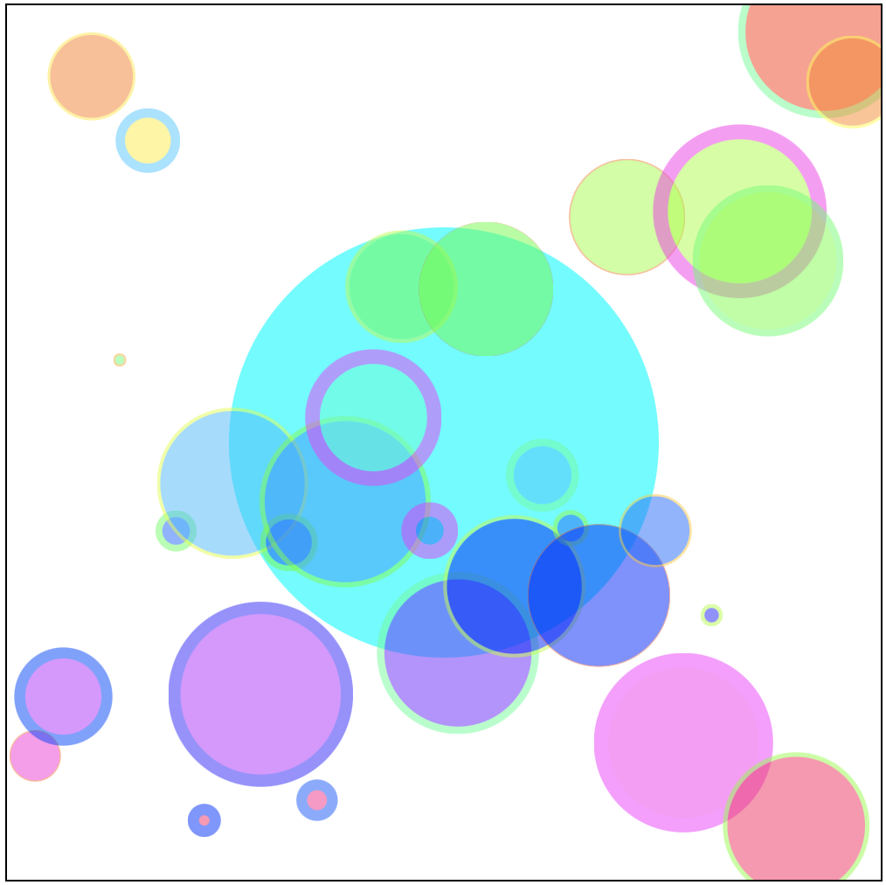
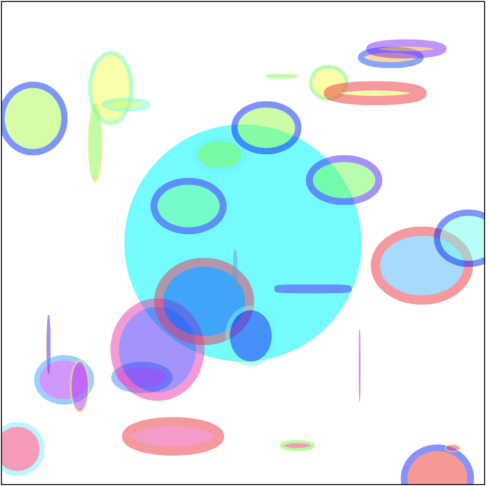

## SVG

SVG is Scalable, Vector, Graphics. It's a language related to HTML but used to draw things. Rather than display text and pictures, SVG is used to draw lines and shapes.

SVG and HTML are closely related. Both languages share the same parent language and are written in much the same way with the same syntax. You can use SVG within an HTML document. 

Where HTML has tags to create headings, paragraphs, images, and links. SVG has tags that create Rectangles, circles, paths, and polygons. 

SVG has the same syntax as HTML. SVG uses different tag names and the browser renders these following different rules.

Here is a list of some of the SVG tags.

- `<svg>` - The root element for an SVG document. 
- `<rect>` - A Rectangle, you know fours sides width and height 🔲
- `<circle>` - A Circle, these are round ⭕️
- `<ellipse>` - An Elipse it's an oval like an egg 🥚
- `<g>` - A Group, groups elements 
- `<line>` - A Line, a straight line 📈
- `<path>` - A Path 🛣
- `<polygon>` - A Polygon ⬡
- and [many more...](https://developer.mozilla.org/en-US/docs/Web/SVG/Element)

### Making SVG happen

D3 writes SVG for us! While you can write your SVG documents using D3 you will use D3 to write the SVG content for you. 

SVG tags have different names and many new and different attributes!

Create a new HTML document with the boilerplate code: 

```HTML
<!DOCTYPE html>
<html lang="en">
<head>
  <meta charset="UTF-8">
  <meta http-equiv="X-UA-Compatible" content="IE=edge">
  <meta name="viewport" content="width=device-width, initial-scale=1.0">
  <title>Document</title>
</head>
<body>
	
  <script src="https://d3js.org/d3.v7.min.js"></script>
  <script>
    // Your code here
  </script>
</body>
</html>
```

Make an SVG element. You can write SVG into your HTML documents just like you would write a div or other tag. Think of the `<svg>` element as the root element for the SVG drawing/document.

Make an svg tag:

```HTML
<body>
  <svg id="svg" width="500" height="500"></svg>

  ...
</body>
```

Inside an SVG tag, you can add other tags but these need to be SVG elements. SVG has its own tags/elements that are different from HTML tags/elements. 

SVG elements have their attributes also. Try it yourself, make a circle. 

```HTML
<svg id="svg" width="500" height="500">
  <circle cx="250" cy="250" r="123" fill="#0ff"/>
</svg>
```

This should make a cyan circle in the center of the SVG document. 

- `cx` - center x
- `cy` - center y
- `r` - radius
- `fill` - fill color

**Challenge** 

Make a couple more circles for fun. Change the `fill` color, `r` (radius), `cx` and `cy`.

### D3 and SVG Example

Time to make some SVG elements with D3.

For this example, we will use an array of objects each with three properties: `a`, `b`, and `c`. The data will be generated randomly. 

This function takes a parameter `n` and returns an array of n objects. Each object properties a, b, and c with random values from 0 - 1. 

Add the function below to your script. 

```JS
function makeRandomData(n) {
  const array = []
  for (let i = 0; i < n; i += 1) {
    array.push({ a: Math.random(), b: Math.random(), c: Math.random() })
  }
  return array
}
```

Use this function to generate random data for testing. Here you're calling the function and storing the returned value in the variable `data`.

```JS
const data = makeRandomData(11)
```

### Setup D3

Start using D3. In this step, you will follow the d3 boilerplate code. 

Select the SVG element by its id name and give it a CSS style.

```JS
// Select #svg
d3.select('#svg')
  // Style #svg
  .style('border', '1px solid #000')
```

Adding a border will help identify where SVG is in the window. If you don't see the border check your work. 

Select all of the `circle` elements. None exist yet D3 will make them inside the `#svg` element. Add `data`. Then call `enter()` to start creating elements from the data.

```JS
d3.select('#svg')
  .style('border', '1px solid')
  // select all <circle>s in #svg
  .selectAll('circle')
  .data(data)
  .enter()
```

Set attributes on SVG `circle`. Below we've set the `cx`, `cy`, `r`, and `fill` to the values in the data.

```JS
d3.select('#svg')
  .style('border', '1px solid')
  .selectAll('rect')
  .data(data)
  .enter()
  // Style all <circle>s in #svg
  .append('circle')
  .attr('cx', (d, i) => i * 500 / data.length)
  .attr('cy', d => d.a * 500)
  .attr('r', d => d.c * 100)
  .attr('fill', d => 'green')
  .attr('opacity', () => 0.5)
```

Notice that the `.attr()` method takes two parameters. The first is a string and should be the name of the attribute. The second is a callback function that receives one data value and returns the value you want to be assigned to that attribute. 

The callback also receives the index of the data element in its array. The example above uses this to set the `cx` attribute to spread the circles evenly across the width of the SVG container. 

Notice I've used an arrow function here, written on a single line the return is implicit. 


Here is a list of attributes you can use with SVG elements: 

- `stroke` color of a stroke
- `stroke-width` size of the stroke in px
- `cx` the horizontal position of the element
- `cy` the vertical position of the element 
- `r` the radius of a circle
- `fill` the fill color of the element 
- `opacity` the transparency/opacity of the element

There are lots and lots of attributes. Some apply to some elements and not to others while some attributes apply to all elements. 

For example `r`/radius only applies to circles. To know which attributes apply you need to look up the element in the documentation. 

https://developer.mozilla.org/en-US/docs/Web/SVG/Element

**Challenges**

- Set the stroke. Set the property: `stroke`. Make the value the color of the stroke. For example: `.attr('stroke', '#000')` would add a black stroke.
- Use the data b property to set the stroke width. Something like: `.attr('stroke-width', d => 10 * d.b)`
- Change the stroke color. Since the data values are in the range of 0 to 1. You can use an HSL color and multiply the value by 360 to get the hue. For example: ``hsl(${360 * d.b}, 100%, 50%)``.
- Add more data. Remember the function at the top will generate some random values based on the argument provided. 
- Make all of the circles smaller by changing the `r` attribute.
- Set the fill color based on the `data.a` property. 

Your work might look like this: 



Inspect the elements in the browser: 

```HTML
<svg id="svg" width="500" height="500" style="border: 1px solid;">
  <circle cx="250" cy="250" r="123" fill="#0ff"></circle>
  <circle cx="16.129032258064516" cy="222.25708822052192" r="47.88209465530098" fill="hsl(160.02510351877578, 100%, 50%)" opacity="0.5" stroke="hsl(94.4703439376888, 100%, 50%)" stroke-width="2.6241762204913552"></circle>
  <circle cx="32.25806451612903" cy="98.42029526539491" r="14.51146371457872" fill="hsl(70.86261259108434, 100%, 50%)" opacity="0.5" stroke="hsl(294.6841152013748, 100%, 50%)" stroke-width="8.185669866704856"></circle>
  ...
```

Notice the attributes. These are all of the values you assigned with your d3 script! 

**Stretch Challenge**

These circles are so round it's getting boring. Let's change them to ellipses! An ellipse has attributes: `rx` and `ry` to replace the `r` of circle. 



## Review

SVG is a language, like HTML, but it uses different tags. Where HTML is used to display text and images SVG is used to draw shapes. 

SVG use elements to define shapes: 

- `circle`
- `path`
- `rect`
- `polygon`

SVG uses attributes to describe these shapes. Attributes might be: 

- `cx`
- `cy`
- `r`
- `stroke`
- `stroke-width`
