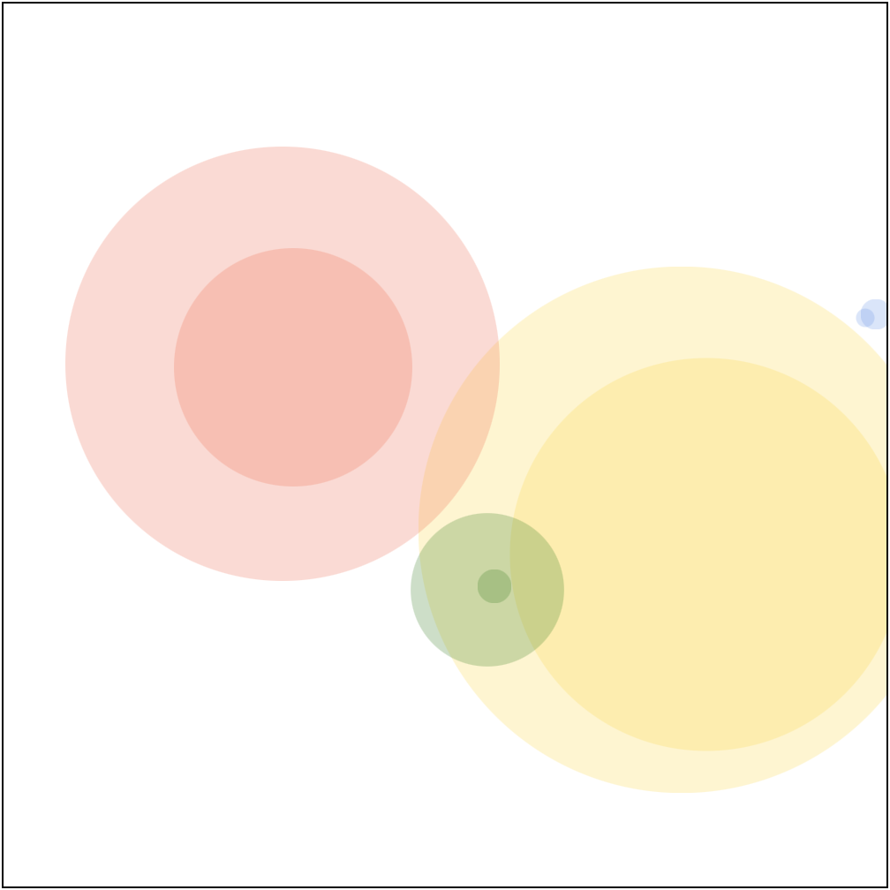

## D3 Loaders

When working with data you'll most often be loading data from external sources.

D3 has built-in data loaders. D3 works with JSON, CSV, and a few other data types. Read more [here](https://github.com/d3/d3/blob/master/API.md#fetches-d3-fetch).

You're probably already familiar with JSON, let's take a look at CSV. CSV stands for Comma, Separated, Values. 

Here is a sample CSV file: 

```
"name","population","country","x","y"
"San Francisco",874961,"USA",122,-37
"Fresno",525010,"USA",119,-36
"Lahore",11126285,"Pakistan",74,31
"Karachi",14910352,"Pakistan",67,24
"Rome",4342212,"Italy",12,41
"Naples",967069,"Italy",14,40
"Rio",6748000,"Brazil",-43,-22
"Sao Paolo",12300000,"Brazil",-46,-23
```

Each row is one record. 

Take a look at the first row, the first row is special: 

```
"name","population","country","x","y"
```

This row defines the fields for all of the other rows. Each field is separated by a comma. The first line names the values in each of the following rows. 

The same data in JSON format would be longer but also can have nested values. CSV is flat. There is just one level of data stored. 

CSV is more compact than JSON it takes fewer characters to store its contents. This makes it possible for CSV to store more data in a smaller file. 

## Loading Data

D3 has a couple of different loaders built-in. You can use these to easily load data from JSON or CSV. 

Load a JSON Object:

```JS
d3.json('metal.json')
  .then(json => console.log(json))
```

Load a CSV object.

```JS
// CSV
d3.csv('metal_bands_2017.csv')
  .then(csv => console.log(csv))
```

Notice that both of these return a Promise!

A Promise is an object used by JS to handle async tasks. let's break the examples above into steps: 

```JS
d3.json('titanic-passengers.json')
  .then(json => console.log(json))
```

What happened here? You called `d3.json('titanic-passengers.json')` which returned a Promise. A Promise is an object. Let's put it in a variable: 


```JS
const p = d3.json('titanic-passengers.json')
p.then(json => console.log(json))
```

Here you put the promise in the variable `p` and then called the `.then()` method of the promise. `.then()` takes a callback function which is executed when the promise resolves. In this example, the promise will resolve when the JSON data is loaded. 

The `then()` callback receives the data you are loading. 

`d3.json().then(data => ...do something with data here... )`

## Getting started

To get started with this example create a new HTML file and add your boilerplate code: 

```HTML
<!DOCTYPE html>
<html lang="en">
<head>
  <meta charset="UTF-8">
  <meta http-equiv="X-UA-Compatible" content="IE=edge">
  <meta name="viewport" content="width=device-width, initial-scale=1.0">
  <title>Document</title>
</head>
<body>

  <svg id="svg" width="500" height="500"></svg>

  <script src="https://d3js.org/d3.v7.min.js"></script>
  <script>
    // Your Script here...
  </script>
</body>
</html>
```

Find the data folder in this repo and copy the `cities.csv` file into the directory with the HTML you just created. 

### Load cities.csv

Add the following to your page: 

```JS
d3.csv('cities.csv')
  .then(data => {
    console.log(data)
  })
```

Load your page to the browser and check the console. You should see something like: 

```
[Log] Array (8) (index-loading.html, line 16)
0 {label: "San Francisco", population: "874961", country: "USA", x: "122", y: "-37"}
1 {label: "Fresno", population: "525010", country: "USA", x: "119", y: "-36"}
2 {label: "Lahore", population: "11126285", country: "Pakistan", x: "74", y: "31"}
3 {label: "Karachi", population: "14910352", country: "Pakistan", x: "67", y: "24"}
4 {label: "Rome", population: "4342212", country: "Italy", x: "12", y: "41"}
5 {label: "Naples", population: "967069", country: "Italy", x: "14", y: "40"}
6 {label: "Rio", population: "6748000", country: "Brazil", x: "-43", y: "-22"}
7 {label: "Sao Paolo", population: "12300000", country: "Brazil", x: "-46", y: "-23"}

Array Prototype
```

What happened here? You loaded the `cities.csv` with D3 and D3 converted this into an array of objects. 

This will be our data for the next example! 

**Challenge!**

Try adding the boilerplate code from memory. 

Your goal is to target the SVG tag and draw some circles. 

The Boilerplate code will go inside the Promise callback since it needs to access the data that shows up there. 

```JS
d3.csv('cities.csv')
  .then(data => {
    // console.log(data)
    d3.select('#svg')
      .style('border', '1px solid')
      .selectAll('circle')
      .data(data)
      .enter()
      .append('circle')
  })
```

The Cities data contains an `x` and `y` field which is the geocoordinate latitude and longitude of the city. These numbers range from `x` of `122` (San Francisco) to `-46` (Sao Paolo), and `y` of `-37` (San Francisco) to `74` (Lahore). 

If we use these values to position our shapes in the SVG document we need to place them in the coordinate space of 0 to 500, the width and height of the SVG document. 

Try this: 

```JS
d3.select('#svg')
  .style('border', '1px solid')
  // select all <circle>s in #svg
  .selectAll('circle')
  .data(data)
  .enter()
  .append('circle')
  .attr('cx', d => parseFloat(d.x) * 2 + 250)
  .attr('cy', d => parseFloat(d.y) * 2 + 250)
  .attr('r', 20)
  .attr('fill', `red`)
  .attr('opacity', 0.25)
```

NOTE! I had to `parseFloat(d.x)` since the values from the CSV file are imported as strings!

Here you scaled the values by multiplying by 2 to get more range, and offset the values by adding 250. 

```JS
parseFloat(d.x) * 2 + 250
```

Imagine the smallest number `-46` multiply by `2` and then add `250`. That gives us `158`. 

The largest value: `122` multiplied by 2 add 250 is: `494`. 

The math here is keeping the objects within the bounds of the SVG document and making the most of the space. 

Let's set the size of the circles based on the populations. These population numbers are really big some are in millions! We need to scale these values. 

Try this: 

```JS
.attr('r', d => parseInt(d.population) * 0.00001)
```

You can try different numbers here and see what happens. 

Let's set the color based on the country. There are four countries represented: USA, Pakistan, Italy, and Brazil. 

```JS
.attr('fill', d => {
  if (d.country === 'USA') {
    return 'cornflowerblue'
  } else if (d.country === 'Pakistan') {
    return 'gold'
  } else if (d.country === 'Italy') {
    return 'green'
  } else if (d.country === 'Brazil') {
    return 'tomato'
  }
})
```

Should look like this so far: 



Wow, San Francisco and Fresno are pretty small compared to those other cities! 

Our visualization has a couple problems: 

**Problem!** The areas represented by the circle's radius do not accurately represent the population since the area of a circle is `πr^2`. Where our drawing represents the diameter of the population. You could take of this with some more math!

**Problem!** to scale and position our elements we need to know the max values and minimum values represented in our data. 

**Problem!** Setting the color for each country was a little awkward. 

While you could solve these problems on our own, you did this earlier, D3 is a library that was built to solve these problems! It has all of the tools we need to handle these problems. 

## Challenges 

Try these challenges to test your knowledge.

**Challenge 1:** Add your home city to the data list in the cities.csv. Be sure to separate each value with a comma! Remember this is a CSV file you need to format it correctly! 

For the x and y values you can use anything. Depending on the values you use it's possible your city could fall outside the boundaries of the SVG document! 

**Challenge 2:** 

Style the SVG document. Give it a background color. 

## Conclusion 

In this tutorial you learned to load JSON and CSV data into D3. 