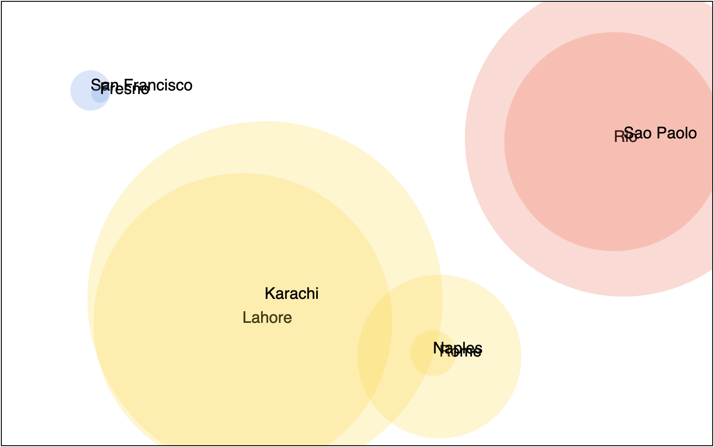
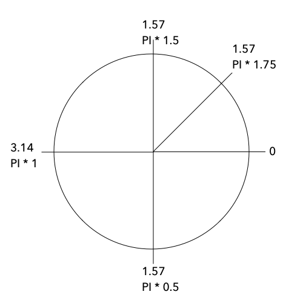
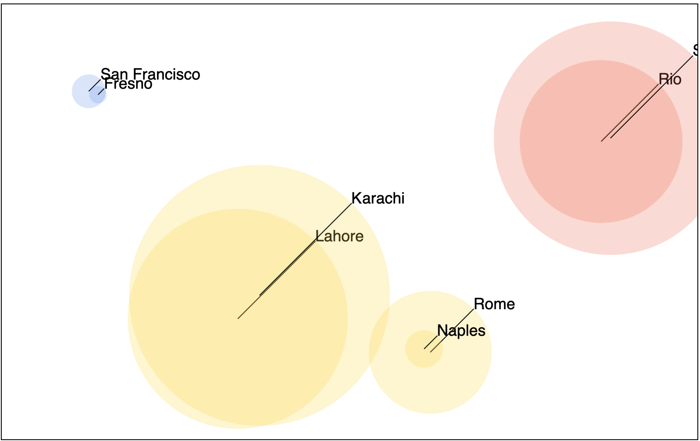
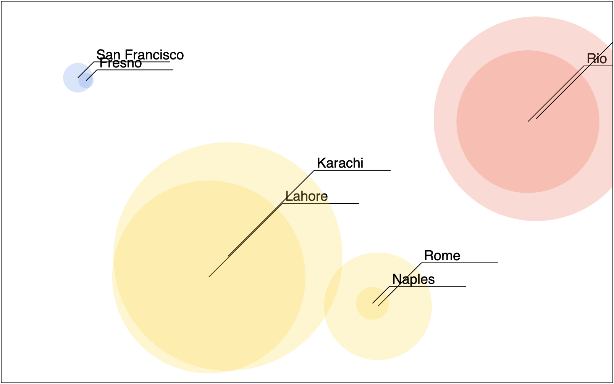
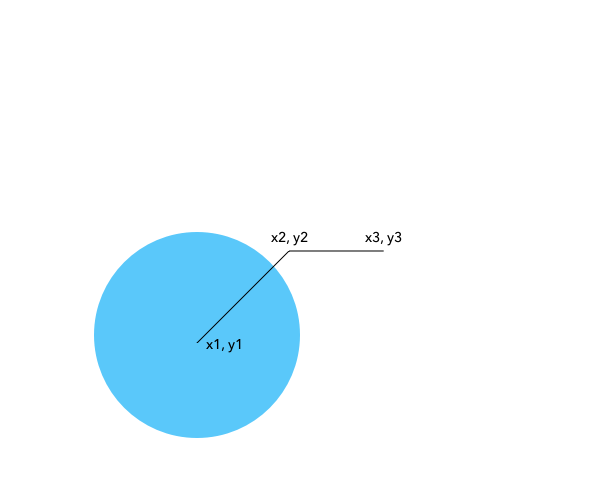

# Groups

The group is an SVG element that allows you to group other elements. 

A group is a tag like `<circle>` and `<ellipse>`. The group tag looks like this: `<g>`. 

What is a group used for? Grouping other elements together! A group is a container element. That is doesn't display anything itself but displays all of its children. 

You can apply properties to the group and all children will inherit those properties. 

https://developer.mozilla.org/en-US/docs/Web/SVG/Element/g

## text element

The `<text>` element draws text inside an SVG element/document. The text has its attributes different from circles and ellipses.

- `x` - x position of the element
- `y` - y position of the element

Text can be styled with CSS styles! This means you can style it in same way you styled HTML elements with D3 earlier: `.style('property', 'value')`. 

https://developer.mozilla.org/en-US/docs/Web/SVG/Element/text

## Put groups, circles, and text together

For complex drawings, you will want to create more than one element for each data value. It will also be advantageous to group related elements under a parent element. You will do both of these things in this step.

The goal is to have D3 structure out svg like this: 

```HTML
<svg>
  <g>
    <circle></circle>
    <text></text>
  </g>
  <g>
    <circle></circle>
    <text></text>
  </g>
  ...
</svg>
```

To do this we are going to rewrie some of the D3 code we used previously. Start with this: 

```JS
const node = d3.select('#svg')
  .style('border', '1px solid')
  .selectAll('g') // Select all groups
  .data(data)
  .enter()
  // Do not chain any more methods here!
```

Notice here we are storing the value returned from `d3.select()`. 

You're performing a `.selectAll('g')` on the group (`<g>` tag.)

After entering we aren't chaining any of the other d3 methods!

The idea is that we have a D3 object that references the `#svg` node. You can now use this node for each new element you want to create. 

Remember the node wants to select `g` groups. So make some groups: 

```JS
// Append some groups
const groups = node
  .append('g')
```

Here you appended a group element for each piece of data.

This time we're saving the reference to those groups in the variable `groups`. 

Add a circle to each group: 

```JS
// For each of those groups 
// add a circle
groups
  .append('circle')
  .attr('cx', d => xScale(d.x))
  .attr('cy', d => yScale(d.y))
  .attr('r', d => popScale(d.population))
  .attr('fill', `red`)
  .attr('opacity', 0.25)
  .attr('fill', d => countryScale(d.country))
```

Here we added a circle element to the groups. This should next one circle inside of each group. 

Along the way you can use all of the attributes, you used in the previous example for these circles. 

Now add a text element to each group. Use `groups` to append a `text` element. 

```JS
groups
  .append('text')
  .text(d => d.label) // set the text
  .attr('x', d => xScale(d.x))
  .attr('y', d => yScale(d.y))
  .style('font-family', 'Helvetica')
  .style('font-size', '18px')
```

Here there are some new ideas. First, we set the text of the text element with `.text()`. This texts the text that is displayed. 

Next, we use the `x` and `y` attributes to position the text. Here I used the same scales and values used for positioning the circles this should place the text in the center of the circle. 

Next, I used the `.style()` method and some CSS properties to style the text. 



**Challenge** 

Move the text to the edge of the circles. To do this you can offset the x by the radius of the circle. 

Hint! The population scale will give you the radius of the circle! 


**Challenge**

That looks good but it might look better if moved the text around the radius of the circle. Right now the text is at about 3 o'clock. Imagine you need to move the text to about 1:30 or 4:30. 

You can use sine and cosine to do this. The circle is divided into radians. Here is a rough map:



Try and put the text at about π * 1.75. To do this calculate the offset using sine for x and cosine for y. You'll be adding these to the x and y values you already have! 

```JS
// calculate x
x + Math.cos(Math.PI * 1.75) * radius
// calculate y
Math.sin(Math.PI * 1.75) * radius
```

You'll need to get the radius from the population scale!

The solution to this problem is presented below if you get stuck you can peek at it in the next section. 

## Draw a line 

SVG is all about drawing things! Besides circles, ellipses, and text it can also draw lines. A line is just a single line segment. Imagine a straight line between two points. 

If you need to draw a multi-segment line or a curved line you'll have to use the `path` or `polygon` elements. 

For now, let's draw a line from the center of the circle out to the text. 

The SVG `line` element has four important attributes: 

- `x1` - x position of the start off of the line
- `y1` - y position of the start of the line
- `x2` - x position for the end of the line
- `y2` - y position of the end of the line

https://developer.mozilla.org/en-US/docs/Web/SVG/Element/line

Add a line element to each group that extends from the center of the circle to text at the edge of the circle. 

Start by appending lines. 

```JS
// calculate the angle
const angle = Math.PI * 1.75
// append some lines
groups
  .append('line')
  .attr('x1', d => xScale(d.x))
  .attr('y1', d => yScale(d.y))
  .attr('x2', d => xScale(d.x) + (Math.cos(angle) * popScale(d.population)))
  .attr('y2', d => yScale(d.y) + (Math.sin(angle) * popScale(d.population)))
  .attr('stroke', '#000')
```

First, append a line element. 

Next, set x1 and y1 to the position calculated with x and the x scale function. This should place the starting position of the line at the center. 

Now calculate x2 and y2 using some math! Here is the x2 calculation. 

```JS
.attr('x2', d => xScale(d.x) + (Math.cos(angle) * popScale(d.population)))
```

Here we get the center x value and add the cosine of the angle and multiply by the radius of the circle. You could look at it like this: 

```JS
x + (Math.cos(angle) + radius)
```



**Challenge**

This looks good but the text and line go right to the edge of the circle. It might look better if the text and line went a little past the edge of the circle. 

To solve the problem you need to add an amount to the radius value so the number is a little larger than the radius of the circle. In short form it would look like this:

```JS
x + (Math.cos(angle) + (radius + 10))
```

In the picture below I added 10 to the radius for the line and 15 to the radius for the text.


## Draw a Path

A path is another SVG element. A path represents a line that can have any number of points. A path can have straight or curved segments it can also have a fill. 

The path element works a little differently from other elements. Let's look at what the path looks like in raw SVG form: 

```SVG
<path d="M 10,30
  A 20,20 0,0,1 50,30
  A 20,20 0,0,1 90,30
  Q 90,60 50,90
  Q 10,60 10,30 z"/>
```

This is a picture of a heart ♡. Hard to tell I know. A path element has a `d` attribute that contains a series of number pairs that represent an x and y position. Sometimes there will be a letter. This is a modifier that describes what type of point something is or how to get to that point. M is a move to, A is an arc, Q is a quadratic curve, Z means to close the path. Seriously.

https://developer.mozilla.org/en-US/docs/Web/SVG/Element/path

I know that sounds pretty complicated. We do not want to write this type of code by hand. Luckily D3 has a helper method for us! 

In the next step, you will draw a simple line. The line will have two straight segments. The first segment will go out from the center to text, essentially the thing you did in the last example, and the next segment will draw a line under the text. 

Here's a picture: 



Here's another picture showing the math. Look closely at this because it may be less complicated than you think. 



If x1 and y1 are the centers you can get these numbers the same as before. x2 and y2 are also the same as the last example. x3 and y3 are the new values. Notice that y3 is the same as y2. x3 is x2 plus the length of your line segment. Make things easy and call this 100. 

Now let's do it! 

```JS
groups
  .append('path')
  .attr('d', d => {
    const x1 = xScale(d.x)
    const y1 = yScale(d.y)
    const x2 = xScale(d.x) + (Math.cos(angle) * (popScale(d.population) + 10))
    const y2 = yScale(d.y) + (Math.sin(angle) * (popScale(d.population) + 10))
    const x3 = x2 + 100
    const y3 = y2
    return d3.line()([[x1, y1], [x2, y2], [x3, y3]])
  })
  .attr('stroke', '#000')
  .attr('fill', 'none')
```

Here you appended some `path` elements to the groups. 

The set the `d` attribute. This is a long one since we have to calculate the 6 numbers. 

Look at the last line: `return d3.line()([[x1, y1], [x2, y2], [x3, y3]])`. This line is using D3's `line()` function to generate the funky value required for `d`. 

Notice `d3.line()` returns a function! You are calling this function and passing to it an array of arrays. Each sub-array contains an x and y value. The value returned from this function we return.
