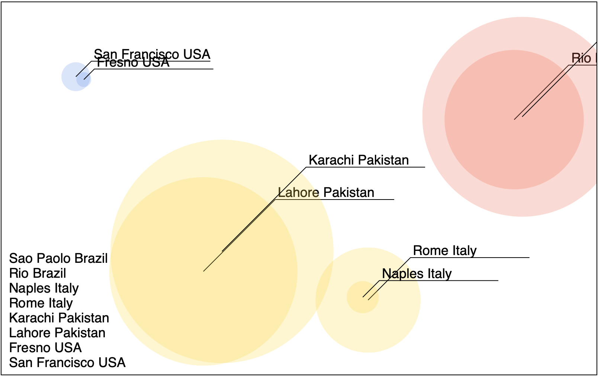

# Challenges

Try these challenges to test your D3 skills. You should be able to solve these challenges using the ideas from the previous tutorial pages. 

**Challenge**

Add some more cities to cities.csv. Be sure to format these carefully! Each record should be a new row, don't add any extra spaces. All the values must be in the same order as they are listed on the first line. Each value is separated by a comma. 

Add your favorite cities. Hometown, places you've visited. Look up the geo-coordinates and population.

test your work. Adding new cities should generate a new circle, paths, and text. 

**Challenge**

Add the country name after the city name in the text element. With this change each name should read something like: 

- Fresno USA

**Challenge**

Might be nice if we had a legend listing all of the cities. Imagine the legend shows all of the cities and countries on the lower left. See the image: 



To do this you can can create new text elements. So far your code is roughly like this: 

```JS
// Creates the SVG node
const node = d3.select('#svg')
  .style('border', '1px solid')
  .selectAll('g') 
  .data(data)
  .enter()

 // Creates a groups node
 const groups = node
  .append('g')

 // Add some circles to each group
 groups
  .append('circle')
  ...

 // Add text to each group
 groups
  .append('text')
  ...

 // Add a path to each group
 groups
  .append('path')
  ...
```

Compare this carefully to your work. 

You can create a new text node for each city on the main SVG element with: 

```JS
node
  .append('text')
  ... 
  // set attributes for this new node here...
```

You need to set the x and y properties to position your text elements in the SVG viewport!

Starting with `node` D3 should create a new element for each data value on the SVG element. 

Notice above this we used `groups` which created a new element in each of the groups that were created when the groups were created on the SVG node!


