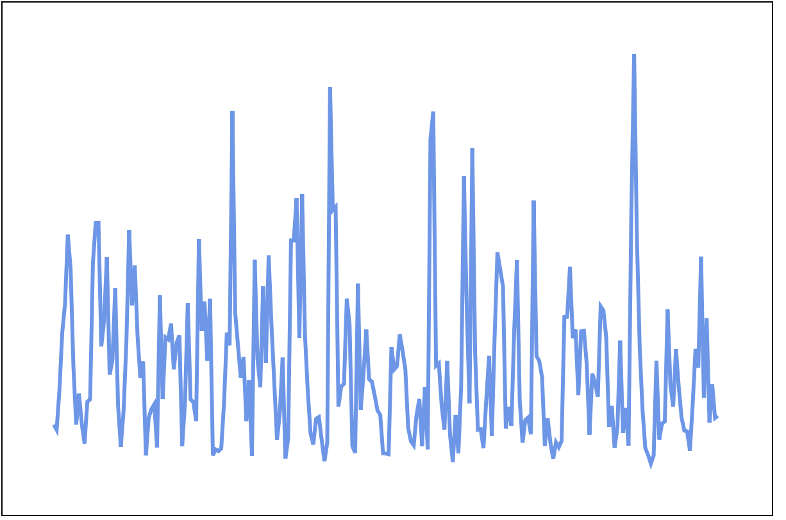

# Paths

The last example used paths. Let's take another look at paths because there is a lot you can do with these. Often we draw data in the form of line graphs you can use a path to do this. 

For this example, you will use the `precipitation.csv`. This file contains rainfall amounts for the years 1998 to 2017. The data is for a month by state. 

## Setup

Start a new HTML document. 

```HTML
<!DOCTYPE html>
<html>
  <head>
  <title>Using Paths</title>
  </head>
  <body>

  <svg id="svg" width="600" height="400"></svg>

  <script src="https://d3js.org/d3.v7.min.js"></script>
  <script>
  // Your code here
  </script>
  </body>
</html>
```

Let put the chart in the center of the screen. You can apply styles to your SVG element.

Add these styles to the head of the document. 

```HTML
<style>
  /* Put the box in the center of the page */
  body, html {
    height: 100%;
    display: flex;
    justify-content: center;
    align-items: center;
  }

  #svg {
    border: 1px solid;
  }
</style>
```

Doesn't look like much yet. You should see a box with a black border in the center of the page. 

Copy the `precipitation.csv` file into the folder where you are working. 

## Loading data

In this step, you'll load the data. Try it on your own. 

In the previous example, we loaded the data with the d3 CSV loader and all of our code was in an anonymous function. This time let's use a named function. 

Our setup will look like this: 

```JS 
d3.csv('precipitation.csv')
  .then(handleData)

function handleData(data) {
  // draw stuff here
}
```

It might even make more sense to arrange it like this: 

```JS 
function handleData(data) {
  // draw stuff here
}

d3.csv('precipitation.csv')
  .then(handleData)
```

After D3 loads the CSV data we will handle it with the `handle data()` function. 

## Filtering the data

The precipitation data is almost 6000 lines long. That would be a lot to process and display. Since the data is arranged by state, month and year we can choose a more reasonable selection of the data to display. 

For example, we can display just precipitation for only a single state, or a single year for all states. Or any other selection you can think of. 

Let's try by state. To start we need a function to filter the data by state. 

Add this function: 

```JS
function getDataForState(data, state) {
  const arr = data
    .filter(d => d.state === state)
    .filter(d => !isNaN(d.precipitation))
    .map(d => {
      d.precipitation = parseFloat(d.precipitation)
      return d
    })
  return arr
}
```

This data takes an array and a state string. 

NOTE! The state string here is not the typical state abbreviations you may be used to for example: "BA" is a state on this list! 

It filters all of the data returning only the objects where `d.state === state`. 

There may be some missing data it next filters out any records that may be missing precipitation data. 

Last it maps all of the values and converts them to floats. The data from the CSV will be strings. This step will avoid math issues. 

You can test it like this: 

```JS
function handleData(data) {
  // draw stuff here
  console.log(getDataForState(data, 'SE'))
}
```

This should provide a list of 239 floating-point numbers that represent rainfall in inches for each month. 

Some of the state codes you can use are: 

BA, RR, SE, AL, TO, GO, PI, MG, PR, MA, AP, RJ, AC, AM, DF, PE, CE, PA, MT, PB, RS, RN, SP, ES, SC

Not sure where these codes came from. It's just what's there. 

With this helper function in place, we can move forward by displaying some data! 

## Making Scales 

To map the precipitation data onto the screen we need to create some scales. What we're doing is creating some helper functions that will map the source data from their domain of inches to our display domain measured in pixels. 

Everything from here is going to happen inside the `handleData()` function. 

Get the precipitation data for `BA` (I'm not sure what state this is)

```JS
function handleData(data) {
  const baData = getDataForState(data, 'BA')

}
```

Now create an x scale for that data. This needs to divide the number of values over the width of the SVG viewport. In this case, we can just input the numbers.

```JS
function handleData(data) {
  const baData = getDataForState(data, 'BA')
  // x scale 
  const xscale = d3.scaleLinear()
    .domain([0, baData.length]) // number of values
    .range([0, 600]) // width of #svg
}
```

This scale should spread the values horizontally based on their index. 

Now we need a y scale. This needs to map the rainfall value in inches to the height of our SVG viewport in pixels. 

Try it on your own. Use the `d3.extents()` method to get the extent of the precipitation from your `baData`. Then make a scale that maps this to the height of the screen.

```JS
const percipitationExtents = d3.extent(baData, d => d.precipitation)
const yscale = d3.scaleLinear()
  .domain(percipitationExtents)
  .range([0, 400])
```

## Line Generator

Time to make a line generator. If you recall from the previous tutorial we used `d3.line()` to generate the data needed to draw a path. In that example, there were only a few points. This time we have 239 points! We will need a better solution. 

Create a line generator function! 

Let's review how the SVG path works again. The code below generates a heart-shaped path.

```SVG
<path d="M 10,30
  A 20,20 0,0,1 50,30
  A 20,20 0,0,1 90,30
  Q 90,60 50,90
  Q 10,60 10,30 z"/>
```

A path element has a `d` attribute that contains a series of number pairs that represent an x and y position. Sometimes there will be a letter. This is a modifier that describes what type of point something is or how to get to that point. M is a move to, A is an arc, Q is a quadratic curve, Z means to close the path. In the case of the quadratic curve, there are two pairs of points. The second part determines the curvature of the line. 

This would be difficult to do by hand. Luckily D3 has features built into the `d3.line()` method that makes making this type of path description easier.

`d3.line()` provides the following methods:

- `x()` - sets the x position of a point on the line
- `y()` - sets the y position of a point on the line
- `curve()` - determines what type of curve is used for this line segment

Define a line generator below your scales: 

```JS
// line generator
const linegen = d3.line()
  .x((d, i) => xscale(i))
  .y(d => yscale(d.precipitation))
  .curve(d3.curveLinear)
```

Notice that our line will define the x function using the index and the `xScale()` function, and the y function using the precipitation value and the `yScale()` function. For the curve, we are using `d3.curveLinear` which tells D3 that we want straight lines between segments. 

## Drawing the line

Now it's time to make an SVG drawing. The code here is a little different from the code we saw earlier.

```JS
d3.select('#svg')
  .append('path')
  .attr('d', linegen(baData))
  .attr('stroke-width', 3)
  .attr('stroke', 'cornflowerblue')
  .attr('fill', 'none')
```

What happened here? 

First, we selected the SVG element.

Next, we appended a path. In this case, there will only be a single path. Our data will be expressed as points on the path. 

NOTE! Since we aren't making a new element for each piece of data we didn't set `.data()` and we didn't call `.enter()`! Here we are only making a single path. 

Next, we set the `d` attribute for the path. To get the path data we use the `linegen()` function we created earlier and pass our dataset in. This function returns a value that expresses the line. 

The next three lines set the style of the line, including the stroke-width, stroke (color), and fill style. 

It should look something like this so far: 


This is pretty good but the data is going all the way to the edges of the SVG viewport. In some cases, you might want this. Sometimes you might want a little margin. You may even want to limit the vertical height for other reasons. 

Try adjusting the x and y scales to position and fit the drawing in the window a little better. 

To do this you're going to adjust the range of the scale rather NOT the domain! 

Move the left and right in by adjusting the range of the `xscale`:

```JS
const xscale = d3.scaleLinear()
  .domain([0, baData.length])
  .range([40, 560]) // Change the range!
```

Notice the edges move inward. Our minimum x is now 40 and the maximum is 560. 

Do the same to the `yscale`:

```JS
const yscale = d3.scaleLinear()
  .domain(percipitationExtents)
  .range([40, 360]) // Change the range!
```

Now the top comes down 40 and moves up 40 from the bottom. 

I just realized our rainfall values are expressed upside down! 😱 

The lowest values for rainfall are at the top of the graph and high numbers are at the bottom! 

Fix it by inverting the range: 

```JS
.range([360, 40])
```

Your graph should look something like this: 



