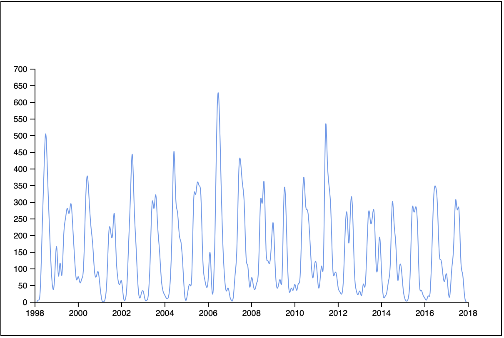

## Drawing an Axis

This next section will continue from the precipitation graph in [07-Paths](../07-Paths).

The current graph is looking good but it would be hard for people to intuit what we were expressing with this image. 

Which asks the question: What is this image expressing?


Time is running left to right on the horizontal axis. What is the time? The graph shows 1998 to 2017. 

The vertical axis of the graph is showing how much rain fell each month. 

There should be a month for each peak but it's hard to tell where 2005 might be? Or any other month or year. 

The higher peaks show more rainfall but I can't tell how many inches of rainfall that represents?

Some labels on the horizontal and vertical axis of the graph would help!

What if our graph looked like this: 



An axis is a series of labels that run along the horizontal and vertical axis of the graph. If you're thinking D3 has a tool to generate an axis you would be correct! 

## Setting size and margins

In the last example, we set the size by using hard numbers. This works but will create a lot of work for us if we need to change the size of our graph. 

Our SVG viewport is 600 by 400 pixels and moved the graph inside these dimensions by 40 pixels on each side. 


The image above shows the size of the SVG viewport with the dotted line showing the area where the graph/line/path is drawn. 

A better approach is to add some variables for these values.

Add some constants to the top of your code: 

```JS
function handleData(data) {
  const width = 600
  const height = 400
  const margin = 40
  // draw stuff here
  ...
```

We will use these numbers later in the code to determine the size and position of the elements we draw.

## Time Scale

The horizontal axis in the previous example used a linear scale: `d3.scaleLinear()`, with a range of 40 to 560. D3 provides `d3.scaleTime()` to convert a domain of dates into a range. 

### Parsing dates

For this, to work we need to provide D3 with date objects. Currently, our data has dates in string format. 

```
30/11/2016
```

That's `day/month/year`. This must be European? Maybe that's why the state codes are weird? 

Luckily D3 has `d3.timeParse()` a function we can use to format a string into a date object. 

Add the following above your scales:

```JS
// Dates are formatted: 30/11/2017
const parseTime = d3.timeParse('%d/%m/%Y')
// parse the dates for d3
baData.forEach(d => d.date = parseTime(d.date))
```

You provide a formatting string when you create your `parseTime` function. The characters `%d` represent the day, `%m` represent the month, and `%y` the year. This matches the situation in our date strings.

The second line loops over all of the objects in our data and replaces the existing date string with a date object.

### d3.scaleTime()

Now we can use a time scale for the xscale. Replace the existing xscale with: 

```JS
// Find the extents of the dates
const dateExtent = d3.extent(baData, d => d.date)
// x scale 
const xscale = d3.scaleTime() // Make a time scale!
  .domain(dateExtent)
  .range([margin, width - margin]) // Use the width and margin!
  .nice() // Rounds the scale "nicely"
```

This should look the same as before. The difference here is we're using dates to scale the x-axis and we have some variables to calculate the width and margin. 

### Adjust the yscale

Use your variables on the yscale. 

```JS
const yscale = d3.scaleLinear()
  .domain(percipitationExtents)
  .range([height - margin, margin])
```

### LineGen with dates 

Since we used the date to set the x scale we need to calculate the x position for each point on the line using dates. 

Adjust the `linegen` function. 

```JS
// line generator
const linegen = d3.line()
  .x(d => xscale(d.date)) // Use date here! 
  .y(d => yscale(d.precipitation))
  .curve(d3.curveLinear)
```

## Drawing the axis

To draw the axis we need to consider the structure of our SVG document. 

Currently the document is structured like this:

```SVG
<svg>
  <path d="..."></path>
</svg>
```

You can check this by inspecting the elements in the browser. 

The code that generates that is: 

```JS
const svg = d3
  .select('#svg')
  .append('path')
  ...
```

Here you selected the `#svg` element and then appended a `path`. 

We want to add some more elements. The new elements will draw the axis showing dates along the bottom, and inches of ranfall along the left. For this to be possible you need to create an SVG structured like this: 

```SVG
<svg>
  <g><path d="..."></path></g>
  <g>...</g><!-- date axis-->
  <g>...</g><!-- rainfall axis-->
</svg>
```

You want three groups!

In the next step, you will be rearranging the existing code and adding some new code. 

Start by selecting the SVG and storing it in a variable. 

```JS
// Draw something on our svg
const svg = d3
  .select('#svg')
  // ends here nothing after .select()!
```

Make a group for the graph/path:

```JS
// Make a group for the graph
const graph = svg
  .append('g')
 
// Use the group to append the path and generate a line.
graph
  .append('path')
  .attr('d', linegen(baData))
  .attr('stroke-width', 1)
  .attr('stroke', 'cornflowerblue')
  .attr('fill', 'none')
```

### Generating an axis

Now we generate and axis! Luckily D3 has us covered with `d3.axisBottom()` and `d3.axisLeft()`. 

Add the following: 

```JS
// This makes generator.
const bottomAxis = d3.axisBottom(xscale)
const leftAxis = d3.axisLeft(yscale)
```

Notice you are providing the xscale for the horizontal axis and yscale for the vertical axis. The scales are used to generate the axis! 

Now append a group to the SVG and add generate the bottom axis. 

```JS
// Append a group and add the bottom axis 
svg
  .append('g')
  // Position the group
  .attr('transform', `translate(0, ${height - margin})`)
  // generate the axis in the group
  .call(bottomAxis)
```

Note! Group does not have `x` or `y` attributes but you can use transform translate. This is works the same as CSS! 

Notice you used the `height` and `margin` variables here! 

The last line uses the `call()` method to call the provided function. 

Now make the left axis. 

Add the following:

```JS
// Append the group and add the left axis
svg
  .append('g')
  .attr('transform', `translate(${margin}, 0)`)
  .call(leftAxis)
```

At this point you should have something like this: 


## Complete solution for reference

```JS
function getDataForState(data, state) {
  const arr = data
    .filter(d => d.state === state)
    .filter(d => !isNaN(d.precipitation))
    .map(d => {
      d.precipitation = parseFloat(d.precipitation)
      return d
    })
  return arr
}

function handleData(data) {
  const width = 600
  const height = 400
  const margin = 40
  // draw stuff here
 
  const baData = getDataForState(data, 'BA')

  // Parse the dates in the data
  // Dates are formatted: 30/11/2017
  const parseTime = d3.timeParse('%d/%m/%Y')
  // parse the dates for d3
  baData.forEach(d => d.date = parseTime(d.date))
  console.log(baData)

  // x scale 
  const dateExtent = d3.extent(baData, d => d.date)
  const xscale = d3
    .scaleTime()
    .domain(dateExtent)
    .range([margin, width - margin])
    .nice()

  // y scale 
  // d3.extent(caData, d => d.precipitation)
  const percipitationExtents = d3.extent(baData, d => d.precipitation)

  const yscale = d3.scaleLinear()
    .domain(percipitationExtents)
    .range([height - margin, margin])

  // line generator
  const linegen = d3.line()
    .x(d => xscale(d.date))
    .y(d => yscale(d.precipitation))
    .curve(d3.curveLinear)

  // Draw something on our svg
  const svg = d3
    .select('#svg')

  // Make a group for the graph
  const graph = svg
    .append('g')

  graph
    .append('path')
    .attr('d', linegen(baData))
    .attr('stroke-width', 1)
    .attr('stroke', 'cornflowerblue')
    .attr('fill', 'none')
 
  // This makes generator.
  const bottomAxis = d3.axisBottom(xscale)
  const leftAxis = d3.axisLeft(yscale)

  svg
    .append('g')
    // Position the group
    .attr('transform', `translate(0, ${height - margin})`)
    // generate the axis in the group
    .call(bottomAxis)

  // Append the group, transform, and add the axis
  svg
    .append('g')
    .attr('transform', `translate(${margin}, 0)`)
    .call(leftAxis)
}

d3.csv('precipitation.csv')
  .then(handleData)
```

