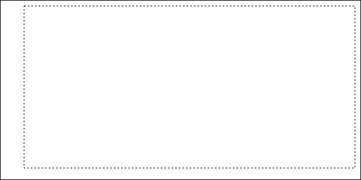
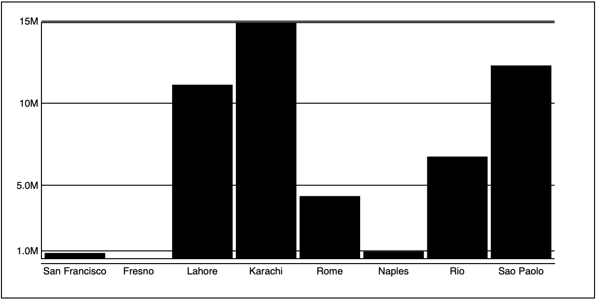

# Bars 

In this section let's review what we've covered so far and create a bar graph.

bar graphs/charts are common and a good way to show relative values and progression. Read about bar charts here: https://datavizcatalogue.com/methods/bar_chart.html

This will give you a chance to practice everything we covered so far. 

## Getting started

**Challenge** 

Set up your starting HTML document. Add the following: 

- An SVG element to display the chart
- Script to load the D3.js lib from the CDN
- A script tag where your code will be written. 

I set the size of my SVG to 600 by 300. You can use any size but you may have to adjust some numbers in the example code. 

**Challenge**

For this example, we will use the `cities.csv` dataset. 

In your script load this dataset using your favorite method. 

## Drawing Bars

At this point, you should have your data loaded. The data should be an array of cities with names, populations, and countries. It should look something like this: 

```JS
[
  {name: "San Francisco", population: "874961", country: "USA", x: "122", y: "-37"}
  {name: "Fresno", population: "525010", country: "USA", x: "119", y: "-36"}
  {name: "Lahore", population: "11126285", country: "Pakistan", x: "74", y: "31"}
  {name: "Karachi", population: "14910352", country: "Pakistan", x: "67", y: "24"}
  {name: "Rome", population: "4342212", country: "Italy", x: "12", y: "41"}
  {name: "Naples", population: "967069", country: "Italy", x: "14", y: "40"}
  {name: "Rio", population: "6748000", country: "Brazil", x: "-43", y: "-22"}
  {name: "Sao Paolo", population: "12300000", country: "Brazil", x: "-46", y: "-23"}
]
```

### Defining the size of the chart

We will need to put a few things in place and make some decisions on how things will be displayed. 

You will need a couple of scales to convert population values into pixels. 

You will also need a horizontal and vertical axis. 

I set variables for `width`, `height`, and `margin`. This time I want to be able to adjust the top, right, bottom, and left margins independently. I used an object for `margin` and set a property for of these. 

This is the code started with:

```JS
async function handleData() {
  const data = await d3.csv('cities.csv')
  console.log(data)
  const margin = { top: 10, right: 10, bottom: 20, left: 40 }
  const width = 600 - (margin.left + margin.right)
  const height = 300 - (margin.top + margin.bottom)
}

handleData()
```

Notice that I calculated the `width` and `height` using margin values. Imagine the width and height describe the dotted line in this image. 



### Making the scales 

We need a scale for the xscale. For this example, we are going to use `d3.scaleBand()`. use `scaleBand()` for evenly spaced data. In a bar graph, each takes up the same horizontal width. 



```JS
// x scale 
const xscale = d3.scaleBand()
  .domain(data.map(d => d.label))
  .range([margin.left, width + margin.left])
  .padding(0.05)
```

Notice you used a list of the city names as the domain: `['San Francisco', 'Fresno', 'Lahore', ...]`.

The range maps these bands into the viewport. Starting at `margin.left` going to the `width + margin.left`.

Last you set the padding. This determines the spaces between bands.

Now make the y scale. This determines the height of the bars and will be based on the population. 

```JS
// y scale 
const popExtent = d3.extent(data, d => d.population)
const yscale = d3.scaleLinear()
  .domain(popExtent)
  .range([height, margin.top])
```

On the first line, you found the extent of the population. 

On the last line, we set the range. This is the `height` at the minimum and `margin.top` at the maximum. This might seem backward but the bars will draw from the top down so it will work. 

### Drawing the chart

Select the SVG element and save it to a variable. This will be the root node of the graph. Having the root node in a variable makes it easy to add other nodes later. 

```JS
// Select the SVG
const svg = d3.select('#svg')
```

Make a group to hold the bars.

```JS
const barGroup = svg.append('g')
```

Now make the bars. 

```JS
// Make the bars
barGroup 
  .selectAll('rect')
  .data(data)
  .enter()
  .append('rect')
  .attr('class', 'bar')
  .attr('x', (d, i) => xscale(d.label))
  .attr('y', d => yscale(d.population))
  .attr('width', xscale.bandwidth())
  .attr('height', d => height - yscale(d.population))
```

Here you selected all `rect`s. You added your city data, entered the data, and appended `rect`s for each data element.

Next, you added a class name to each bar. This could be useful later. SVG elements can be styled with some CSS styles. 

Set the x of each bar using the `xscale()` and the label. Remember the scale is a band and we used a list of labels as the domain. So here we pass the label as an argument to identify the band. 

The `y` attribute is set using the `yscale()`. Here you pass the population as an argument. 

The width of each `rect` is set as the `bandwidth()`. This is a method of `scaleBand` that calculates the width based on the range and the padding. 

Last you set the height based on the population. Rectangles are sized from the upper left corner. So we take the height and subtract the `yscale()`.

At this point your chart should look like this: 


Poor Fresno is so small it doesn't even register! 

**Challenge**

Try changing the padding where you defined xscale. This should change the space between bars. 

Try setting other properties on the bars like the fill. This should change the color of the rectangles. 

**Stretch Challenge** 

Make a color scale and use it to give each bar a different color. 

## Draw the axis

We need some labels. Know one will know what this chart is talking about without labels. 

### Add a bottom axis

First, define a new bottom axis generator. 

Add the following:

```js 
const bottomAxis = d3.axisBottom(xscale)
```

Here you defined the axis generator and used the `xscale` to configure it.

Now display the axis. 

Add a new group to the `svg` element, then add the axis to the group: 

```JS
svg
  .append('g')
  .attr('transform', `translate(${0}, ${height})`)
  .call(bottomAxis)
```

Here you happened a group and then translated the group. Since the axis uses the scale it will draw using the range of the scale. This means the x transform is 0. For the y transform, we move the scale to the height of the chart. 

The last line uses `.call()` to "call" the axis generator function which generates the axis elements. 

It should look like this so far: 


## Adding the left axis

Generate your left axis with the y scale. 

Create the left axis generator. Add the following: 

```JS
const leftAxis = d3.axisLeft(yscale)
```

Now create a new group and generate the axis. Add this: 

```JS
svg
  .append('g')
  .attr('transform', `translate(${margin.left}, 0)`)
  .call(leftAxis)
```

The first line appends a new group. The second line transforms the group. Since the group is using the `yscale` its y transform is 0. The x transform is `margin.left` which should be put at the left of the chart. 

So far it should look like this: 


This looks pretty good but numbers go off the left side. You can fix this in a couple of ways. Test out the ideas below. 

Change the margin. Adjust the `margin.left` at the top of your code block. Try changing `margin.left` to `70`. 

Another way to fix the problem might be to change the number format. It might help clarify the information also. Since all those zeros are hard to read. 

```JS
const leftAxis = d3.axisLeft(yscale)
  .tickFormat(d3.format('.2s')) // Format the axis
```

Here we format to 2 digits with a single decimal. The numbers now read in millions. 

Read more about formatting here: http://bl.ocks.org/zanarmstrong/05c1e95bf7aa16c4768e

Maybe we want more ticks along the axis. Try this: 

```JS
const leftAxis = d3.axisLeft(yscale)
  .tickFormat(d3.format('.2s'))
  .ticks(12) // Set the number of ticks
```

Now we get 12 ticks. D3 seems to round this depending on the range. Try a few different values and see what happens. 

You can also control the width of the ticks. These are the little lines along the axis. 

```JS
const leftAxis = d3.axisLeft(yscale)
  .tickFormat(d3.format('.2s'))
  .ticks(12)
  .tickSize(-width) // Set the width of the ticks
```

Oh San Francisco you're soo small! 

You can also customize the values displayed on the axis. Try this: 

```JS
const leftAxis = d3.axisLeft(yscale)
  .tickFormat(d3.format('.2s'))
  .ticks(12)
  .tickSize(-width) 
  // Set the values displayed
  .tickValues([1000000, 5000000, 10000000, 15000000])
```

Notice this conflicts with the number of ticks. 

