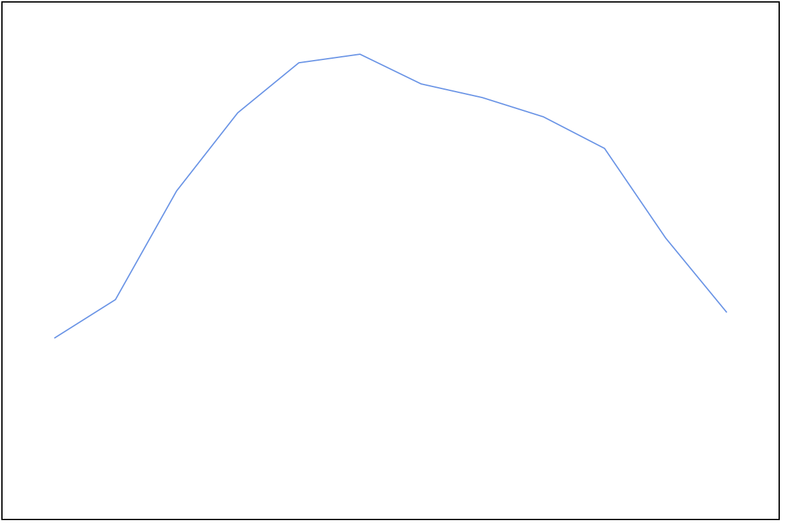
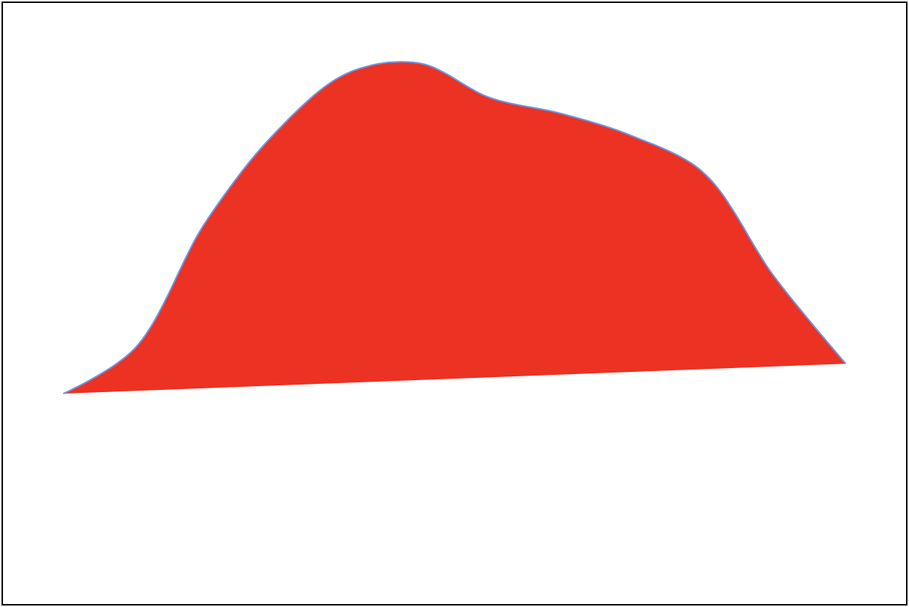
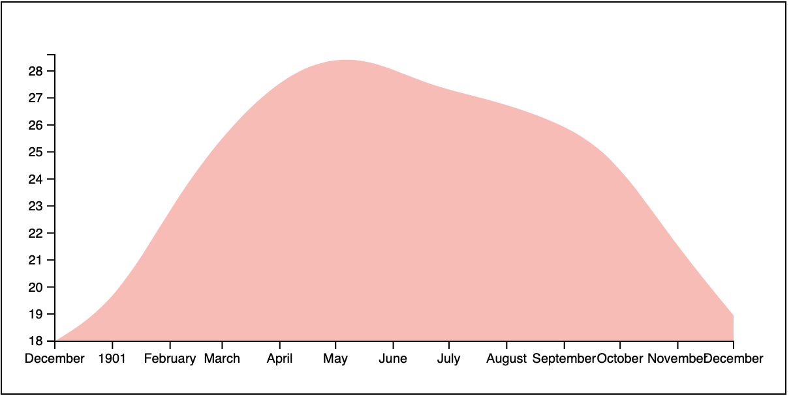
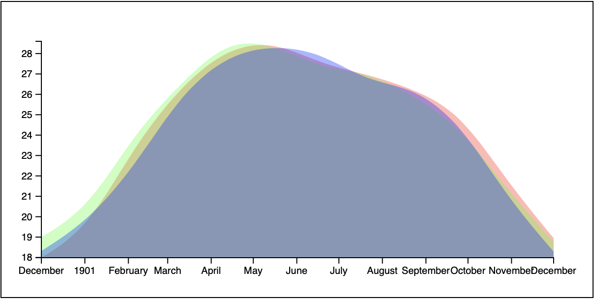

# Areas

In this section, we will make a new graph and follow all of the steps we used in the previous graph for review and make a few changes along the way. 

## The Data

The dataset for this example will be the `Weather Data in India from 1901 to 2017.csv`. This dataset contains the mean temperature for each month of the years for the years 1901 to 2017. 

The data came from Kaggle here: https://www.kaggle.com/mahendran1/weather-data-in-india-from-1901-to-2017

Here is a look at the data: 

```CSV
,YEAR,JAN,FEB,MAR,APR,MAY,JUN,JUL,AUG,SEP,OCT,NOV,DEC
0,1901,17.99,19.43,23.49,26.41,28.28,28.6,27.49,26.98,26.26,25.08,21.73,18.95
1,1902,19.0,20.39,24.1,26.54,28.68,28.44,27.29,27.05,25.95,24.37,21.33,18.78
2,1903,18.32,19.79,22.46,26.03,27.93,28.41,28.04,26.63,26.34,24.57,20.96,18.29
...
```

It's the year and each month. The first column is unlabeled and appears to have a row number. 

There are a few ways we can look at this data. 

1. All months and all years. This would be a lot of information but might show a trend over time. 
2. All months for a single year. This would be twelve numbers. It might show the change in temperature over a year. 
3. One month for all years. For example Jan 1901, Jan 1902, Jan 1903, etc. This could show a trend of temperature changes over time. 

## Getting started

- Setup an HTML document 
- Add an SVG element
- Import the D3 library
- Add a script tag for your scripts

Do this from memory if you can. Or refer to the other tutorial projects. 

Add the following script. Here we take the idea from the last examples but this time we'll use `async` and `await`. 

```JS
async function handleData() {
  const data = await d3.csv('Weather Data in India from 1901 to 2017.csv')
  console.log(data)
  // draw things here later...
}

handleData()
```

Note! `handleData()` in this example is `async`. That means we can `await` any promise to resolve inside this function. `d3.csv()` returns a promise. So we use `await` on line 2.

Using the console to see the data we get: 

```JS
[
  {: "0", YEAR: "1901", JAN: "17.99", FEB: "19.43", MAR: "23.49", ...}
  {: "1", YEAR: "1902", JAN: "19.0", FEB: "20.39", MAR: "24.1", ...}
  {: "2", YEAR: "1903", JAN: "18.32", FEB: "19.79", MAR: "22.46", ...}
  ...
]
```

Each element of the array is an object. Depending on what we want to show we may have to take one row here and turn it into an array of objects. 

We should have a helper function to do that. 

**Challenge**

Write a function that takes an object with the `MON:TEMP` and turn it into an array of objects with properties `month` and `temp`. While you're at it convert those temperature strings to numbers. For example: 

```JS
// Turn this into 
const obj = {: "0", YEAR: "1901", JAN: "17.99", FEB: "19.43", MAR: "23.49", ...}
function convertToArray(obj) {
  // Challenge...
}

const arr = convertToArray(obj)
// [{ month:'JAN', temp: 17.99 }, { month: 'FEB', temp: 19.43 }, { month: 'MAR', temp: 23.49 }, ...]
```

<details>
  <summary>
    ** Solution **
  </summary>
 
```js
function convertToArray(obj) {
  const months = ['JAN', 'FEB', 'MAR', 'APR', 'MAY', 'JUN', 'JUL', 'AUG', 'SEP', 'OCT', 'NOV', 'DEC']
  return months.map(month => {
  const temp = parseFloat(obj[month])
    return { month: month, temp }
  }) 
}
```

</details>

When you're done with this use your code to get one of the months of temperature data. 

This is what I did:

```JS
async function handleData() {
  const data = await d3.csv('Weather Data in India from 1901 to 2017.csv')
  const year_1901 = data[0]
  const months_1901 = convertToArray(year_1901)
  console.log(months_1901)

  // Drawing code here...
}
```

I got the data for 1901 and saved it to a variable. 

## Drawing a path

Let's review drawing a path. Start by defining the size of the document. 

Add a few variables to define the size of the SVG viewport and the margins for the axis. 

```JS
const width = 600
const height = 300
const margin = 40
```

We need a scale for the x and y-axis. The x-axis is time but we don't have a full date, just the month, so we can use the index here. 

The y scale will be based on the temp data. 

Define the xscale:

```JS
const xscale = d3.scaleLinear()
  .domain([0, months_1901.length - 1])
  .range([margin, width - margin])
```

Now define the y scale: 

```JS
const yscale = d3.scaleLinear()
  .domain(d3.extent(months_1901, d => d.temp))
  .range([height - margin, margin])
```

This time we'll plan by and make a group for the path. 

Add the following to set up the SVG elements with D3. 

```JS
// Select the SVG
const svg = d3
  .select('#svg')

// Make a group for the graph
const graph = svg
  .append('g')
```

Define a line generator. 

```JS
// line generator
const linegen = d3.line()
  .x((d, i) => xscale(i))
  .y(d => yscale(d.temp))
  .curve(d3.curveLinear)
```

Notice you used the index of the data for the x-axis to space things evenly left to right. You used the temp value for the y scale. 

Now let's draw the line. You'll draw simple linear/straight lines for now. Later you will try some new ideas with this. 

Add the following to draw a line in the "graph" group. 

```JS
// Draw the graph
graph
  .append('path')
  .attr('d', linegen(months_1901))
  .attr('stroke-width', 1)
  .attr('stroke', 'cornflowerblue')
  .attr('fill', 'none')
```

At this point you should have something like this: 



### Curved path

This looks good but what if we wanted a smooth curved path. Currently, D3 is draw straight line segments from point to point. 

In the last example, we created a graph with straight lines. This used the SVG path. If you recall I showed this example: 

```SVG
<path d="M 10,30
  A 20,20 0,0,1 50,30
  A 20,20 0,0,1 90,30
  Q 90,60 50,90
  Q 10,60 10,30 z"/>
```


Check the course code for this image it's the code from above wrapped in an SVG document! 

The code above is hard for us to write. It is not human-readable. Luckily D3 has a function to help us out. 

Take a look at the `linegen` function: 

```JS
// line generator
const linegen = d3.line()
  .x((d, i) => xscale(i))
  .y(d => yscale(d.temp))
  .curve(d3.curveLinear) // defines the curve type!
```

It's the last line here that defines the curvetype used. D3 has several built in curve types:

- `curveLinear`
- `curveStep`
- `curveStepBefore`
- `curveStepAfter`
- `curveBasis`
- `curveCardinal`
- `curveMonotoneX`
- `curveCatmullRom`

It's hard to put these into words try them out for yourself. Some of these will have subtle differences and this graph may not make those differences obvious. 

Try these:

```JS
...
.curve(d3.curveStep)
```

```JS
...
.curve(d3.curveBasis)
```

The difference between these two and linear is noticeable. 

### Adding a fill 

What if we wanted to add a fill? 

You could add a fill to the `path` element. Try it: 

Add the following attribute to your path:

```JS
...
.attr('fill', 'red')
```

This might look like: 



This doesn't look so great because the doesn't end and start at a consistent point. 

Luckily D3 has us covered. If we are drawing a path and want to make a fill we can use `d3.area()` instead of `d3.line()`. 

Try it out. Change the `linegen` function to look like: 

```JS
const linegen = d3.area() // change line to area
  .x((d, i) => xscale(i))
  .y0(d => yscale(d.temp)) // change y to y0
  .y1(height - margins) // add this line
  .curve(d3.curveBasis)
```

Here you are swapping `d3.line()` for `d3.area()`. This is going to draw a filled shape. Rather than ending the line at the endpoints. The `area()` function will close the shape by drawing a line from the last point down to a baseline then across to the starting point and up to the first point. 

The `y0()` method maps each point along the top of the chart. You used the temp values run through the `yscale()` function. 

The `y1()` function maps the outline of the area/shape that runs from the last point down to the bottom of the shape and along the bottom edge back to the first point. 

Here you used the height less the margin to run the bottom of the area/shape about 40px up from the bottom of the viewport.

**Challenge**

Adjust the fill. Try a transparent color. Might be good to remove the stroke. 

Might look like this at this stage: 


## Add an axis!

**Challenge**

This is a review! Give it a try on your own. Here are a few tips. 

It will be awkward to get the dates from this data since we have an object that represents the year, and then an array months that just given as an abreviation. Just hack this together by making an extent of 12 months. Something like this: 

```JS
const monthsScale = d3.scaleTime()
  .domain([new Date('1901-01-01'), new Date('1901-12-01')])
  .range([margin, width - margin])
  .nice()
```

Rather than trying to get the dates from our data, we can just declare the extent with two date objects. 

```JS
[ new Date('1901-01-01'), new Date('1901-12-01') ]
```

The first date is: `Jan 1, 1901` the last date is: `Dec 1, 1901`. 

Set the range to: 

```JS
[ margin, width - margin ]
```

So the left edge should be margin/40px from the left and the right should be 40px from the right. 

<details>
  <summary>
  ** Solution **
  </summary>
 
```js
// Define the axis generators
const bottomAxis = d3.axisBottom(monthsScale)
const leftAxis = d3.axisLeft(yscale)
// Create the bottom axis
svg
  .append('g')
  .attr('transform', `translate(0, ${height - margin})`)
  .call(bottomAxis)
// Create the left axis
svg
  .append('g')
  .attr('transform', `translate(${margin}, 0)`)
  .call(leftAxis)
```

</details>

Might look like this when you're done. 



**Challenge** 

Draw another area using another year of data. For example draw the temperature for all 12 months of both 1901 and 1902. 

Superimpose these one on top of the other. Give them a transparent fill. 

Bonus points for using a function...

Might look like this when you're done: 



**Stretch Challenge**

This graph shows the mean temperature each month of a year. It might be good if we could show the temperature for the same month of all yeasr represented in the data. 

