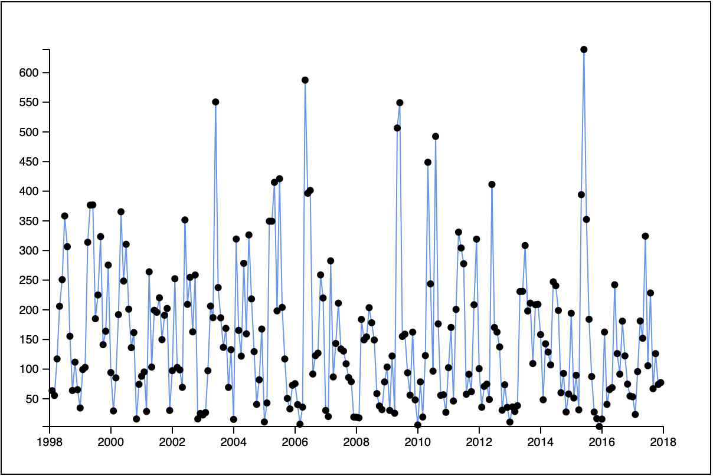
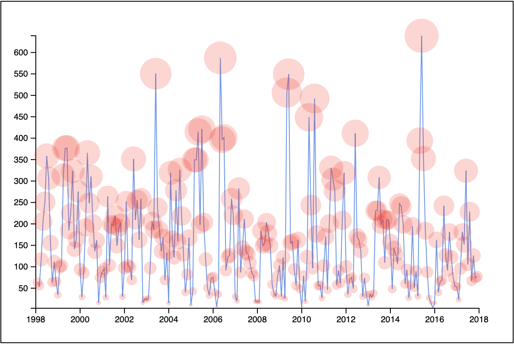
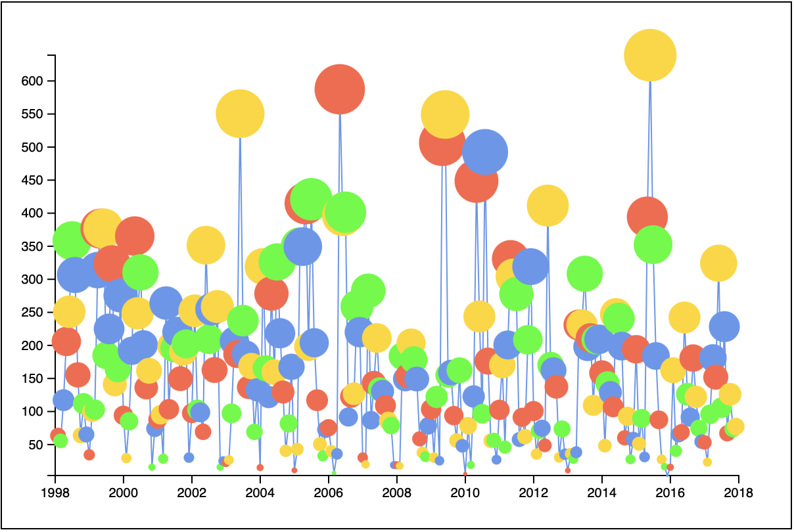
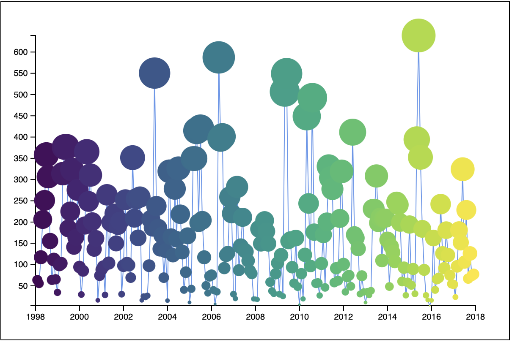

# Scatterplots and color scales

This section will look at paths again and talk about some of the other things you might do with this type of graph. 

## Scatter Plot

A scatter plot shows points of data on an x and y graph. Usually, these look like small dots scattered across the page. 

The rainfall makes an okay example of this.

Place a small circle for every month of rainfall. To do this you can make a group, then append some circles to the group. 

For this example start with the last example showing the rainfall data as a line graph. 

At the bottom of the drawing, the code adds the following. 

```JS
// Scatter plot
svg
  .append('g')
  .selectAll('circle')
  .data(baData)
  .enter()
  .append('circle')
  .attr('cx', d => xscale(d.date))
  .attr('cy', d => yscale(d.precipitation))
  .attr('r', 3)
```

This should put a circle at each data point. It might look like this: 



Notice you did the following: 

- Appended a new group. This will hold all of the circle elements
- Selected All the circles. 
- Added the data
- Entered the data
- Appended a circle for each point of data
- Set the attributes of the circles. 
  - You used the `xscale()` function here to get the `cx`
  - And the `yscale()` function to plot the `cy`

Stop and think about that for a minute. 🤔

This is the same pattern that you started with in the first tutorial. With the difference that here we first appended a group. 

**Challenge**

Imagine you wanted to set the size of the new circles to represent the amount of rainfall. More rainfall larger circle. How would you do that? 

Follow these steps: 

- Make a new scale to set the radius of the circles. 
	- Use `d3.scaleSqrt()` since this will more accurately relate area to value.
	- The domain is the extents of precipitation
	- The range will represent the size of the circles. 
- Use the new scale to set the radius of the circles

Depending on the size of the circles they may overlap. So it might be good to use a transparent fill color. Use something like: 

```JS
.attr('fill', 'rgba(255, 0, 0, 0.2)')
```

This is what mine looked like with color above and a range of 1 to 20 for the size of the circles. 



## Color scale 

What if we want each of the circles to be a different color. Maybe the colors could show the month? 

D3 provides some special scales for this purpose and there are more than a few ways to handle it. Here are two ideas. 

### d3.scaleOrdinal()

Use `d3.scaleOrdinal()`. This maps values in the domain through a list of values set in the range. 

```JS
const colorScale = d3.scaleOrdinal()
  .domain(dateExtent)
  .range(['tomato', 'gold', 'lime', 'cornflowerblue'])
```

To display the colors you might do this: 

```js
  ...
  .attr('fill', d => colorScale(d.date))
  ...
```

Here values of `d.date` will be assigned one of the four values in the range above. The values will repeat in order if they run out. 

**Challenge**

Apply the scale ordinal above. 

Here is what mine looked like: 



### d3.scaleSequential()

When we are talking about colors they often follow a sequence. D3 has a special scale for sequences and it also provides some built-in color interpolations. 

Swap the last color scale for this one: 

```JS
const colorScale = d3.scaleSequential()
  .domain(dateExtent)
  .interpolator(d3.interpolateViridis)
```

Here you are using `d3.scaleSequential()`. Notice the extent is the same but the range has been swapped for `.interpolator()`. This interpolator calculates the from a provided interpolator. D3 has many built-in interpolators some specific to colors. 

Here I used `d3.interpolateViridis` it generates colors from purple through green to yellow. 

Here is what it looked like for me: 



Try these other color interpolators: 

- `d3.interpolateRainbow`
- `d3.interpolateViridis`
- `d3.interpolateInferno`
- `d3.interpolateMagma`
- `d3.interpolatePlasma`
- `d3.interpolateWarm`
- `d3.interpolateCool`
- `d3.interpolateRainbow`
- `d3.interpolateCubehelixDefault`

