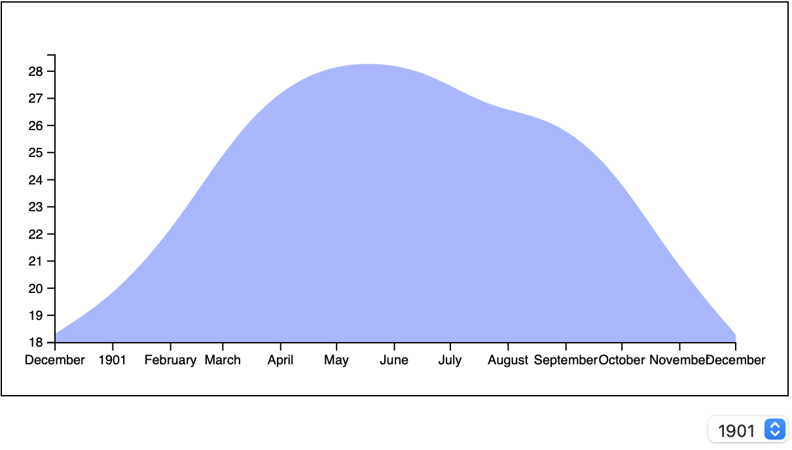
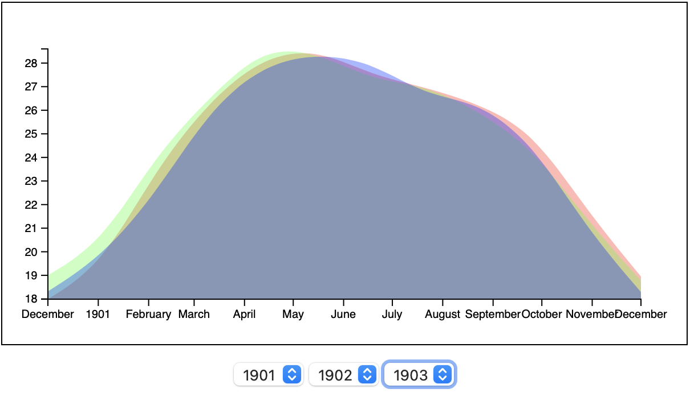
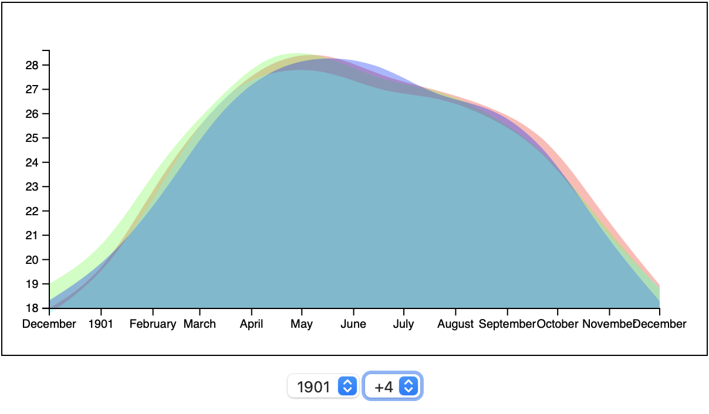

# Interaction

D3 Supports interaction. In a few ways. In this section, you will look at the idea of updating data to have and seeing the view update. 

## Getting started 

For this example, we will use the same data used in the last example which was the `Weather Data in India from 1901 to 2017.csv`. 

The goal here is to make a menu that that lets us select the year we want to view. 

### Adding a menu

Add a select dropdown with a few years. 

```HTML
<svg id="svg" width="600" height="300"></svg>

<select>
 <option value="0">1901</option>
 <option value="1">1902</option>
 <option value="2">1903</option>
 <option value="3">1904</option>
 <option value="4">1905</option>
</select>
```

The menu has an option for each of 5 years, and a value of each year is the index of that year's data in the data array. 

A quick reminder as to how this will connect with the data. Remember our data looks like this: 

```JS
[
 {: "0", YEAR: "1901", JAN: "17.99", FEB: "19.43", MAR: "23.49", ...}
 {: "1", YEAR: "1902", JAN: "19.0", FEB: "20.39", MAR: "24.1", ...}
 {: "2", YEAR: "1903", JAN: "18.32", FEB: "19.79", MAR: "22.46", ...}
 ...
]
```

This is an array of objects. Each is one year/12 months of mean temperature measurement from 1901 to 2017. 

**Stretch Challenge**

Generate the options here using code! 

### Styles 

I added a few styles to make things look a little better. 

```CSS
/* Put the box in the center of the page */
body, html {
 height: 100%;
 display: flex;
 flex-direction: column;
 justify-content: center;
 align-items: center;
}

#svg {
 border: 1px solid;
}

select {
 font-size: 1rem;
 margin: 1rem 0;
 align-self: flex-end;
}
```

With this in place you should have something that looks similar to this: 



Notice the menu in the lower right. 

## Adding a listener

We need to know when a new value is selected from the menu. In this section, you'll add a vanilla JavaScript listener. Something like this: 

`element.addEventListener('change', handler)`

Note! Important here is understanding scope. The handler function for this `change` event will need access to the elements created by D3. 

In our previous work all of that code was inside the `function handleData()` function and the variables used were defined there. For example: 

```JS
async function handleData() {
 const data = ...
 const year_1901 = ...
 const months_1901 = ...
 const width = 600
 const height = 300
 const margin = 40

 const xscale = ...
 const tempExtent = ...
 const yscale = ...

 // Select the SVG
 const svg = ...

 // Make a group for the graph
 const graph = ...

 // line generator
 const linegen = ...

}
```

These variables are only accessible from inside the `handleData()` function. They can not be accessed outside of this function! 

Our listener needs to work with some of these variables. To make this possible you have one of two options: 

1. Declare the variables outside `handleData()`. If you do this you can access you define your listener function anywhere. 
2. Declare the listener inside `handleData()`. 

Here is what either of these methods might look like. 

**Method 1:** Declare variables outside `handleData()`. 

```JS
let data
let year
let graph
let linegen

async function handleData() {
 data = ...
 year = ...
 ...
 // Make a group for the graph
 graph = ...
 // line generator
 linegen = ...
 ...
} // <-- handleData() block ends here! 

// Adding an event listener outside handleData()
element.addEventListener('change', (e) => {
 // we have access to:
 // data, year, graph, and linegen here
})
```

Notice all of the variables that we need to access in handler need to be declared with `let` since we aren't assigning a value at declaration. 

**Method 2:** declare the handler insde `handleData()`

```JS
async function handleData() {
 const data = ...
 const year_1901 = ...
 const months_1901 = ...
 const width = 600
 const height = 300
 const margin = 40

 const xscale = ...
 const tempExtent = ...
 const yscale = ...

 // Select the SVG
 const svg = ...

 // Make a group for the graph
 const graph = ...

 // line generator
 const linegen = ...
 ...

 // Adding an event listener inside handleData()
 element.addEventListener('change', (e) => {
 // we have access to:
 // data, year, graph, and linegen here
 })

} // <-- handleData() block ends here! 
```

In this example, we defined our event listener inside of the `handleData()` function. Here everything else stays the same without the need for change. Also notice we can use `const` since the variables are assigned at the time they are declared. 

### adding a listener

I'm going to use the second option. You can use your favorite method. 

**Challenge** 

Add an event listener. It should listen for change events on the select element. 

For now, handle these events by getting the `value` from the `select` element. This should be the index: 0, 1, 2, etc. Use this index to get the year's temperature from the data array. 

<details>
 <summary>
 ** Solution **
 </summary>
 
```js
document.querySelector('select')
 .addEventListener('change', e => {
 const index = parseInt(e.target.value)
 console.log(data[index])
 // more work to do here later...
})
``` 

</details>

## Updating D3 data

D3 is pretty smart. If you change the data assigned to an element the element will redraw. This means we need a reference to the element. 

For this example, we only need to update the area/path. That means we need a reference to that element stored in a variable. 

Currently your code should look similar to this: 

```JS
// Draw the graph 1901
graph
 .append('path')
 .attr('d', linegen(months_1901))
 .attr('fill', 'rgba(255, 0, 0, 0.33)')
```

Here you appended a path to the `graph` element. But there is no reference to the path. 

Save a reference to the path. 

Make the this change: 

```JS
// Draw the graph
const path = graph // Save the path here! 
 .append('path')
 .attr('d', linegen(months_1903))
 .attr('fill', 'rgba(0, 0, 255, 0.33)')
```

Head back to your 'change' event listener. 

Add the last three lines here:

```JS
document.querySelector('select')
 .addEventListener('change', e => {
 const index = parseInt(e.target.value)
 console.log(data[index])
 // Update the path here! 
 path
 .attr('d', linegen(convertToArray(data[index])))
})
```

When a change event occurs we get the value from the select option. This should be the index of data we want. Form values are always numbers. Next, we set the `d` attribute of the path. To do this we call `linegen()`. 

This function needs some data. The data is an object so we use the helper function to turn it into an array. 

**Challenge**

Change the color of the fill each time you choose a new year from the menu. Do this by setting the `fill` attribute. 

You can make the color anything you like. For bonus points make the color different each time you select a year. For bonus points give each year a different color but make sure it's the same color each time that year is chosen.

Might look like this when you choose 1904:


<details>
 <summary>
 ** Solution **
 </summary>

 HSLA colors to the rescue! The hue of an HSLA color runs from 0 to 360. Divide this by the number of data elements to get a unique color for each. 

 If you made a scale or added color to the data object you did a better solution, pat yourself on the back! My solution has 12 colors. Divide 360 by the number of unique colors that you need. 

```JS
document.querySelector('select')
 .addEventListener('change', e => {
 const index = parseInt(e.target.value)
 const hue = 360 / 12 * index // data.length
 const fillColor = `hsla(${hue}, 100%, 50%, 0.33)`
 // Update the path here! 
 path
 .attr('d', linegen(convertToArray(data[index])))
 .attr('fill', fillColor)
})
```

</details>

### Animating Changes 

This looks Real good so far but a little motion would make it amazing. Again D3 has us covered!

For any change to properties, we need to tell D3 to `transition` and what the `duration` of the transition is. 

We can't animate the initial state since the transition is a change from one state to another. 

We also have to call `transition()` first before setting any attributes. The attributes that come after the transition will be animated. 

In the event handler add the two new lines shown below: 

```JS
document.querySelector('select')
 .addEventListener('change', e => {
 const index = parseInt(e.target.value)
 const hue = 360 / 12 * index 
 const fillColor = `hsla(${hue}, 100%, 50%, 0.33)`
 // Update the path here! 
 path
 .transition() // Add a tranistion
 .duration(1000) // set the duration
 .attr('d', linegen(convertToArray(data[index])))
 .attr('fill', fillColor)
 })
```

Notice the transition and duration come before you set the line data/d and the fill. So these attributes get animated. 

The duration is set to 1000. This in milliseconds so 1000 === 1 second. 

Should work something like this: 


**Challenge**

Adjust the duration to the time that looks best to you. 

### Easing

Transitions are all about changing values over time. There is some math involved. How we get from one value to another is handled by an easing function. 

Easing functions can impart character and quality to motion. There are many built-in easing functions. Let's apply a couple here and see what they look like. 

Apply easing in the same way you applied duration. 

Here is a reference to the easing functions that graphs change over time. 

https://github.com/d3/d3-ease

Add the following new line to your path update in the event handler: 

```JS
path
 .transition()
 .duration(1000)
 .ease(d3.easeExpIn) // Add an easing function here! 
 .attr('d', linegen(convertToArray(data[index])))
 .attr('fill', fillColor)
```

Try these: 

- `.ease(d3.easeExpOut)`
- `.ease(d3.easeElasticOut)`
- `.ease(d3.easeBackOut)`

There are a lot of easing functions. See the link above. The differences between some will be very subtle. The three examples above are very dramatic. 


## Further Challenges

This is looking pretty good so far. But it could be taken further. Try these challenges. 

**Challenge**

Look close at the difference between 1901 and 1905. You'll notice that rainfall for January dips below the line of the graph. You can also see this in the animated example image above. 

The problem here is that the extent for the y scale was set using the values from 1901. That means any year where rainfall was above or below the values for 1901 will fall outside the axis. 

The challenge here is to find the extent for all years 1901 to 2017 and use this extent for the y scale. 

**Challenge**

The graph shows a single year. It might be good if we could compare years. You try any of the suggestions below or come up with your solution. 

Add a second or third menu. These menus allow us to choose different years to show. It might look like the image below. Notice the menu shows 1901, 1902, and 1903. 



Add a new menu that lets us choose how many years after the selected year should be shown. 

Take a look at the image below. Notice the first menu shows 1901 and the second shows +4. The image shows 4 years starting with 1901. So the years shown here would be 1901, 1902, 1903, and 1904. 

