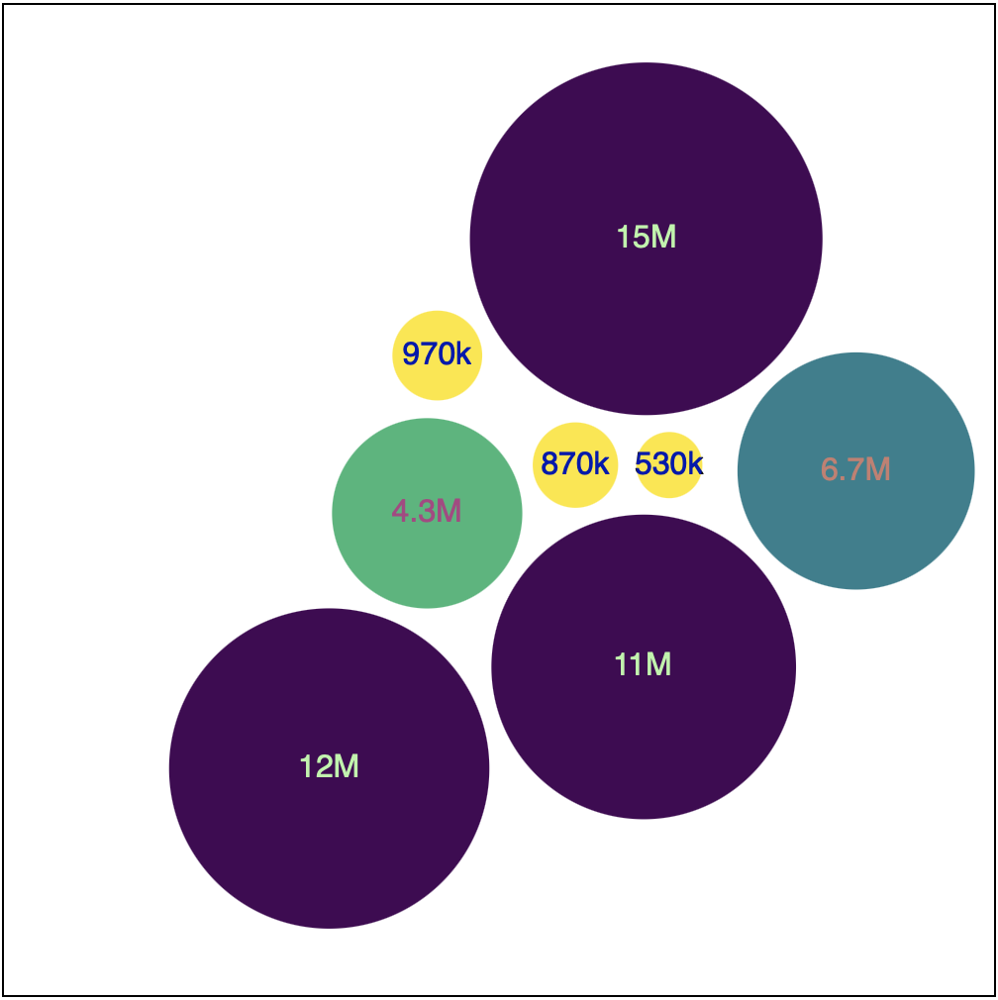

# Pack

The pack takes several objects and fits them together in an area. 

Here is a picture to give you an idea:


Here all of the values are shown as relative size and fit within space. 

This bubble pack is a treemap. It groups related elements into a circle and shows their relative size. In the example above there is only a single level to the tree. 

The example above only shows a single level but we ould show more. 

## Getting started

Setup a new D3 page. Add the default starting HTML code. Import the D3.js code.

Add an SVG element to your page where you will display your visualization. 

Import the `cities.csv` data. Use your favorite method for this. 

## Add a color scale

We won't need a scale for sizing elements that will be covered by the pack function. We do need a scale for color. 

Since you're using a list of values `d3.scaleSequential()` will be appropriate. 

```JS
// Create a color scale 
const colorScale = d3
  .scaleSequential(d3.interpolateViridis)
  .domain(d3.extent(data, d => d.population))
```

This should provide a color for each value from the `interpolateViridis` color palette. 

## Formatting numbers

The population numbers are large and will not read well unformatted. So make a number formatter! 

```JS
// Number formatter
const num_f = d3.format(".2s")
```

This should format any number shortened with a suffix. Something like: 

- 100,000 -> 100k
- 6,500,000 -> 6.5M

## d3.hierarch()

Some data is hierarchical. D3 can handle and display this type of data provided it is arranged in a hierarchy. 

Arrays/Lists are flat for example: 

```
['Apple', 'Banana', 'Edamame']
```

Objects/JSON are hierarchical, for example: 

```
{
  fruit: ['Apple', 'Banana'],
  legume: ['Edamame']
}
```

You should have loaded the `citied.csv` in the previous step. We will use this data for this example. If we look at the data as a list of cities. IT has a single level. To build the pack diagram we still need to arrange it in a hierarchy. 

Assuming that you loaded the `cities.csv` data and stored it in a variable named: `data`, add the following: 

```JS
const root = d3.hierarchy({ children: data })
  .sum(d => d.population) // Must call sum before pack()
```

This makes a D3 hierarchy object. Calling `.sum()` is required for the packing operation to work. This function is going to calculate the size of each node in the tree. here you're passing the population since the size of each node will be based on this value. 

## d3.pack()

The `d3.pack()` method is used to create enclosure diagrams. These are used to group elements within a space. A pack requires a hierarchy to do its work. 

```JS
// Pack - Create a pack function
const pack = d3.pack()
  .size([500, 500]) // Set the size of the area
  .padding(10) // define some padding between each circle
```

Here you created a new `pack` object and set its size. I matched the size to the size of the SVG element I was using. You should do the same by changing the numbers here: `.size([500, 500])`. The first number is the width and the second is the height. 

The next line `.padding(10)` sets the space between packed elements. You may want to come and adjust this value after you see what your pack diagram looks like. 

## Creating a Root node

The next step is to create a root node. The root node is built from the hierarchy. It contains properties that you will use to draw SVG elements. 

```JS
// Create a root node for d3 to draw
const rootNode = pack(root) // Must call sum() first! 
```

## Drawing the pack diagram

The next step is to start drawing the pack diagram. 

```JS
// Select the SVG element 
d3.select('#svg')
  .style('border', '1px solid')
  // Create a group for each element
  .selectAll('g')
  // Data is the leaves of the hierarchical root node
  .data(rootNode.leaves())
  // More coming...
```

Here you selected your SVG element. Then set a style to give it a border. 

Then you selected all of the `g` elements. These don't exist yet. The goal is to create a group and put a circle and a text node inside the group. 

The last line sets the data for this selection. Notice we get the data from `.leaves()` on our root node. The root node has rearranged our data, `rootNode` is our packed hierarchy. 

```JS
d3.select('#svg')
  .style('border', '1px solid')
  .selectAll('g')
  .data(rootNode.leaves())
  .join('g') // Join your group. 
  // Position each node using x and y 
  .attr('transform', d => `translate(${d.x}, ${d.y})`)
  // Add a circle to each group
  .append('circle')
  // Set the radius
  .attr('r', d => d.r)
  // Set the color of each circle
  .attr('fill', d => {
    // Note! d is hieracty data and the source data is on the data property!
    return colorScale(d.data.population)
  })
```

One way to do this is with `.append()` but, `.append()` only allows you to add a single node. For example `.appeand('circle')` adds a circle but not a text node. 

This time you'll use `.join()`. With `.join('g')` you're saying you want to join the data with the selection. 

Notice we get the `x`, `y` and `r` (radius) from packed data. The packing operation has added these to our hierarchy. 

The actual values from the original data is stored on the `data` property in the hierarchy. 

Should look something like this: 


Add a text node to each group and place it in the center of the circle. 

```JS
// Add a text node to each group
d3.select('#svg')
  // find each group
  .selectAll('g')
  .data(rootNode.leaves())
  .join('g')
  // Add a text node
  .append('text')
  // Set the text
  .text(d => num_f(d.data.population))
  // Set the font 
  .attr('font-family', 'Helvetica')
  // Position the text in the center
  .style('text-anchor', 'middle')
  .style('alignment-baseline', 'middle')
  .style('mix-blend-mode', 'difference')
  .style('fill', 'white')
```

Here you joined some new elements to the existing elements. 

Appended a text node to each. Then set the text of each node. Here you used the number formatting function you created earlier. 

The last four lines set some CSS styles on the node. 

- `text-anchor` sets the horizontal location the text draws from
- `alignment` sets the vertical location text draws from
- `text-blend-mode` determines how the color blends with the background color. In this example, we're using this to make the text appear darker against a lighter background or lighter against a darker background. 
- `fill` sets the color of the text. 

Should look something like this: 



