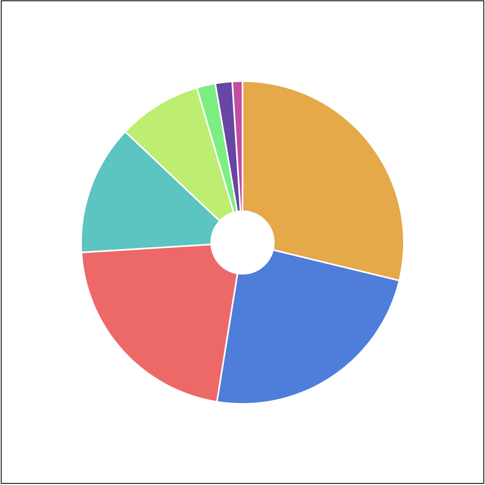

# Pie Charts 

Pie charts are circles that have been divided into pizza slices. It has been argued that pie charts are not good at representing data. 

https://www.data-to-viz.com/caveat/pie.html

With this in mind in the right place, they can be useful. 

As you probably guessed D3 has these covered! Let's build a pie chart. 

The cities.csv might be a good choice for this example. The pie chart might express the relative size of the populations of each city. 

## Getting started 

Let's get started with a challenge. 

**Challenge**

Create a new HTML document. Add the following: 

- Add an SVG element
- Import the D3 JS from the CDN
- Add a script tag for your code

**Challenge**

In your script add the code to load the `cities.csv` data. Choose your favorite arrangement for this. 

<details>
  <summary>
    ** Solution **
  </summary>

 I chose to use `async` and `await`.

```JS
async function handleData() {
  const data = await d3.csv('cities.csv')

  // Draw stuff ...
}

handleData()
```

</details>

### The Data

The cities data looks like this: 

```CSV
"name","population","country","x","y"
"San Francisco",874961,"USA",122,-37
"Fresno",525010,"USA",119,-36
"Lahore",11126285,"Pakistan",74,31
```

After importing it should be arranged like this. Check it for yourself by logging it to the console. 

```JS
[
  {name: "San Francisco", population: "874961", country: "USA", x: "122", y: "-37"}
  1 {name: "Fresno", population: "525010", country: "USA", x: "119", y: "-36"}
  2 {name: "Lahore", population: "11126285", country: "Pakistan", x: "74", y: "31"}
  3 {name: "Karachi", population: "14910352", country: "Pakistan", x: "67", y: "24"}
  4 {name: "Rome", population: "4342212", country: "Italy", x: "12", y: "41"}
  ...
]
```


This is an array of objects with properties of:

- name
- population
- country
- x
- y


### Setup 

Now that the data is loaded you should define some variables to set the height and width. 

Add the following constants: 

```JS
const width = 600
const height = 600
const margin = 40
```

Note! It's probably best if the width and height here match the sizes used on the SVG element.

### Make a Scale 

Make a scale. We need a color for each pie wedge. 

**Challenge**

Set up a color scale. 

The scale can be sequential. The rainbow interpolator might be a good choice here. 

The domain should be the list of objects so the extent can be 0 to the length of the list. 

<details>
  <summary>
    ** Solution **
  </summary>

```JS
// Make a scale to set the color 
const colorScale = d3.scaleSequential()
  .domain([0, data.length])
  .interpolator(d3.interpolateRainbow);
```

</details>

### d3.pie()

D3 provides a `d3.pie()` method that helps us make pie charts. This method takes in an array of data and calculates the starting and ending angles for each of the slices. 

Think about the pie chart. It's made up of slices. All of the slices together make up the entire circle. To draw the pie you need to know the starting and ending angle for each slice. 

Define a piegenerator, add the following: 

```JS
const pieGen = d3.pie()
```

The pie generator doesn't draw the pie directly. We need to calculate the arcs from some data. 

Define some arc data. Add the following: 

```JS
const arcData = pieGen(data.map(d => d.population))
```

Here you're using the `piegen` to generate arc/slice data from the cities data. You're using population as value to determine the size of each arc/slice.

Remember the path tutorial? You used a function to generate the path data. We need to do the same thing here. This we are going to generate one path for arc/pie slice. 

Define an arc generator. Add the following: 

```JS
const arcGen = d3.arc() // Make an arc generator
  .innerRadius(40) // Set the inner radius
  .outerRadius(200) // Set the outer radius
  .padAngle(0.01) // Set the gap between arcs
```

`d3.arc()` has a few methods we can use to configure the shape of the arc/pie-wedge/slice shapes. 

Setting `.innerRadius()` to 0 will create your standard pizza chart. Numbers larger than 0 give us a doughnut. 

The `.outerRadius()` sets the outside diameter. 

The `.padAngle()` sets the space between each slice. 

Read more about these here:

https://github.com/d3/d3-shape#arcs

**Challenge**

Try adjusting the numbers for inner radius, outer radius, and padding. 

### Drawing the pie chart

Select the SVG element with D3. Add the following: 

```JS
// Select the SVG
const svg = d3
  .select('#svg')
```

Since the arc generator is going to a path for each arc/slice we should put all of this in a group. 

Make a group, add the following:

```JS
// Append a group (<g>) to hold the arcs 
const pieGroup = svg
  .append('g')
  // position the group in the center
  .attr('transform', `translate(${width / 2}, ${height / 2})`)
```

Here we transformed the `pieGroup` to move it into the center of the SVG viewport. The arcs will draw around the center of the group. 

Now draw the arcs. Here we need to make some paths. There will be one for each arc/slice.

Add the folloeing: 

```JS
const piePath = pieGroup
  .selectAll('path') // Select all paths
  .data(arcData) // Use the arc data 
  .enter()
  .append('path') // Make a path for each arc segment
  .attr('d', arcGen) // Draw the arc segement with the generator
  .attr('fill', (d, i) => colorScale(i)) // Use the color scale
```

The pattern here is very similar to the pattern we used at the very beginning. The difference here is that the path data comes from the `arcGen`. 

Notice we set the fill for each arc and used the `colorScale()` to set the colors. 

At this stage you should have something like: 



## Adding a legend

This chart is looking good but I can't tell what each slice represents. If we knew what the colors were we would know how big Fresno is vs San Francisco!

Imagine that our chart looked like this: 


You might be able to do this with one of the axis functions. In this example, you'll make the legend manually using all of the same D3 features you used in the previous steps of the tutorial. 

**Challenge**

Make this a challenge if you feel up to it. You can follow the solution below. or compare your work to the solution. 

### Making the Legend

We have the pie chart in its group. The legend will be made up of SVG circles and text elements. It would be good to keep them all in a group. This will allow us to access these elements and move them all together. 

Create a new group for the legend, add the following: 

```JS
const labels = svg
  .append('g')
```

Now add a circle to the labels group for each element in your data. We can follow the same pattern from the very first tutorial here. 

Add the following: 

```JS
labels
  .selectAll('circle')
  .data(data)
  .enter()
  .append('circle')
  .attr('r', '5')
  .attr('cx', 10)
  .attr('cy', (d, i) => (i * 20) + 15)
  .attr('fill', (d, i) => colorScale(i))
```

Here you selected all of the circles, added your data, and entered your data. 

Next, we appended a circle for each data element. 

Last you set the attributes to draw the circles. Notice we set the `cy` based on the index and set the fill color using the `colorSCale()`. 

**Challenge** 

Adjust the radius, cy, and cx to make this look good. 

Now add the text. We can follow all of the steps again but this time append `text` elements. 

```JS
labels
  .selectAll('text')
  .data(data)
  .enter()
  .append('text')
  .text(d => d.name)
  .attr('x', 20)
  .attr('y', (d, i) => (i * 20) + 20)
```

Again you are targeting the `labels` group. This time you select all `text` elements, add your data, enter the data, and append a text element for each data element. 

Next set the attributes of the text element. Adjust the x and y to position the text next to each circle. 

## Challenge 

Here are some final challenges for this project. 

**Challenge**

The cities data also has a country name. Show the country name in the legend. 

**Challenge**

The cities data shows the country name for each city. Build an array of unique country names and show a pie chart showing countries. Use the total population for all cities in that country for the value. 

This won't show country population accurately but it will be proportional to the city size we already have. 

Draw another smaller pie chart in one of the corners. 

Or, stretch goal, draw a doughnut around the existing piechart showing the coutries. 

**Challenge**

Draw the city names on the arc/slices.

It might look like this: 


This image is imperfect since the labels overlap but it working. 

To do this follow these steps: 

- Creat a new group to hold the labels. 
- Creat a new `d3.arc()` you'll use this to caluclate the position of each label along the arc. 
  - On this new arc call `.outerRadius(160)` and `.innerRadius(160)` to set the radius for the arc. 
- Now create the labels on your new group
  - Select all 
  - Set data to your city data
  - append a text element
  - Set the text of the text element
  - Transform the text element to position. You can use this: 
    - `.attr("transform", d => `translate(${arcLabels.centroid(arcData[i])})`)`

The `arcLabels.centroid(arcData[i])` uses the arc data you created ealier. Remember this data had a start angle and end angle. The `.centroid()` method finds the center between the start and end angle. 

<details>
<summary>
** Solution **
</summary>

```JS
const rLabels = svg
  .append('g')
  .attr('transform', `translate(${width / 2}, ${height / 2})`)

const arcLabels = d3.arc()
  .outerRadius(160)
  .innerRadius(160)

rLabels
  .selectAll('text')
  .data(data)
  .enter()
  .append('text')
  .text(d => d.name)
  // Place labels around circle ?
  .attr("transform", (d, i) => `translate(${arcLabels.centroid(arcData[i])})`)
  .attr('text-anchor', 'middle')
```

</details>

**Challenge**

Draw a ring around the current chart that shows a pie chart of the total population for countries. 

To do this you'll need to creat an array of countries and total the population from each of the cities in the original array. 

Then follow all of the same steps to make a new pie and arc. Set the inner radius to something a little larger than the outer radius of the first pie. 

It might look something like this: 


