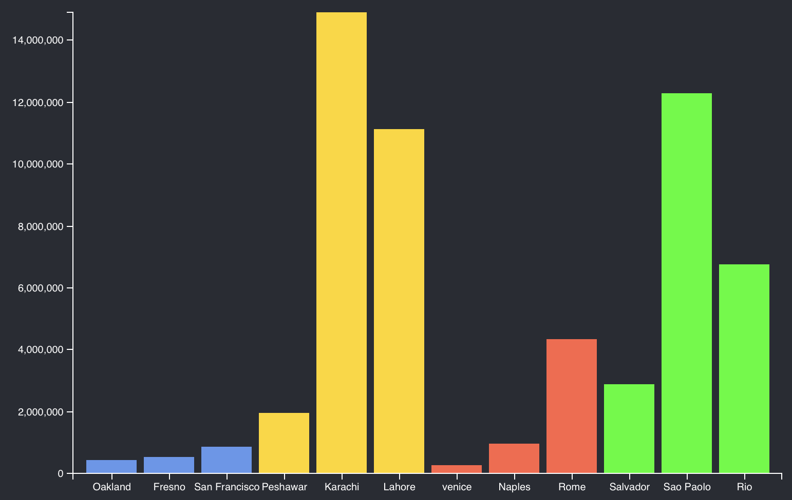

# D3 & React

You might be creating a React project and needs to incorporate D3. This is possible! To do this its important to understand that D3 and React work with the DOM in two different ways. 

D3 uses the DOM in the traditional way where it access the "real" DOM directly. React uses a virtual DOM. Problems arise when mixing the two systems. D3 may make changes to the DOM, later React updates a component it will overwrite those changes using what it has stored in the virtual DOM. 

To solve the problem you either need to make all of changes to the virtual DOM. To do this all of your changes need to happen through components, props, and state. Or, mark a DOM element as a Reference. This removes it from React's virtual.

Here is a link to a guide: 

https://www.pluralsight.com/guides/using-d3.js-inside-a-react-app

## Getting started 

Start by creating new React Project:

```
npx create-react-app react-d3-example
```

Add D3 as a dependency:

```
yarn add d3
```

Start your project with: 

```
yarn start
```

Open this new project in your code editor. 

## Make a Bar chart component

Create a new file `BarChart.js`.

Add the following: 

```JS
import * as d3 from 'd3'

function BarChart() {
  return (
    <svg
      style={{
        height: 500,
        width: "100%",
        marginRight: "0px",
        marginLeft: "0px",
      }}
    >
      <g className="plot-area" />
      <g className="x-axis" />
      <g className="y-axis" />
    </svg>
  )
}

export default BarChart
```

To make it easy to use D3 make yourself a custom hook. Add a new file `useD3.js`. 

```JS
import { useRef, useEffect } from 'react'
import * as d3 from 'd3'

export const useD3 = (renderChartFn, dependencies) => {
	const ref = useRef()

	useEffect(() => {
		renderChartFn(d3.select(ref.current))
		return () => {}
		}, dependencies)
	return ref
}
```

Now update the `BarChart` component in `BarChart.js`. Here you are importing the new `useD3`, and add the code to draw the bar chart. 

```JS
import * as d3 from 'd3'
import { useD3 } from './useD3'

function BarChart({ data }) {
	const ref = useD3((svg) => {
		const height = 500
		const width = 800
		const margin = { top: 20, right: 30, bottom: 30, left: 80 }

		const xscale = d3
			.scaleBand()
			.domain(data.map(d => d.label))
			.rangeRound([margin.left, width - margin.right])
			.padding(0.125)

		const yscale = d3
			.scaleLinear()
			.domain([0, d3.max(data, d => parseInt(d.population))])
			.rangeRound([height - margin.bottom, margin.top])
		
		const colorScale = d3
			.scaleOrdinal(data.map(d => d.country))
			.range(['cornflowerblue', 'gold', 'tomato', 'lime', 'brickred'])

		const bottomAxis = d3.axisBottom(xscale)
		const leftAxis = d3.axisLeft(yscale)

		svg
			.select('.x-axis')
			.attr('transform', `translate(0, ${height - margin.bottom})`)
			.call(bottomAxis)

		svg
			.select('.y-axis')
			.attr('transform', `translate(${margin.left}, 0)`)
			.call(leftAxis)

		svg
			.select('.plot-area')
			.selectAll('.bar')
			.data(data)
			.enter()
			.append('rect')
			.attr('class', 'bar')
			.attr('x', d => xscale(d.label))
			.attr('width', xscale.bandwidth())
			.attr('y', d => yscale(d.population))
			.attr('height', d => yscale(0) - yscale(d.population))
			.attr('fill', d => colorScale(d.country))
	}, [data.length])

  return (
    <svg
			ref={ref} // Don't forget to add this line!
      style={{
        height: 500,
        width: "100%",
        marginRight: "0px",
        marginLeft: "0px",
      }}
    >
      <g className="plot-area" />
      <g className="x-axis" />
      <g className="y-axis" />
    </svg>
  )
}

export default BarChart
```

Notice you added the drawing code within the callback of the `useD3` hook. This hook returns a `ref`. The `ref` is a reference to a DOM element. This allows you to manage that element outside the virtual DOM! 

Notice all of the D3 drawing code happens within the callback created here. 

In the `<svg>` block a the bottom notice that you have added `ref={ref}`. This assigns the ref you created at the to this element. 

## Using the BarChart Component

To use the `BarChart` component. You'll make an instance in your react project and pass it some data. 

Open `App.js` and add the following: 

```JS
import './App.css';
import BarChart from './BarChart';

const data = [
	{ label: "Oakland", population: 425097, country: "USA" }
	{ label: "Fresno", population: 525010, country: "USA" }
	{ label: "San Francisco", population: 874961, country: "USA" }
	{ label: "Peshawar", population: 1970042, country: "Pakistan" }
	{ label: "Karachi", population: 14910352, country: "Pakistan" }
	{ label: "Lahore", population: 11126285, country: "Pakistan" }
	{ label: "venice", population: 258685, country: "Italy" }
	{ label: "Naples", population: 967069, country: "Italy" }
	{ label: "Rome", population: 4342212, country: "Italy" }
	{ label: "Salvador", population: 2886698, country: "Brazil" }
	{ label: "Sao Paolo", population: 12300000, country: "Brazil" }
	{ label: "Rio", population: 6748000, country: "Brazil" }
]

function App() {
  return (
    <div className="App">
      <header className="App-header">
        <BarChart data={data} />
      </header>
    </div>
  );
}

export default App;
```

Here we hard codes the data. The page with the chart should look something like: 



Note! that I left the default Create-React.App `App.css` in place which is adding the background color and some other styles. 

## Loading CSV Data from a file

That was a little awkward placing all of the data in a `App.js`. This would be possible and maybe convenient for small lists of data. For many cases it will be easier to load the data from outside. 

Copy the `cities.csv` into the public folder of your React project.

In `App.js` make the following changes:

```JS
import './App.css';
import BarChart from './BarChart';
import { useState, useEffect } from 'react'
import * as d3 from 'd3'

function App() {
  const [data, setData] = useState([])
  
  useEffect(() => {
    d3.csv('./cities.csv')
      .then(data => {
        data.sort((a, b) => a.country < b.country)
        setData(data)
      })
  }, [])

  return (
    <div className="App">
      <header className="App-header">
        <BarChart data={data} />
      </header>
    </div>
  );
}

export default App;
```

Since loading the data will be an asynchrous action you need to store the data on state. React will only render a component when state changes or the component receives props. In this case the App component will render when it loads new data since you are storing the data on a state variable and updating it when it loads. The BarChart component will update since you are passing data to it as a prop. 

