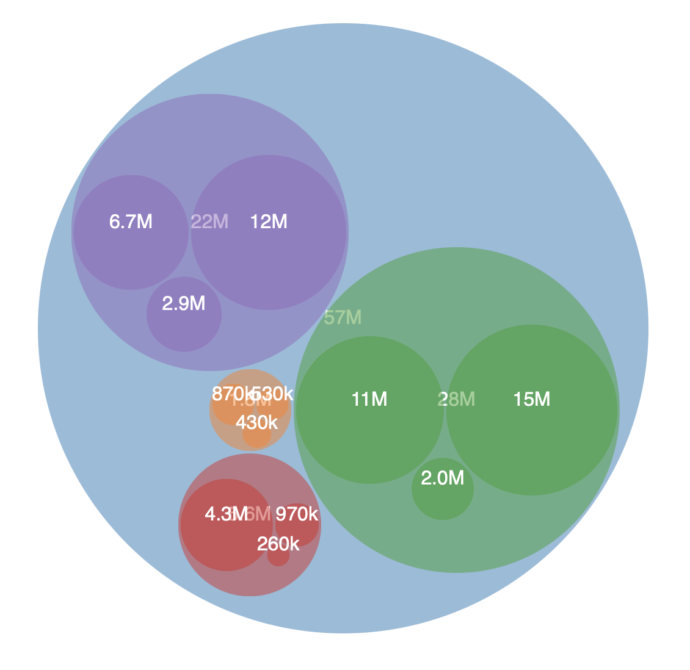
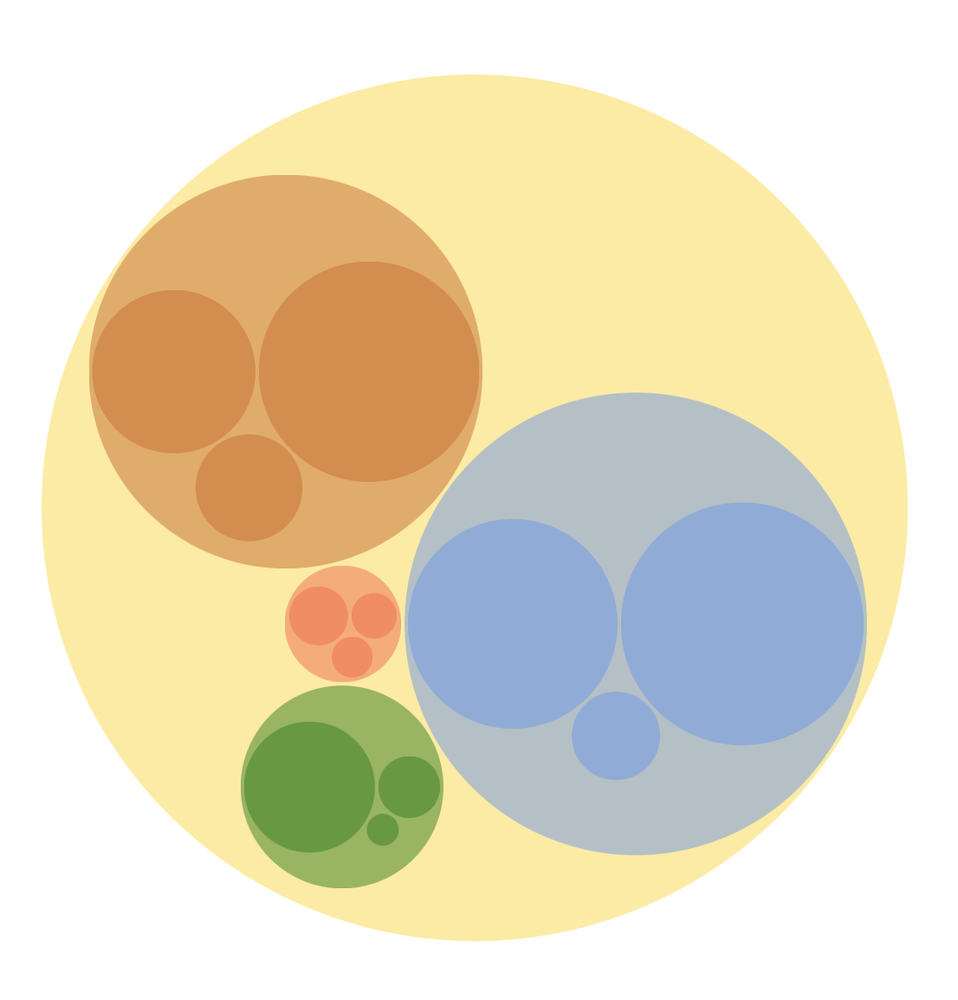
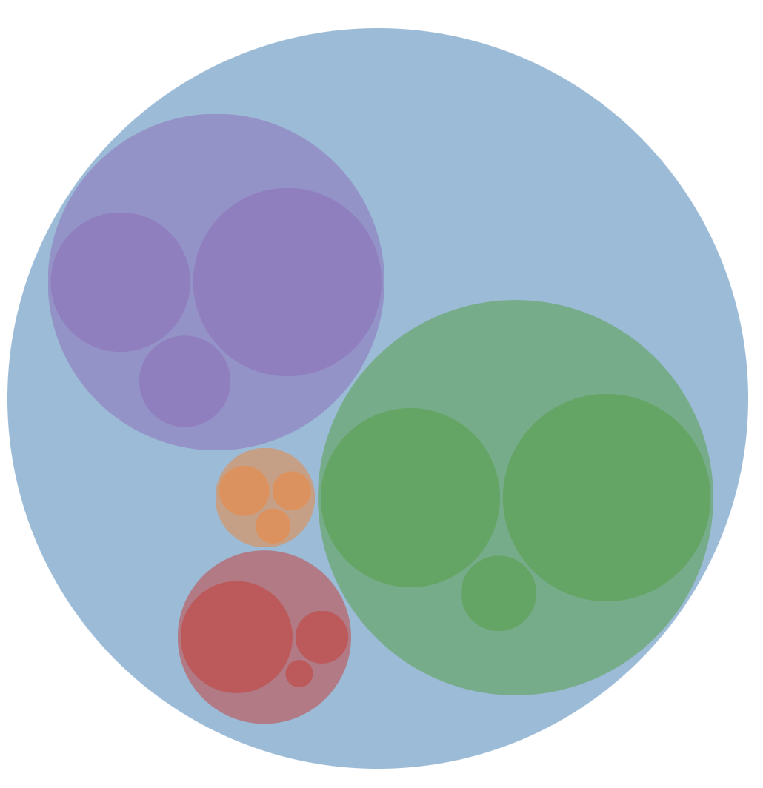
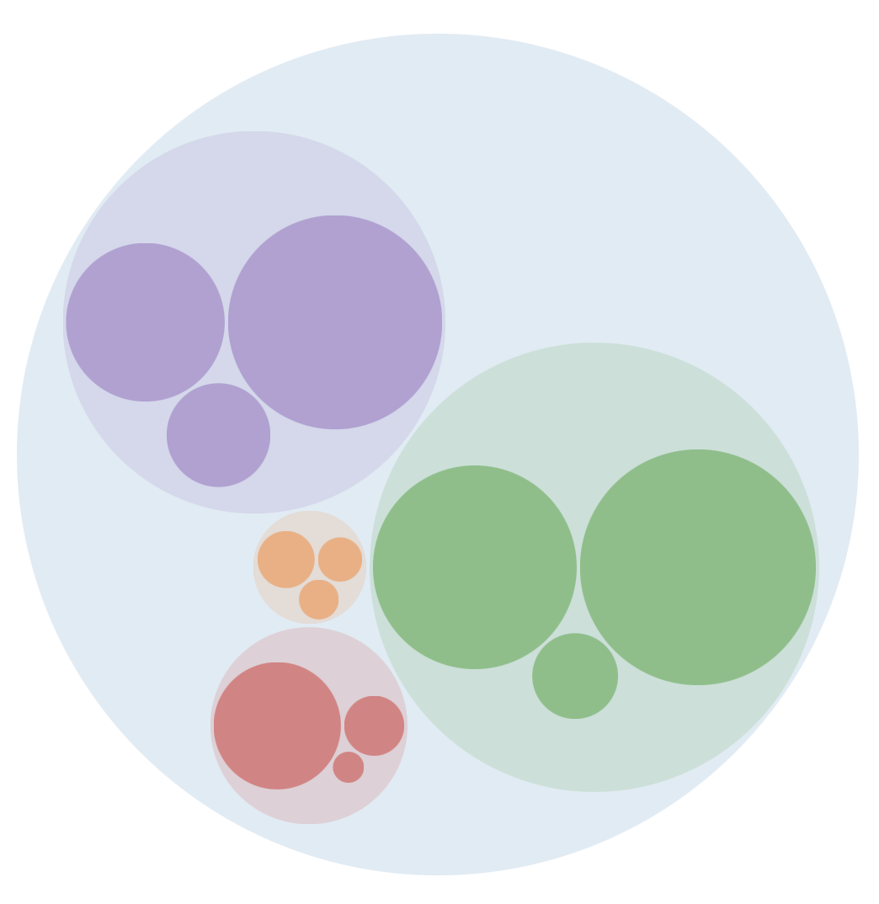
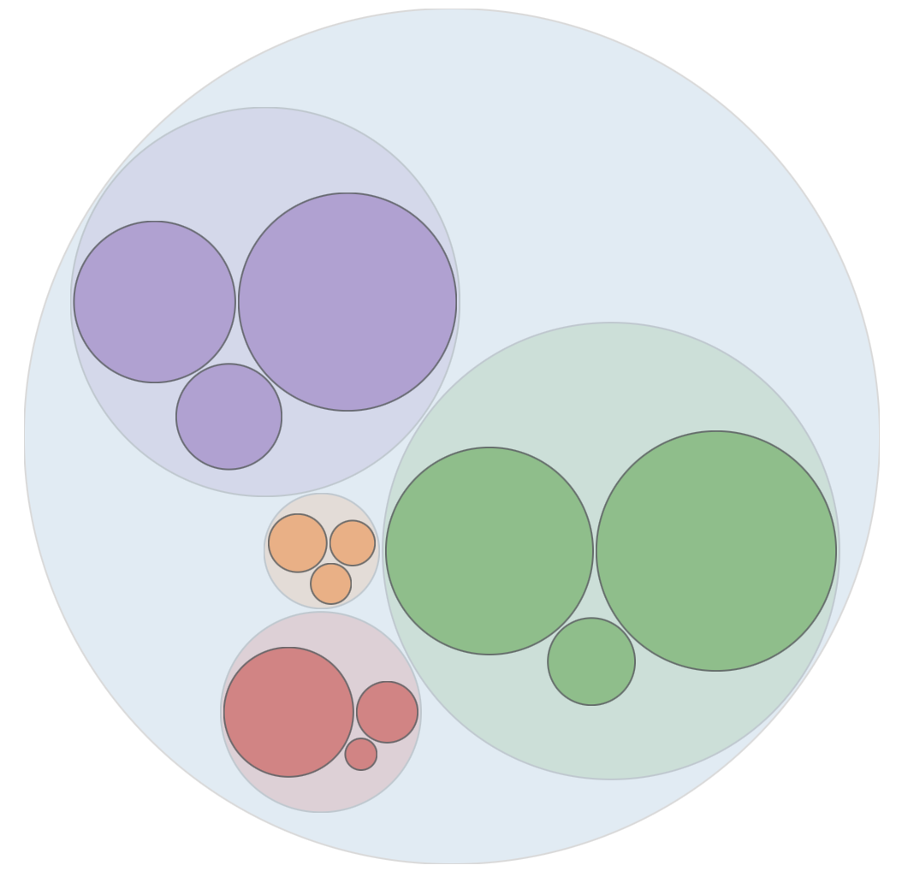
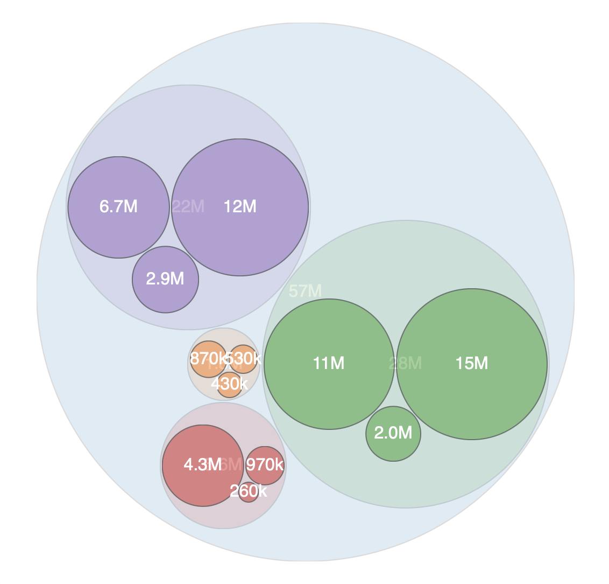
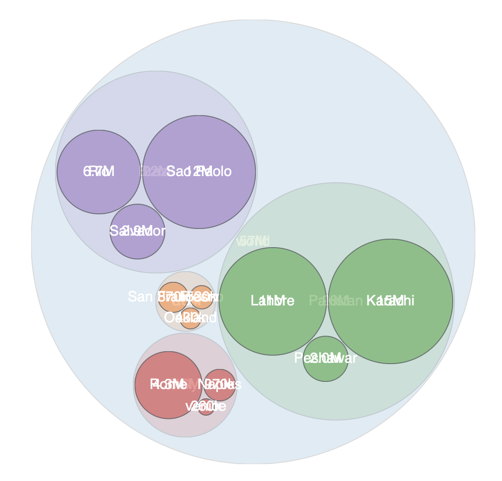
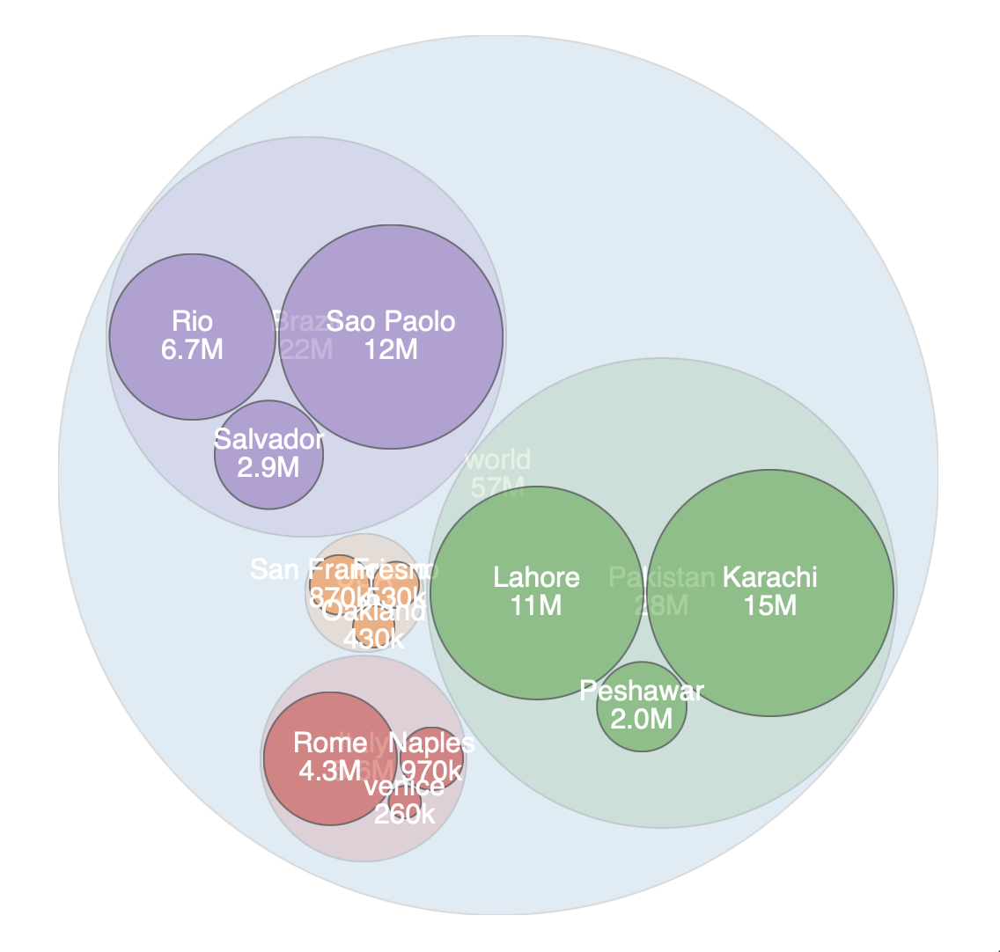
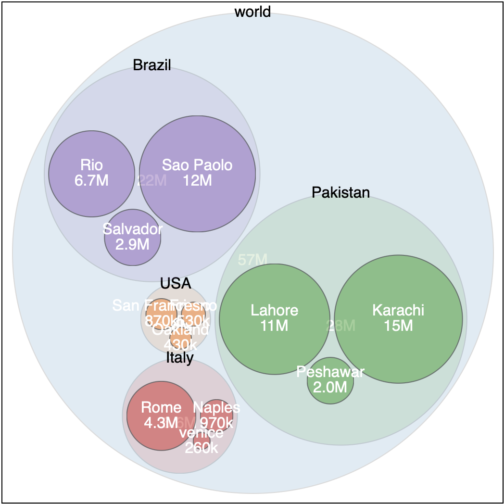

# Hierarchies

Hierarchies are a core feature of data structures. You see these in all parts of computer science. In the last example, you created a hierarchy with a single level. It was all about cities. Imagine we also want to show a relationship between cities and countries. 

In this case, we can group cities into a larger circle representing the country. The result might look like this. 



Note! I added another city to each country for this example. 

## Getting started

For this example, you'll use the `cities.csv` again. 

**Challenge**

Create a new HTML file with an `SVG` element. 

Import the D3.js library from the CDN. 

Add a script tag for your code. 

Load the cities.csv data using the `d3.csv()` loader. 

## Visualizing hierarchies

Looking at the cities data you'll find it has a hierarchy. Cities all belong to a country. The original data is flat the actual data is hierarchical. 

The original data look slike this: 

- "label","population","country","x","y"
- "San Francisco",874961,"USA",122,-37
- "Fresno",525010,"USA",119,-36
- "Lahore",11126285,"Pakistan",74,31
- "Karachi",14910352,"Pakistan",67,24
- "Rome",4342212,"Italy",12,41
- "Naples",967069,"Italy",14,40
- "Rio",6748000,"Brazil",-43,-22
- "Sao Paolo",12300000,"Brazil",-46,-23

Expressed as a single array: 

```JS
[
	{ label: "San Francisco", population: 874961, country: "USA", x: 122, y: -37
	{ label: "Fresno", population: 525010, country: "USA", x: 119, y: -36
	{ label: "Lahore", population: 11126285, country: "Pakistan", x: 74, y: 31
	{ label: "Karachi", population: 14910352, country: "Pakistan", x: 67, y: 24
	{ label: "Rome", population: 4342212, country: "Italy", x: 12, y: 41
	{ label: "Naples", population: 967069, country: "Italy", x: 14, y: 40
	{ label: "Rio", population: 6748000, country: "Brazil", x: -43, y: -22
	{ label: "Sao Paolo", population: 12300000, country: "Brazil", x: -46, y: -23
]
```

Notice some cities chare a country. Adds a level of hierarchy to the data that is not expressed in the data structure. 

We could rearrange the data to express this: 

```JS
{ 
	Brazil: [
		{label: "Rio", population: "6748000", country: "Brazil", x: "-43", y: "-22"},
		{label: "Sao Paolo", population: "12300000", country: "Brazil", x: "-46", y: "-23"}
	],
	Italy: [
		{label: "Rome", population: "4342212", country: "Italy", x: "12", y: "41"},
		{label: "Naples", population: "967069", country: "Italy", x: "14", y: "40"}
	],
	Pakistan: [
		{label: "Lahore", population: "11126285", country: "Pakistan", x: "74", y: "31"},
		{label: "Karachi", population: "14910352", country: "Pakistan", x: "67", y: "24"}
	],
	USA: [
		{label: "San Francisco", population: "874961", country: "USA", x: "122", y: "-37"},
		{label: "Fresno", population: "525010", country: "USA", x: "119", y: "-36"}
	]
}
```

With this arrangement, we can see that each country has cities. Our code can make this distinction also! 


## D3 Hierarchies

For D3 to understand the hierarchy you have created you need to arrange the data in a form that D3 will recognize. 

Every property needs to have a `children` property that contains the children of that node. 

In the last example you needed to arrange your data as:

```JS
{ 
	children: [ 
		{ label: 'Fresno', ... }, 
		{ label: 'Lahore', ... }, 
		{ label: 'Rome', ... }, 
		...
	] 
}
```

This is one level deep with the top-level having a single `children` property. 

For this example you need to arrange the data like this: 

```JS
{ 
	label: 'World',
	population: 9999999,
	children: []
}
```

Note! The population needs to be the total population of all cities! 

This will be the root element of the hierarchy. 

**Challenge** 

Define an object with `label`, `population`, and `children` properties. Make sure the value for `population` is the total population of all cities. 

<details>
<summary>

**solution**

</summary>

```JS
const byCountry = {
	label: 'world',
	children: [],
	population: data.reduce((acc, d) => parseInt(d.population) + acc, 0)
}
```

</details>

## Creating a hierarchy

Your next challenge is to rearrange the data into a hierarchy. For this, to work we need to arrange the data so that D3 will recognize our hierarchy. 

At the top level we need: 

```JS
{
	name: 'root',
	children: [ ... ]
}
```

`root` is the parent and `children` is an array of children. 

The `children` array should contain an array of objects each with a `name` and `children`, and again `children` is an array of objects. 

```JS
{
	name: 'root',
	children: [
		{ name: 'USA', population: 1825068, children: [ ... ] },
		{ name: 'Pakistan', population: 28006679, children: [ ... ] },
		...
	]
}
```

Do you see where this going? The array of `children` in each country contains the cities in that country! 

The goal is to get the data to look like this: 

```JS
{
	name: 'root',
	children: [
		{ 
			name: 'USA', 
			population: 1825068,
			children: [
				{ label: "San Francisco", population: 874961, x: 122, y -37 }, 
				{ label: "Fresno", population: 525010, x: 119, y: -36 }
			] 
		},
		{ 
			name: 'Pakistan', 
			population: 28006679,
			children: [
				{ label: "Lahore", population: 11126285, x: 74, y 31 },
				{ label: "Karachi", population: 14910352, x: 67, y: 24 }
			] 
		},
		...
	]
}
```

Note! you have to sum the population for all cities in a country along the way. 

**Challenge**

Your goal is the get the data arranged in the structure above. There are many ways to do this. Any method you choose is as good as another. 

If you need help getting started try this. Start with a:

```JS
const byCountry = {
	name: 'root',
	children: []
}
```

From here you need to populate the children with a list of countries. Where each country has a name and an array of children. Get the countries first with a map. You'll end up with duplicates so you can remove these by making a set:

```JS
const countryNames = Array.from(new Set(data.map(d => d.country)))
```

This should give you an array of unique country names/strings. Now turn these into objects with children.

<details>
<summary>

**Solution**

</summary>

```JS
const countryNames = Array.from(new Set(data.map(d => d.country)))
countryNames.forEach(d => {
	const cities = data.filter(c => c.country === d)
	const pop = cities.reduce((acc, d) => parseInt(d.population) + acc, 0)
	byCountry.children.push({ 
		label: d, 
		population: pop, 
		children: cities 
	})
})

console.log(byCountry) 
```

</details>

## Creating the hierarchy with D3

Create a D3 hierarchy with: 

```JS
const root = d3.hierarchy(byCountry)
```

Note! `byCountry` was the name I used to store the hierarchy I created in the previous step. You may have used any other name. 

Now sum the populations!

```JS
root
	.sum(d => {
	return d.population
}) // Must call sum before pack()
```

## Packing the Circles

Now create a pack from your hierarchy. Note! This code is the same as the previous tutorial example! 

```JS
// Pack - Create a pack function
const pack = d3.pack()
	.size([500, 500]) // Set the size of the area
	.padding(2) // define some padding between each circle
```

Now pack the root node. 

```JS
// Create a root node for d3 to draw
const rootNode = pack(root) // Must call sum() first! 
// This adds new properties to the root data
```

Here you created a pack object from the original data. It helps understand what happens later if you look at this. Try logging it to the console. 

```JS
console.log(rootNode)
```

We get something like this: 

```JS
pd {data: Object, height: 2, depth: 0, parent: null, children: Array, …}
```

Notice the original data has been rearranged and new properties have been added. 

Let's open this up and explore. 

```js
{
	children: [pd, pd, pd, pd],
	data: {label: "world", children: Array, population: 57334411},
	depth: 0,
	height: 2,
	parent: null,
	r: 249.99999999999997,
	value: 172003233,
	x: 250,
	y: 250
}
```

Notice your original properties: `label`, `children`, and `population` have been moved to live under the `data` property. 

New properties have been added: `x`, `y`, and `r` are used to position and size this circle. These can now be used to position and size your SVG elements. 

The `depth`, `parent`, and `children` are used by D3 to manage the hierarchy. Now we have a structure that relates the parent element to its children and the child to the parent. 

## Creating formtters and scales

We need a number formatter and a color scale. 

```JS
// Number formatter
const num_f = d3.format(".2s")

// Create a color scale 
const colorScale = d3
	.scaleOrdinal(d3.schemeCategory10)
```

Here we used the number formatter from the previous tutorial. 

The color scale is ordinal with the `schemeCategory10` which provides 10 different colors. The ordinal scale will allow us to map any arbitrary value across these 10 colors. In this case, we can use the country name or the city name, or even the population.

Note! You could use a list of your own colors here. For example: 

```JS
// Create a color scale 
const colorScale = d3
	.scaleOrdinal(['gold', 'tomato', 'cornflowerblue', 'green', 'chocolate', 'cadetblue', 'rebeccapurple'])
```

Here the scale values are a list of keyword colors. 

## Drawing the Circles

Draw the circles. Again this is the same as the previous tutorial! 

```JS
// Start drawing circles! 
const nodes = d3.select('#svg')
	.selectAll('g')
	.data(rootNode.descendants())
	.join('g')
	.attr('transform', d => `translate(${d.x}, ${d.y})`)
```

Here you're drawing the groups that will eventually hold the circles and text. 

This returns a list of group nodes which you will use to add some circles and text. 

Let's draw some circles. This will draw a circle between the world, each country, and each city. The cities will be positioned within a country, and countries will all be positioned within the world.

Notice that each circle is transformed and the `x` and `y` values that were created when we "packed" our data. 

You'll be adding a circle and text to each of these groups in the next steps. These elements will inherit the position from their group. 

```JS
nodes
	.append('circle')
	.attr('r', d => d.r) // get the radius
	.attr('fill', d => {
		if (d.data.country === undefined) {
			return colorScale(d.data.label)
		}
		return colorScale(d.data.country)
	})
	.attr('opacity', '0.5')
```

The radius `r` attribute is set from our `rootNode` where D3 conveniently created the value for us to use. 

The position is not needed since the group was positioned since being a child of the group created in the previous step it will inherit the position of the group. 

The fill color is set by the country or label name. D3 is going to work through all of the elements in the hierarchy. All of the leaf nodes (the cities) have a country name. The world and country nodes all use the `label` property to store their name. Here we can check if the country is `undefined` and use `label` instead. 

Passing the name into the `colorScale()` should give us a unique color for each country. Since the city nodes will have the same country names and the country nodes the larger country circles will have the same colors as the cities they contain. 

The last line sets the `opacity` of the element. This makes circles 50% transparent. Without this, it would be hard to see the cities contained within the country circles. 

At this point your visualization might look like this: 



Note! The image above is using the key word colors `.scaleOrdinal(['gold', 'tomato', 'cornflowerblue', 'green', 'chocolate', 'cadetblue', 'rebeccapurple'])`



This example uses the `.scaleOrdinal(d3.schemeCategory10)` color list. 

**Challenge**

Play with the values and properties here to change the appearance. Try these ideas: 

- Give the country a different opacity value from the cities
- Try giving the countries a stroke
- Try removing the fill from the world and giving the work a stroke

Here are a few images showing what these modifications might look like. 



Country and world opacity `0.15`, opacity of cities is `0.5`.



Here all of the circles have a `stroke` of `black` and a `stroke-width` of 1. Notice the opacity affects the stroke! 

## Adding the text

Adding text is the last step. Here you'll add the population to each city. There are a few problems that will arise here. The size of some of the circles is pretty small. The numbers may be larger. Adding the city or country name will be even larger. 

Second, the child circles appear on top of their parents. This will cover elements in the parent. For example, the countries appear on top of the world, and the cities appear on top of the countries. 

Add the population to each circle: 

```JS
nodes
	.append('text')
	.text(d => `${num_f(d.data.population)}`)
	.attr('font-family', 'Helvetica')
	.style('text-anchor', 'middle')
	.style('alignment-baseline', 'middle')
	.style('fill', 'white')
```

Here you append a text node to each group in nodes. 

Set the text to population. 

Then set some text attributes and styles. These include the `font-family`, `text-anchor`, and `alignment-baseline`, and `fill`. 

The `text-anchor` and `alignment-baseline` set the center point around where the text will be drawn. The `text-anchor` `middle` sets the position to horizontal center. The `alignment-baseline` `middle` sets the vertical alignment to the center. 

Might look like this:



You can see the country and world populations are covered by the city circles. Also, when the circles are clustered the country population is especially obscured. 

How you deal with this is up to you. Here are a few ideas. 

Imagine you wanted to add the city and country names. You can them to be above or below the population number. SVG doesn't allow for a text wrap or line break. The best we can do is make a second text element but this will require moving the two elements so that they do not overlap. 

Add a new text element to display the name. 

```JS
nodes
	.append('text')
	.text(d => `${d.data.label}`)
	.attr('font-family', 'Helvetica')
	.style('text-anchor', 'middle')
	.style('alignment-baseline', 'middle')
	.style('fill', 'white')
```

With this addition things might look like this: 



You can see the names are centered on top of the population numbers. You can nudge one of these up and the other down so they don't overlap. 

Remember you have two blocks that each add a text node. One for the population and the other for the name. 

Nudge the population number down by adding the following line to its block: 

```JS
.attr('transform', `translate(0, 8)`)
```

Then nudge the name up by adding this to the end of the other block: 

```JS
.attr('transform', `translate(0, -8)`)
```

With transform, the first value is the offset on the x or horizontal axis and the second number is the offset on the y or vertical axis. The numbers `8` and `-8` were chosen arbitrarily. You can adjust these to the font size and your visual taste. 

It might look like this so far: 



Note this is imperfect especially in the USA since all of the circles are much smaller than the text. 

To make this work you will have to make changes.

- If the whole diagram is larger then there will be more space and the centers of all of the circles will move further apart. 
- The text could be smaller. This would provide more space. If the text is too small it will be hard to read. 
- You can move them off the center of their circles. 

To wrap up this tutorial section let's experiment with the last idea. 

For the country names block I made these changes: 

```JS
nodes
	.append('text')
	.text(d => `${d.data.label}`)
	.attr('font-family', 'Helvetica')
	.style('text-anchor', 'middle')
	.style('alignment-baseline', 'middle')
	// set the fill color to black for country and world
	.style('fill', d => {
		if (d.data.country === undefined) {
			return 'black'
		}
		return 'white'
	})
	// Offset the y by the radius for the country and world
	.attr('transform', d => {
		if (d.data.country === undefined) {
			return `translate(0, -${d.r})`
		}

		return 'translate(0, -8)'
	})
```

Here we check that we are not a city node and then make some changes. 

I changed the color to black for the countries and world. 

Then I offset the y position by the radius. This moves the text to the top of the circle. This has the problem where the world label is halfway off the top of the SVG. I made the SVG larger by 20 and offset the group nodes by 10 to compensate. 

Here is what my example looked like: 



Still imperfect but hopefully you can see some options that might help make a better visualization. 