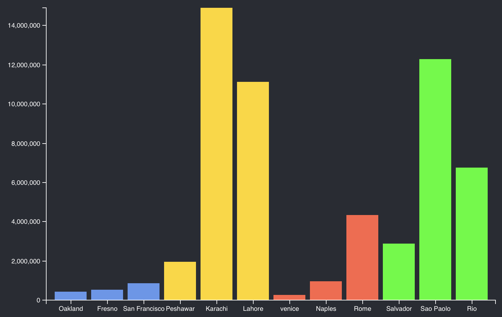

# D3 & React

You might be creating a React project and needs to incorporate D3. This is possible! To do this its important to understand that D3 and React work with the DOM in two different ways.

D3 uses the DOM in the traditional way where it access the "real" DOM directly. React uses a virtual DOM. Problems arise when mixing the two systems. D3 may make changes to the DOM, when React updates a component it will overwrite changes made by D3. 

For D3 and React to work together you use one of two methods. 

Handle all changes to element in a component, this way elements are managed by the virtual DOM, or declare a DOM element as a Reference, this prevents that element from being managed by the virtual DOM. 

Here is a link to a guide: 

https://www.pluralsight.com/guides/using-d3.js-inside-a-react-app

## Getting started 

Start by creating new React Project:

```
npx create-react-app react-d3-example
```

Add D3 as a dependency:

```
yarn add d3
```

Start your project with: 

```
yarn start
```

Open the project in your code editor. 

## Make a Bar chart component

This first example will let D3 manage the DOM by creating a ref. You'll start by creating a custom hook that returns reference to the D3 managed DOM element. 

To make it easy to use D3 make yourself a custom hook. Add a new file `useD3.js`.

```JS
import { useRef, useEffect } from 'react'
import * as d3 from 'd3'

export const useD3 = (renderChartFn, dependencies) => {
	const ref = useRef()

	useEffect(() => {
		renderChartFn(d3.select(ref.current))
		return () => {}
		}, dependencies)
	return ref
}
```

The code above is a hook. Next you'll create a new component to display a chart and import the hook above there. 

This needs some explanation. This function is a hook. A hook function whose name begins with "use". Here you created a function named `useD3`. 

Inside a hook you can call other hooks as long as you call them unconditionally. That is you can't put a call to another hook inside of an if else statement for example. 

A hook can take any parameters you care to include. In this the `useD3` hook takes two parameters: `renderChartFn` and `dependencies`.

Read more about React Hooks: https://reactjs.org/docs/hooks-custom.html

So how does the the `useD3` hook work? 

React normally manages DOM but in this case we want D3 to handle the DOM. "Handling" the DOM in this case means creating and updating elements in DOM. In out example we want D3 to create new SVG elements and set their attributes. 

To offload this this behavior from React and pass it to D3 you need a ref. A ref is a "reference" to a DOM element that will be handled outside of React. In our case this will the SVG element. 

The Ref can't be used until the element it refers to is created. For this work you'll use the `useEffect` hook. 

`useEffect` can be used to run a callback function when a component loads or when a component is updated. 

All of this might be hard to follow now let's talk about it again at the end after all of the rest of the code is in place. It will make more sense then. 

## Creating the bar chart

Create a new file `BarChart.js`.

Add the following: 

```JS
import * as d3 from 'd3'

function BarChart() {
  return (
    <svg
      style={{
        height: 500,
        width: "100%",
        marginRight: "0px",
        marginLeft: "0px",
      }}
    >
      <g className="plot-area" />
      <g className="x-axis" />
      <g className="y-axis" />
    </svg>
  )
}

export default BarChart
```

Notice this component is rendering an SVG element. Here you created some groups: `plot-area`, `x-axis`, and `y-axis`. In the previous examples you created those dynamically with D3. Here you wrote those elements and will populate them with D3. 

Now update the `BarChart` component in `BarChart.js`. Here you are importing the new `useD3`, and add the code to draw the bar chart. 

```JS
import * as d3 from 'd3'
import { useD3 } from './useD3'

function BarChart({ data }) {
	const ref = useD3((svg) => {
		const height = 500
		const width = 800
		const margin = { top: 20, right: 30, bottom: 30, left: 80 }

		const xscale = d3
			.scaleBand()
			.domain(data.map(d => d.label))
			.rangeRound([margin.left, width - margin.right])
			.padding(0.125)

		const yscale = d3
			.scaleLinear()
			.domain([0, d3.max(data, d => parseInt(d.population))])
			.rangeRound([height - margin.bottom, margin.top])
		
		const colorScale = d3
			.scaleOrdinal(data.map(d => d.country))
			.range(['cornflowerblue', 'gold', 'tomato', 'lime', 'brickred'])

		const bottomAxis = d3.axisBottom(xscale)
		const leftAxis = d3.axisLeft(yscale)

		svg
			.select('.x-axis')
			.attr('transform', `translate(0, ${height - margin.bottom})`)
			.call(bottomAxis)

		svg
			.select('.y-axis')
			.attr('transform', `translate(${margin.left}, 0)`)
			.call(leftAxis)

		svg
			.select('.plot-area')
			.selectAll('.bar')
			.data(data)
			.enter()
			.append('rect')
			.attr('class', 'bar')
			.attr('x', d => xscale(d.label))
			.attr('width', xscale.bandwidth())
			.attr('y', d => yscale(d.population))
			.attr('height', d => yscale(0) - yscale(d.population))
			.attr('fill', d => colorScale(d.country))
	}, [JSON.stringify(data)])

  return (
    <svg
			ref={ref} // *** Don't forget to add this line! ***
      style={{
        height: 500,
        width: "100%",
        marginRight: "0px",
        marginLeft: "0px",
      }}
    >
      <g className="plot-area" />
      <g className="x-axis" />
      <g className="y-axis" />
    </svg>
  )
}

export default BarChart
```

Notice you added the drawing code within the callback of the `useD3` hook. This hook returns a `ref`. The `ref` is a reference to a DOM element. This allows you to manage that element outside the virtual DOM! 

Notice all of the D3 drawing code happens within the callback in the call to `useD3`.

In the `<svg>` block a the bottom notice that you have added `ref={ref}`. This assigns the ref you created at the to this element. 

Look at the drawing code. Notice the `svg.select('.x-axis')...`, `svg.select('.y-axis')...`, and `svg.select('.plot-area')...`. Here you are selecting the elements you wrote hand. You skipped `.append()` for these because they already exist! You can select them in this way because you have created the ref for their parent svg element. 

The last parameter of `useD3`: `[JSON.stringify(data)]` might look a little weird. This is an array of dependencies. If one of the values in this array changes the render function, the first parameter, will be run. 

In this case we have an array of data. That we need to to compare which doesn't play nice here. To fix that I coverted the data into a string.

## Using the BarChart Component

To use the `BarChart` component. You'll make an instance in your react project and pass it some data. 

Open `App.js` and add the following: 

```JS
import './App.css';
import BarChart from './BarChart';

// Define you data
const data = [
	{ label: "Oakland", population: 425097, country: "USA" },
	{ label: "Fresno", population: 525010, country: "USA" },
	{ label: "San Francisco", population: 874961, country: "USA" },
	{ label: "Peshawar", population: 1970042, country: "Pakistan" },
	{ label: "Karachi", population: 14910352, country: "Pakistan" },
	{ label: "Lahore", population: 11126285, country: "Pakistan" },
	{ label: "venice", population: 258685, country: "Italy" },
	{ label: "Naples", population: 967069, country: "Italy" },
	{ label: "Rome", population: 4342212, country: "Italy" },
	{ label: "Salvador", population: 2886698, country: "Brazil" },
	{ label: "Sao Paolo", population: 12300000, country: "Brazil" },
	{ label: "Rio", population: 6748000, country: "Brazil" }
]

function App() {
  return (
    <div className="App">
      <header className="App-header">
        <BarChart data={data} />
      </header>
    </div>
  );
}

export default App;
```

The data is an array of objects. You could define this any where and import it if you like.

The page with the chart should look something like: 



Note! that I left the default Create-React.App `App.css` in place which is adding the background color and some other styles. 

## Loading CSV Data from a file

That was a little awkward placing all of the data in a `App.js`. This would be possible and maybe convenient for small lists of data. For many cases it will be easier to load the data from outside. 

Copy the `cities.csv` *into the public folder* of your React project.

In `App.js` make the following changes:

```JS
import './App.css';
import BarChart from './BarChart';
// Import useState and useEffect
import { useState, useEffect } from 'react' 
import * as d3 from 'd3' // import D3

function App() {
  const [data, setData] = useState([])
  
  useEffect(() => {
    d3.csv('./cities.csv')
      .then(data => {
        data.sort((a, b) => a.country < b.country)
        setData(data)
      })
  }, [])

  return (
    <div className="App">
      <header className="App-header">
        <BarChart data={data} />
      </header>
    </div>
  );
}

export default App;
```

Since loading the data will be an asynchrous action you need to store the data on state. React will only render a component when state changes or the component receives props. In this case the App component will render when it loads new data since you are storing the data on a state variable and updating that variable when the data is laoded. The BarChart component will update when new data is passed as a prop. 

## Review 

Let's review everything that happened in this example. 

### useD3

The `useD3` hook is responsible for creating a reference to the DOM element where D3 will do it's work creating DOM elements. 

```JS
export const useD3 = (renderChartFn, dependencies) => {
	const ref = useRef()

	useEffect(() => {
		renderChartFn(d3.select(ref.current))
		return () => {}
		}, dependencies)
	return ref
}
```

This hook can't do anything with the DOM until that DOM element is created so you used `useEffect`. Here `useEffect` will run the call back when the DOM is loaded and when any value in the `dependencies` array is updated. 

To use `useD3` you called it in the `BarChart` component. 

```JS
const ref = useD3((svg) => {

	... d3 drawing code here ...

}, [JSON.stringify(data)])
```

`useD3` returns a reference object which you assigned to the svg element where D3 will do it's drawing. 

```HTML
<svg
	ref={ref}
	...
</svg>
```

The first argument you pass to `useD3` is the render function. This function does the work of rendering your D3 elements. 

The second argument you passed to `useD3` is the `dependencies` array. If any value in this array changes `useD3` will run the render function again. Which should redraw your chart. 

## Challenges

**Challenge:** This looks good but that data is getting pretty old! Try this example with another dataset.

**Challenge:** Update the data. Doing this will show how `useEffect` is working with `useD3` and that `dependencies` array. 

Try this: create a couple buttons that sort the data on different criteria. For example: sort on name/label. Sort on country, sort on population. 

Since `array.sort()` mutates the original array you'll need to top the array when you set state.  

## Conclusion

In this tutorial you leanred to build a D3 chart in React. You created a custom hook that managed DOM elements in React using a ref. 

