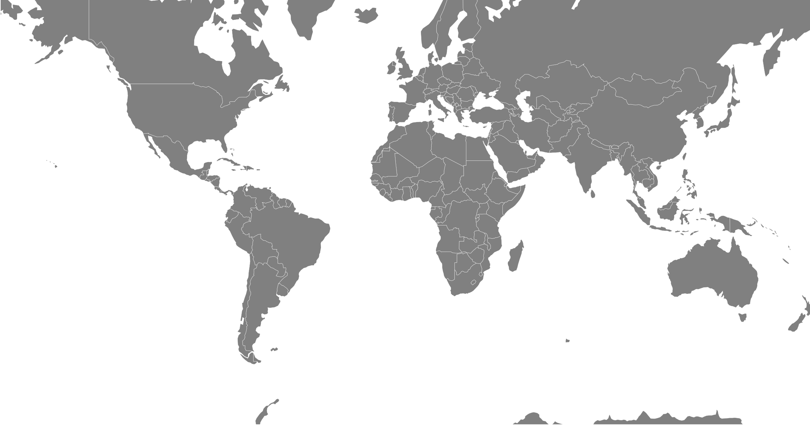

# Maps with D3

Some data contains location information. D3 contains some powerful tools for displaying maps. 


<!-- Outline

Ideas from Blocks:
https://bl.ocks.org/d3noob/82f4db23d47971c74699abb5f4bf8204

import map json:
<script src="https://unpkg.com/topojson@3"></script>

Download: world-110m2.json 
from: https://github.com/cszang/dendrobox/blob/master/data/world-110m2.json
Click "raw" and save your file with the name: world-110m2.json


 -->


## Getting started

Start by setting up the boiler plate D3 HTML document. Leave out the SVG tag and you will generate that in code this time. 

<details>
<summary>

**solution**

</summary>

```HTML
<!DOCTYPE html>
<html lang="en">

<head>
	<meta charset="UTF-8">
	<meta http-equiv="X-UA-Compatible" content="IE=edge">
	<meta name="viewport" content="width=device-width, initial-scale=1.0">
	<title>D3 Maps US</title>
</head>

<body>
<script src="https://d3js.org/d3.v7.min.js"></script>
<script>
	// code here
</script>
</body>
</html>
```

</details>

## Dependencies 

For this project there are a couple dependencies. You need to import `topojson`. This contains utilities that work map data. It's repsonible for drawing the borders around regions on the map. 

Check out the topojson repo: https://github.com/topojson/topojson

Add this to head of your document: 

```HTML
<script src="https://unpkg.com/topojson@3"></script>
```

YOu also need some map data. There are many different datasets for maps. For this example you will use a world map. I couldn't find this data on a CDN so you'll need to download the file and save it to the directory where you are working. 

- Go to: https://github.com/cszang/dendrobox/blob/master/data/world-110m2.json
- Click "raw" and save the file with the name: "world-110m2.json"

## Define the height and width

Add some variables to define the height and width of your map:

```JS
// Define some variables for width and height
const width = 950
const height = 500
```

## Projections 

The globe is a sphere your computer screen is flat. To display the world on your screen you need a projection to map the sphere on to the flat screen. D3 supports many different types of projections. 

Check out some examples and read more about projections here: https://github.com/d3/d3-geo-projection

Define a projection: 

```JS
// Define a projection
const projection = d3.geoMercator()
```

Here you used the mercator projection. YOu may have seen this in the docs linked above. This is a classic map. Notice the top and bottom are stretched out where in the center band of of the globe things are the correct relative size.

## Drawing the Map

Start by creating an SVG element: 

```JS
const svg = d3.select('body')
  .append('svg')
  .attr('width', width)
  .attr('height', height);
```

Notice you used the width and height defined earlier. 

Next create a path that will draw the outlines of the continents and countries on the map: 

```JS
const path = d3.geoPath()
  .projection(projection);
```

Here you used `d3.geoPath()` and passed your `projection` in and it returned a path. 

Next add a group to hold the map path: 

```JS
const g = svg.append('g');
```

Last load the map data:

```JS
async function loadMap() {
  // load and display the World
  const topology = await d3.json('world-110m2.json')
  g.selectAll('path')
    // Use topojson here to extract the topology from the map data
    .data(topojson.feature(topology, topology.objects.countries).features)
    .enter()
    .append('path')
    .attr('d', path)
}
```

Here you need to load the `world-110m2.json` data you downloaded earlier. Since this is an asynchronus activity you used a an `async` function and `d3.json` to load the file since it is a JSON file. 

After the file loads you selected the path and set the data. Notice that you used `topojson`, which you imported at the top, passed the `topolgy` data in to define the features that you wanted. In this case you want the countries. 

Then you set appeded a path and set the `d` property to draw the svg shapes. 

## Style the path

To see the countries you'll need to add some styles: 

```JS
.attr('fill', 'grey')
.attr('stroke', 'white')
.attr('stroke-width', 0.25)
```

Here you set the fill to grey, the stroke color to white, and stroke width to 0.25. 

When you're done your map might look like this: 




