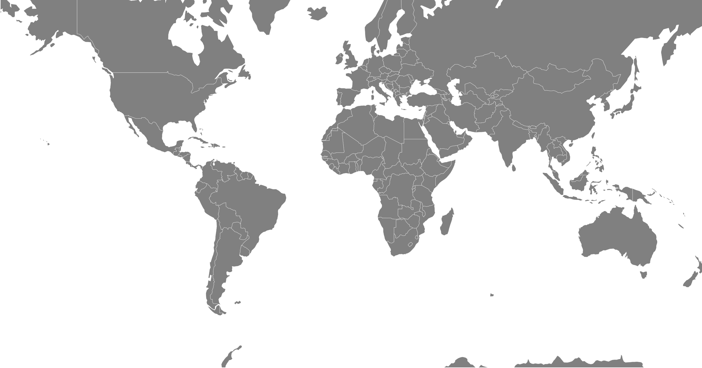
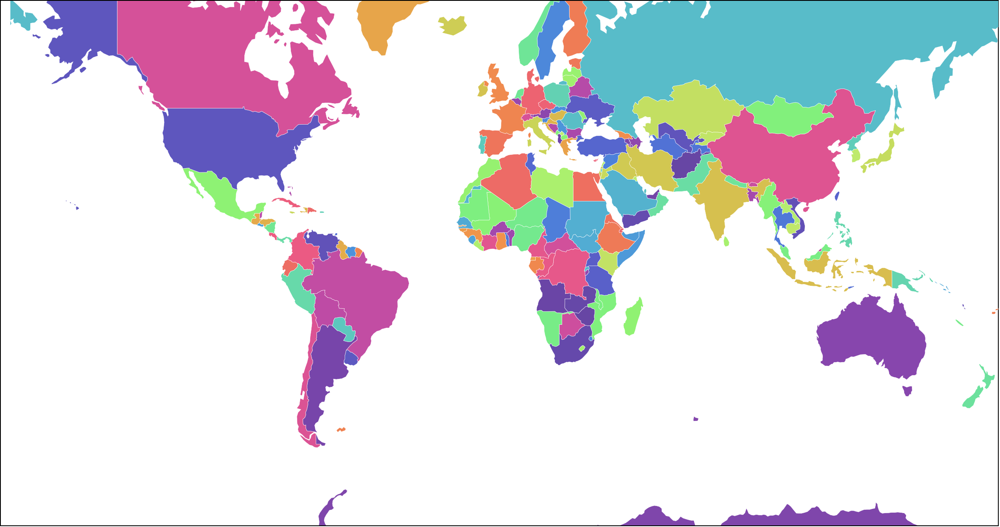

# Maps with D3

Some data contains location information. D3 contains some powerful tools for displaying maps. 

## Getting started

Start by setting up the boiler plate D3 HTML document. Leave out the SVG tag and you will generate that in code this time. 

<details>
<summary>Solution</summary>

```HTML
<!DOCTYPE html>
<html lang="en">

<head>
  <meta charset="UTF-8">
  <meta http-equiv="X-UA-Compatible" content="IE=edge">
  <meta name="viewport" content="width=device-width, initial-scale=1.0">
  <title>D3 Maps US</title>
</head>

<body>
<script type="module">
  import * as d3 from "https://cdn.jsdelivr.net/npm/d3@7/+esm";
  // code here
</script>
</body>
</html>
```

</details>

## Dependencies 

For this project there are a couple dependencies. You need to import `topojson`. This contains utilities that work with map data. It's responsible for drawing the borders around regions on the map. 

Check out the topojson repo: https://github.com/topojson/topojson

Add this to head of your document: 

```HTML
<script src="https://unpkg.com/topojson@3"></script>
```

You will also need some map data. There are many different datasets for maps. For this example you will use a world map. I couldn't find this data on a CDN so you'll need to download the file and save it to the directory where you are working. 

- Go to: https://github.com/cszang/dendrobox/blob/master/data/world-110m2.json
- Click "raw" and save the file with the name: "world-110m2.json"

## Define the height and width

Add some variables to define the height and width of your map:

```JS
// Define some variables for width and height
const width = 950
const height = 500
```

## Projections 

The globe is a sphere your computer screen is flat. To display the world on your screen you need to use a projection to map the sphere on to the flat screen. D3 supports many different types of projections. 

Check out some examples and read more about projections here: https://github.com/d3/d3-geo-projection

Define a projection: 

```JS
// Define a projection
const projection = d3.geoMercator()
```

Here you used the mercator projection. You may have seen this in the docs linked above. This is a classic map. Notice the top and bottom are stretched out where in the center band of the globe things are the correct relative size.

## Drawing the Map

Start by creating an SVG element: 

```JS
const svg = d3.select('body')
  .append('svg')
  .attr('width', width)
  .attr('height', height)
```
This time you created the root svg element dynamically using D3 instead of writing the `<svg>` tag manually! 

Notice you used the width and height defined earlier. 

Next create a path that will draw the outlines of the continents and countries on the map: 

```JS
const path = d3.geoPath()
  .projection(projection)
```

Here you used `d3.geoPath()` and passed your `projection` in and it returned a path. 

Next add a group to hold the map path: 

```JS
const g = svg.append('g')
```

Last load the map data:

```JS
async function loadMap() {
  // load and display the World
  const topology = await d3.json('world-110m2.json')
  g.selectAll('path')
    // Use topojson here to extract the topology from the map data
    .data(topojson.feature(topology, topology.objects.countries).features)
    .enter()
    .append('path')
    .attr('d', path)
}

loadMap()
```

Here you need to load the `world-110m2.json` data you downloaded earlier. Since this is an asynchronous activity you used a an `async` function and `d3.json()` to load the file since it is a JSON file. 

After the file loads you selected the path and set the data. Notice that you used `topojson`, which you imported at the top, passed the `topology` data in to define the features that you wanted. In this case you want the countries. 

Then you appended a path and set the `d` property to draw the svg shapes. 

## Style the path

To see the countries you'll need to add some styles: 

```JS
.attr('fill', 'grey')
.attr('stroke', 'white')
.attr('stroke-width', 0.25)
```

Here you set the fill to grey, the stroke color to white, and stroke width to 0.25. 

When you're done your map might look like this: 



**Challenge:** 

Style the SVG element. Place it in the center of the page. You'll need to use CSS styles for this. 

Give the SVG element a border. 

**Challenge:** 

Edit the fill and stroke styles of the map.

## Positioning the map

Besides projecting the map on to a flat surface also controls how the project is positioned. Since the world is a sphere you could rotate it before flattening it onto the screen. 

The project has a rotation option. Try setting the rotation: 

```JS
const projection = d3.geoMercator()
  .rotate([-180, 0]); // Set the rotation
```

This should rotate the world -180 degrees on the vertical axis. 

Take a look at the antarctic: 

```JS
.rotate([0, 90])
```

Here you rotated the globe 90 on the horizontal axis. 

You can also set the scale of the map. Try this: 

```JS
.scale(400)
.rotate([0, 90])
```

This should zoom into the Antarctic. 

Try this: 

```JS
.scale(100)
.rotate([0, 0])
```

This should image should make it clear how the mercator projection distorts the world map at the top and bottom. 

**Challenge:** 

Use rotation and scale to zoom in on Japan. 

<details>
<summary>Solution</summary>

These were the numbers I used:
```JS
.scale(850)
.rotate([-135, -45])
```

</details>

## Add some color

Add a little color. This next step won't solve all of your color questions but it will get you started coloring the map. In this step you'll give each country a different color based on a linear scale. 

Create a linear scale for color. There are 176 countries in the list so that will be the domain. The colors from tomato to gold will be the range.  

```JS
// Color scale 
const colorScale = d3.scaleLinear()
  .range(['tomato', 'gold'])
  .domain([0, 176])
```

D3 recognizes the keyword colors, tomato is: `#FF6347`, and gold is: `#FFD700`. D3 will interpolate (blend) across these values. 

**Challenge:** 

Apply the color scale to the fill. 

<details>
<summary>Solution</summary>

```JS
 .attr('fill', (d, i) => colorScale(i))
```

</details>

Here is another strategy. Use one of D3 color interpolators. Try this: 

```JS
const colorScale = d3.scaleSequential()
  .interpolator(d3.interpolateRainbow)
  .domain([0, 176])
```

Notice here you changed the scale type to sequential. Then used the interpolator with the rainbow interpolator. This should cycle through the default D3 rainbow and give each country a different color. 

Your map might look like this after using the color scale:  



Here is another alternative. This doesn't use a scale at all. Instead you will generate a fill color dynamically. Find the line that sets the fill attribute for the path. 

```JS
.attr('fill', (d, i) => `hsl(${360 / 176 * i}, 70%, 50%)`)
```

HSL colors take a hue as the first parameter. This ranges from 0 to 360. If we need 176 colors you can divide 360 by 176 and then multiply by the index to get a unique hue for each country. 

## Check Your Understanding

**Q1.** `d3.geoPath()` and `d3.geoMercator()` are two separate objects chained together (`d3.geoPath().projection(projection)`). What does each one actually do?

<details><summary>Answer</summary>

`d3.geoMercator()` (the projection) converts spherical geo-coordinates (longitude/latitude) into flat x/y pixel coordinates. `d3.geoPath()` takes GeoJSON/TopoJSON shape data — polygons describing country borders — and, using the projection you give it, generates the actual SVG `d` path string to draw those borders. The projection handles the coordinate math; the path generator handles turning shapes into drawable paths.

</details>

**Q2.** Why does the map need `topojson.feature()` at all — why not pass the downloaded map file straight into `.data()`?

<details><summary>Answer</summary>

TopoJSON stores shared borders once instead of duplicating them for every adjacent country (that's what makes it more compact than plain GeoJSON). `topojson.feature()` decodes that compact format back into standard GeoJSON features — the shape objects `d3.geoPath()` and `.data()` actually expect — one per country.

</details>

**Q3.** Setting `.scale(100).rotate([0, 0])` on the Mercator projection makes the distortion at the poles obvious. Why does a flat map projection distort anything at all?

<details><summary>Answer</summary>

The Earth is a sphere; a screen is flat. There is no way to unroll a sphere onto a flat plane without stretching, tearing, or otherwise distorting something — every projection makes a different tradeoff about what to preserve (area, angle, distance) and what to sacrifice. Mercator preserves angles/shape locally but stretches area dramatically near the poles, which is exactly what you're seeing.

</details>

## Conclusion 

In this tutorial you created a world map with D3 using topojson along with D3's projection. 

Read more about projections here: https://www.d3indepth.com/geographic/
