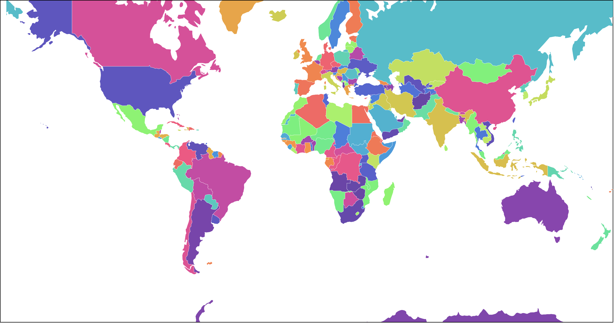
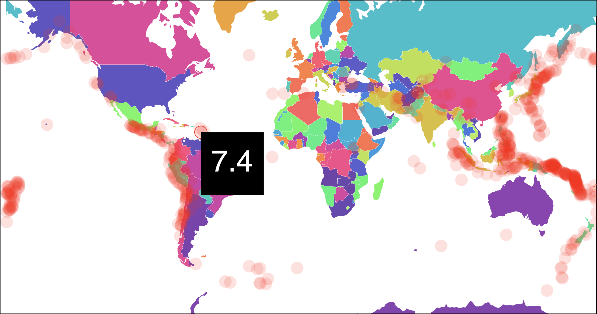

# D3 Maps Part 2

This tutorial will take a second look at the world map. 

In this example you will create the world map and map earthquake data onto the map using geo coordinates. 

## Getting started 

Create a new directory where you will be working. Add a new html file and add your boilerplate D3 code to get started. 

Be sure to import: 

- `<script src="https://d3js.org/d3.v7.min.js"></script>`
- `<script src="https://unpkg.com/topojson@3"></script>`

Copy your dependencies into this folder. You need:  

- `earthquake.csv` 
- `world-110m2.json`

Setup the map. Define some constants: 

```JS
const width = 950
const height = 500
```

Select the body element, create an SVG element and set the width and height: 

```JS
// Create an SVG element
const svg = d3.select('body')
  .append('svg')
  .attr('width', width)
  .attr('height', height);
  ```

Define a group to hold the map: 

```JS
// Make a group to hold the map
const g = svg.append('g');
```

Define a projection and a path generator:

```JS
// Define a projection
const projection = d3.geoMercator()
  // .center([0, 5])
  .scale(150)
  .rotate([0, 0]);

// Create a path
const path = d3.geoPath()
  .projection(projection);
```

Create a color color scale you can use to color the countries: 

```JS
// Color scale 
const colorScale = d3.scaleSequential()
  .interpolator(d3.interpolateRainbow)
  .domain([0, 176])
```

Now load the map and display it: 

```JS
async function loadMap() {
  const topology = await d3.json('world-110m2.json')
  g.selectAll('path')
    .data(topojson.feature(topology, topology.objects.countries).features)
    .enter()
    .append('path')
    .attr('d', path)
    .attr('fill', (d, i) => colorScale(i))
    .attr('stroke', 'white')
    .attr('stroke-width', 0.25)
}

loadMap()
```

You should now have a map that looks like this: 



## Mapping coords

The goal is to display the locations of earthquakes on the map. The first step is to load the earthquake data. 

Load the earthquake data in the `loadMap()` function. Since this function is `async` and `d3.csv()` returns a Promise you can `await` this.

Place this at the top: 

```JS
async function loadMap() {
  // Load the earthquake data
  const earthquakeData = await d3.csv('earthquake.csv')

  const topology = await d3.json('world-110m2.json')
  g.selectAll('path')
  ...
}
```

### Filtering the data

Take a glance at `earthquake.csv`. Look at the first line of the file. This file defines the following keys: 

```
Date,Time,Latitude,Longitude,Type,Depth,Depth Error,Depth Seismic Stations,Magnitude,Magnitude Type,Magnitude Error,Magnitude Seismic Stations,Azimuthal Gap,Horizontal Distance,Horizontal Error,Root Mean Square,ID,Source,Location Source,Magnitude Source,Status
...
```

Wow that's a lot of keys! Let's list them here: 

- Date
- Time
- **Latitude**
- **Longitude**
- Type
- Depth
- Depth Error
- Depth Seismic Stations
- **Magnitude**
- Magnitude Type
- Magnitude Error
- Magnitude Seismic Stations
- Azimuthal Gap
- Horizontal Distance
- Horizontal Error
- Root Mean Square
- ID
- Source
- Location Source
- Magnitude Source
- Status

I highlighted a couple pieces of data that we will use in this example: latitude, longitude, and magnitude. The first two are the geo coordinates of the earthquake. 

Scroll to the bottom of the data. There is more than 23,000 earthquakes recorded here! That's a lot of data. Mabe too much to show on the screen. Imagine 23,000 circles... Might be hard to understand what was going on. It may also caus performance issues. 

You need to filter this data to show a reasonable number of data points. I experimented a bit and found that displaying all of the earthquakes with a magnitude greater than 7 showed a reasonable number of quakes. 

Add the following below the line that loads the earthquake data: 

```JS
// Filter for earthquakes greater than 7 magnitude
const data = earthquakeData.filter(d => d.Magnitude > 7)
```

## Marking the Earthquakes

The next step is to display an evg element at the position of each earthquake. To do this you need to translate the longitude and latitude data into screen coordintes. These are two different numbers and scales! 

Read about longitude and latitude (optional): https://en.wikipedia.org/wiki/Geographic_coordinate_system

Luckily D3 has this all figured out! The projection function you created earlier will translate any pair of geocoordinates into pixel coordinates! For example: 

```JS
projection([-122.431297, 37.773972]) // [159.47561397944156, 143.05157618818106]
```

The input array contains the geolocation [longitude, latitude] of San Francisco the output array contains the x and y position of San Francisco on this projection. Notice you input an array and the output was an array!

The data has these properties: 

- **Latitude**
- **Longitude**

Notice the splling! (uppercase L)

Create a circle for each earthquake: 

```JS
// add a circle for each earthquak in data
d3.select('svg')
  .selectAll('circle')
  .data(data)
  .enter()
  .append('circle')
  // Position the circles using geo coords and porjection
  .attr('cx', d => projection([d.Longitude, d.Latitude])[0])
  .attr('cy', d => projection([d.Longitude, d.Latitude])[1])
  // Style the circles 
  .attr('r', 10)
  .attr('fill', 'rgba(255, 0, 0, 0.15)')
```

First you select the svg element. Then selected all of the circles. It might have been good to put all of these circles in a group first (**challenge** add all of the circles to a group!) Then you set the data for this selection, entered the data, appended circles. This should give you a circle for each element in the data array. 

Next you positioned each circle by setting it's `cx` and `cy`. To do this you got the data element as `d` then passed the array of longitude and latitude: `[[d.Longitude, d.Latitude]]` into your `projection()` function. 

```js
projection([d.Longitude, d.Latitude])
```

Note! You used `d.Longitude` and `d.Latitude` (uppercase) because this is how the keys were spelled in the CSV file! 

Note! Projection is returning an array with two values. The first value is the `cx` and the second is `cy`. You used the `[0]` and `[1]` at the end to get the value you needed. 

```JS
.attr('cx', d => projection([d.Longitude, d.Latitude])[0])
.attr('cy', d => projection([d.Longitude, d.Latitude])[1])
```

Last, you styled the circles. I set the radius to 10 and the color to a transparent red. 

**Challenge** 

Style the circles yourself. 

Add a stroke by setting the stroke (color) and stroke-width.

## Interacting with circles

It might be nice for anyone researching earthquakes to know what the magnitude was for any particular earthquake. In this section you will add a pop up tooltip that shows magnitude value above the location. 

The information box you create will be a rectangle containing the magnnitude of the quake in the center as a text element. To make this work you'll need to make a group that contains both a `rect` and `text` element. 

```html
<g>
  <rect />
  <text>0.0</text>
```

Start by creating a variable for the info box with D3. 

```JS 
const infoBox = d3.select('svg')
  .append('g')
  .attr('class', 'info-box')
```

Here you made the new group and assigned it to the variable: `infoBox`. Then you set the class attribute. This way you can can style the info box or select it via it's class name. Which might be useful. 

Next append a rectangle to the info box and set it's size: 

```JS
infoBox.append('rect')
  .attr('width', 100)
  .attr('height', 100)
```

Now add a text element to the info box and set some styles: 

```JS
infoBox
  .append('text')
  .text('0.0')
  .attr('fill', 'white')
  .attr('dx', 50)
  .attr('dy', 50)
  .attr('text-anchor', 'middle')
  .attr('alignment-baseline', 'middle')
  .attr('font-size', 48)
  .attr('font-family', 'Helvetica')
```

Here you appened the text element, set the initial text to "0.0", set the fill color, set the position, the alignment (these two properties center it in the rectangle,) then set the font size and font family. 

When you're done you should see a black box in the upper left corner of the page. 

You only want this box to show up when you hover over an earthquake location. Hide the box by setting the display attribute of the group. Add this new line here: 

```JS
const infoBox = d3.select('svg')
  .append('g')
  .attr('class', 'info-box')
  .attr('display', 'none') // add this line! 
```

If an element has display none it is not visible.

The infor box will become visible when you hover over one of the circle, it should hide when you move the cursor off of the circle. You can do this by adding mous events with D3. 

D3 works with all of the standard JS events but uses it's own syntax of `.on(event, handler)` instead of JavaScript's `.addEventListener(event, handler)`.

Find the code where you appended the circles. You'll add mouse events to the circles. 

```JS
d3.select('#svg')
  .selectAll('circle')
  .data(data)
  .enter()
  .append('circle')
  ...
  .on('mouseover', function (e, d) {
    // Show the info box
  })
  .on('mouseout', function (d, i) {
    // Hide the info box
  })
```

Add the event listeners to the end of the existing code. 

Notice that the handler for each event listener receives an event object and the data for that element. 

```JS
.on('mouseover', function (e, d) {
    // Show the info box
  })
```

Here `e` is the event object and `d` is data associated with the element. 

Display the box and set the magnitude. 

```JS
.on('mouseover', function (e, d) {
  d3.select(this)
    .attr('stroke', '#f00')
  d3.select('.info-box')
    .attr('display', 'yes')
    .attr('transform', `translate(${d3.select(this).attr('cx')}, ${d3.select(this).attr('cy')})`)
  d3.select('.info-box text')
    .text(d.Magnitude)
})
```

First you select the element you mouseovered. `this` in an event handler is the element that generated the event. In this case it should be one of the circles. You can select it with: `d3.select(this)`. Then set the stroke of the circle. 

Next find the info box with via it's class name. Set display to `yes` to make it visible. Then stransform it to the location of the circle you are hovering over. To do this you need to get the `cx` and `cy` attributes. 

Last set the text of the text element in the info box to the magnitude of the data.

The info box should show up now but it doesn't go away. Use the `mouseout` event to hide it. 

```JS
.on('mouseout', function (e, d) {
  d3.select(this)
    .attr('stroke', 'none')
  d3.select('.info-box')
    .attr('display', 'none')
})
```

Here you select the circle and set it's stroke to none, this removes the stroke added by the `mouseover` event. 

Then you selected the info box via it's class name and set it's `display` attribute to none, this hides it.

The map should look reoughly like this: 



**Challenge** 

Style the info box and text. Do anything you like here. Make it look the way you think is best. Set the fill color, stroke, and stroke-width, change the size etc. 

**Challenge**

Style the circle in it's hovered state. Currently you just set the stroke. You could also change the fill, or the radius, or anything else you can think of. 

**Challenge**

Animate the info box. Make fade in on mouse over and fade out on mouse out. You can do this by setting the opacity. 

**Challenge**

Display other information in the info box. There is lots more data in the CSV file, look at the keys. You have access to all of this through data object `d`. 

## Conclusion

In this tutorial you reviewd the concepts of making a world map with D3. Then you learned to map data with geolocation information on to a projection. You also used `.on()` to handle mouse events. 
