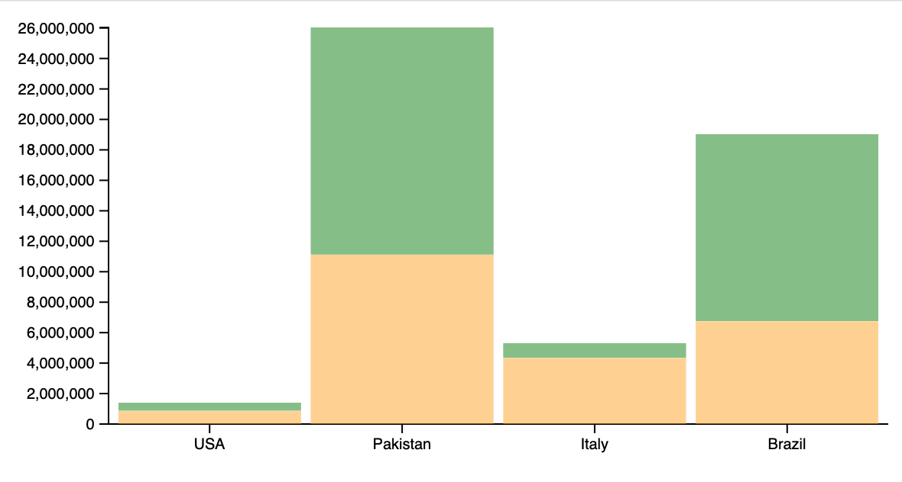

# Create stacked bars

This tutorial assumes that you have completed the earlier tutorials on bars, scales and axis. 

## Getting started

This project will use the population data from the earlier tutorial and display the population of each country as a bar made up of stacked blocks that represent the populations of each city in that country. 

Start by creating a folder where you will be working. 

Add the cities.csv file from the earlier eaxmples, or create it now and and add this data: 

```
"label","population","country","x","y"
"San Francisco",874961,"USA",122,-37
"Fresno",525010,"USA",119,-36
"Lahore",11126285,"Pakistan",74,31
"Karachi",14910352,"Pakistan",67,24
"Rome",4342212,"Italy",12,41
"Naples",967069,"Italy",14,40
"Rio",6748000,"Brazil",-43,-22
"Sao Paolo",12300000,"Brazil",-46,-23
```

There are four countries: Brazil, Italy, Pakistan, and USA. There are two cities in each country. 

## Setup HTML

Create a new html document. Name it index.html. Add the following boilerplate code: 

```HTML
<!DOCTYPE html>
<html lang="en">
<head>
  <meta charset="UTF-8">
  <meta http-equiv="X-UA-Compatible" content="IE=edge">
  <meta name="viewport" content="width=device-width, initial-scale=1.0">
  <title>Stacked bars</title>
</head>
<body>

  <svg id="svg" width="500" height="300"></svg>

  <script type="module">
    import * as d3 from "https://cdn.jsdelivr.net/npm/d3@7/+esm";

    // Your code here
  </script>
</body>
</html>
```

You will drawing your chart into the svg#svg. You are importing the D3 library as a module. All of your code will go in the script tag below the comment "Your code here".

## Loading Data

Load the data from the CSV file with an async function. 

```JS
async function handleData() {
    // Load the data
    const data = await d3.csv('cities.csv')

}

handleData()
```

Here you defined an async function and invoked that that function. Then you loaded the data from `cities.csv`.

## Arranging the Data 

For this example the data needs to be arranged with each country having properties for each city. Currently the data is aranged as cities. 

Currently you have something like: 

```
[
    {label: "San Francisco", population: 874961, country: "USA", x: "122", y: "-37"}
    {label: "Fresno", population: 525010, country: "USA", x: "119", y: "-36"}
    {label: "Lahore", population: 11126285, country: "Pakistan", x: "74", y: "31"}
    {label: "Karachi", population: 14910352, country: "Pakistan", x: "67", y: "24"}
    {label: "Rome", population: 4342212, country: "Italy", x: "12", y: "41"}
    {label: "Naples", population: 967069, country: "Italy", x: "14", y: "40"}
    {label: "Rio", population: 6748000, country: "Brazil", x: "-43", y: "-22"}
    {label: "Sao Paolo", population: 12300000, country: "Brazil", x: "-46", y: "-23"}
]
```

Each city is separate and has counrty as a property. 

We need to arrange this like this: 

```
[
    {country: "USA", total: 1399971, city0: 874961, city1: 525010}
    {country: "Pakistan", total: 26036637, city0: 11126285, city1: 14910352}
    {country: "Italy", total: 5309281, city0: 4342212, city1: 967069}
    {country: "Brazil", total: 19048000, city0: 6748000, city1: 12300000}
]
```

Here all of the countries have properties of city0 and city1 which show the population of each city. 

```JS
// Convert all of the popluation values to numbers
data.forEach(d => d.population = parseInt(d.population))

// Create a unique list of countries
const countries = Array.from(new Set(data.map(d => d.country)))
// Create an array of countries
const byCountry = []
// Populate the byCountry array woth data
countries.forEach(country => {
    const obj = {
        country,
        total: 0
    }
    const cities = data.filter(d => d.country === country).forEach((city, i) => {
        obj['city'+i] = city.population // get a city
        obj.total += city.population // tally the total population 
    })
    byCountry.push(obj)
})

console.log(byCountry) // Check our work
```

Here you convert the array of cities into an array of countries. 

## Define size and margin 

Start by defining some sizes and margins. 

```JS 
const margin = { top: 10, right: 10, bottom: 20, left: 80 }
const width = 600 - (margin.left + margin.right)
const height = 300 - (margin.top + margin.bottom)
```

## Define some scales 

Define your scales. 

```JS
// x scale 
const xscale = d3.scaleBand()
    .domain(byCountry.map(d => d.country))
    .range([margin.left, width + margin.left])
    .padding(0.05) // space between bars

// Get the popluation extents  
const popExtent = d3.extent(byCountry, d => d.total)

const yscale = d3.scaleLinear()
    .domain([0, popExtent[1]]) // Lets use 0 to the max extent
    .range([height, margin.top])
```

X scale uses scaleBand indexed on the country name. 

Y scale uses population extent based on 0 to the total population for all countries. It finds the highest total population and will range from 0 to that highest value. 

Add a color scale. 

```JS
const colorscale = d3.scaleOrdinal()
    .domain(['city0', 'city1'])
    .range(['orange','green'])
```

## Create axis

Here you will make a group to hold the axis. Then append the axis to this group. 

Start by selecting the SVG element and setting it's size. 

```JS
// Select the SVG element
const svg = d3.select("#svg")
    .attr("width", width + margin.left + margin.right)
    .attr("height", height + margin.top + margin.bottom)
```

Next, append a group for the bottom axis and position that axis with the magins. 

```JS
// Append a group bottom axis
svg.append("g")
    .attr("transform", `translate(0, ${height})`)
    .call(d3.axisBottom(xscale).tickSizeOuter(0));
```

Append another group for the left axis

```JS
 // Add a left axis
svg.append("g")
    .attr("transform", `translate(${margin.left}, 0)`)
    .call(d3.axisLeft(yscale));
```

## Setup stack 

Here you'll use `d3.stack()`. This will generate a stack but it needs to know which properties to stack.  

```JS
const stackedData = d3.stack()
    .keys(['city0', 'city1'])(byCountry)
```
Notice you provide the keys and the data. 

## Drawing the stacked bars


```JS
svg.append("g")
    .selectAll("g")
    // Enter in the stack data = loop key per key = group per group
    .data(stackedData)
    .enter()
    .append("g")
    .attr("fill", d => colorscale(d.key))
    .selectAll("rect")
    // enter a second time = loop subgroup per subgroup to add all rectangles
    .data(d => d)
    .enter()
    .append("rect")
    // We need the country name to arrange the bars on the x
    .attr("x", (d, i) => xscale(d.data.country))
    .attr("y", d => yscale(d[1]))
    .attr("height", d => yscale(d[0]) - yscale(d[1]))
    .attr("width", xscale.bandwidth())
    .attr("opacity", 0.5)
```




