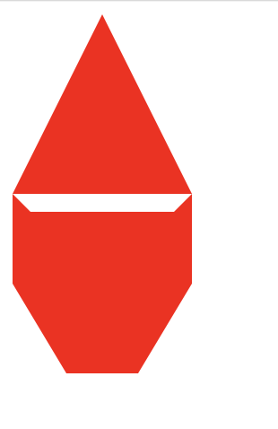
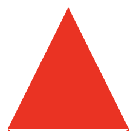
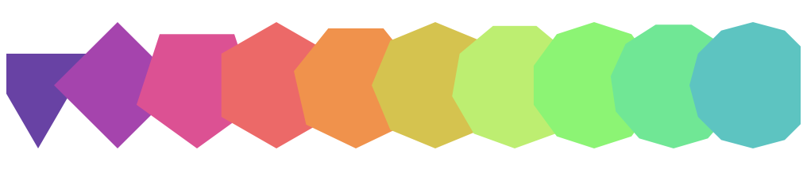
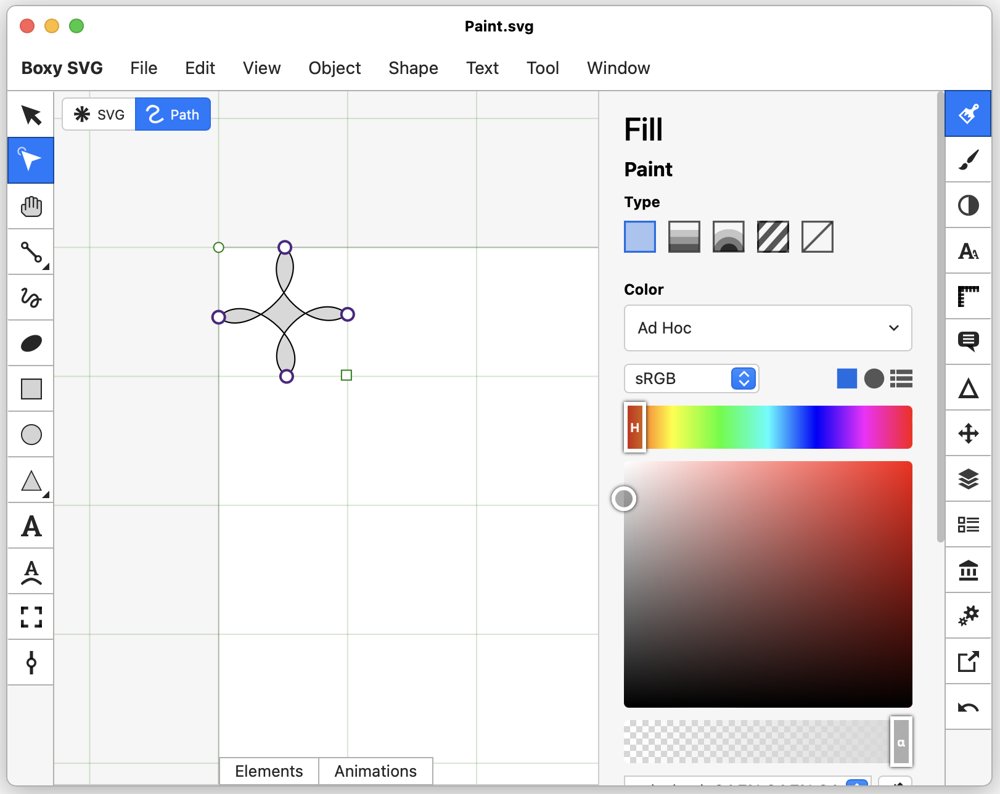
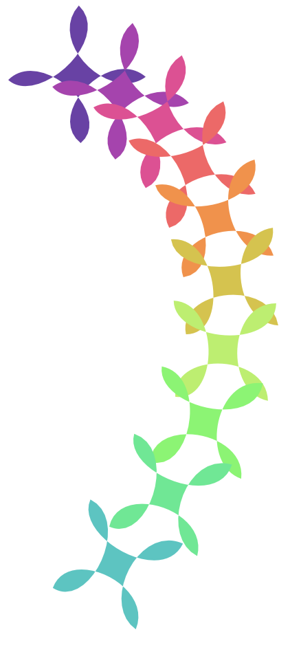
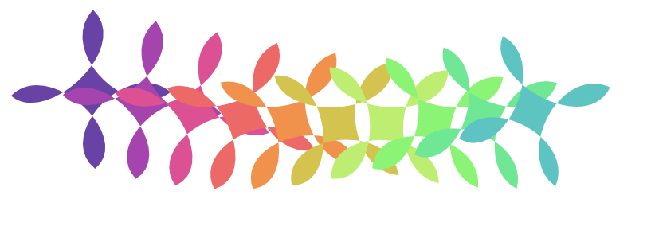
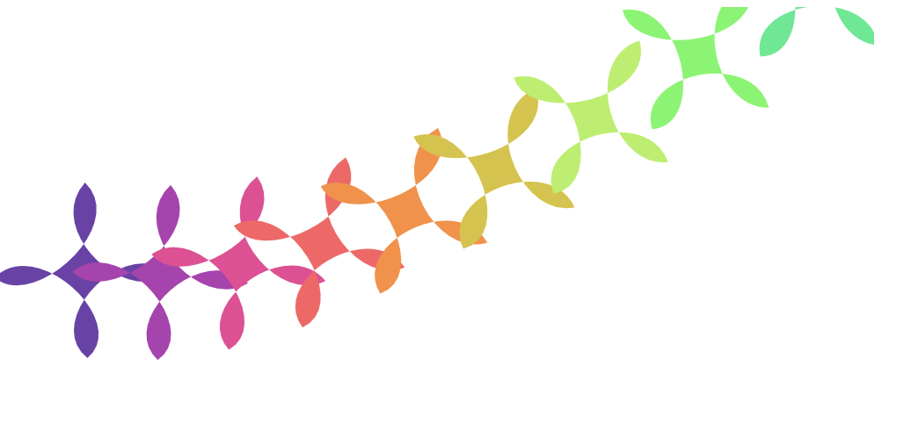
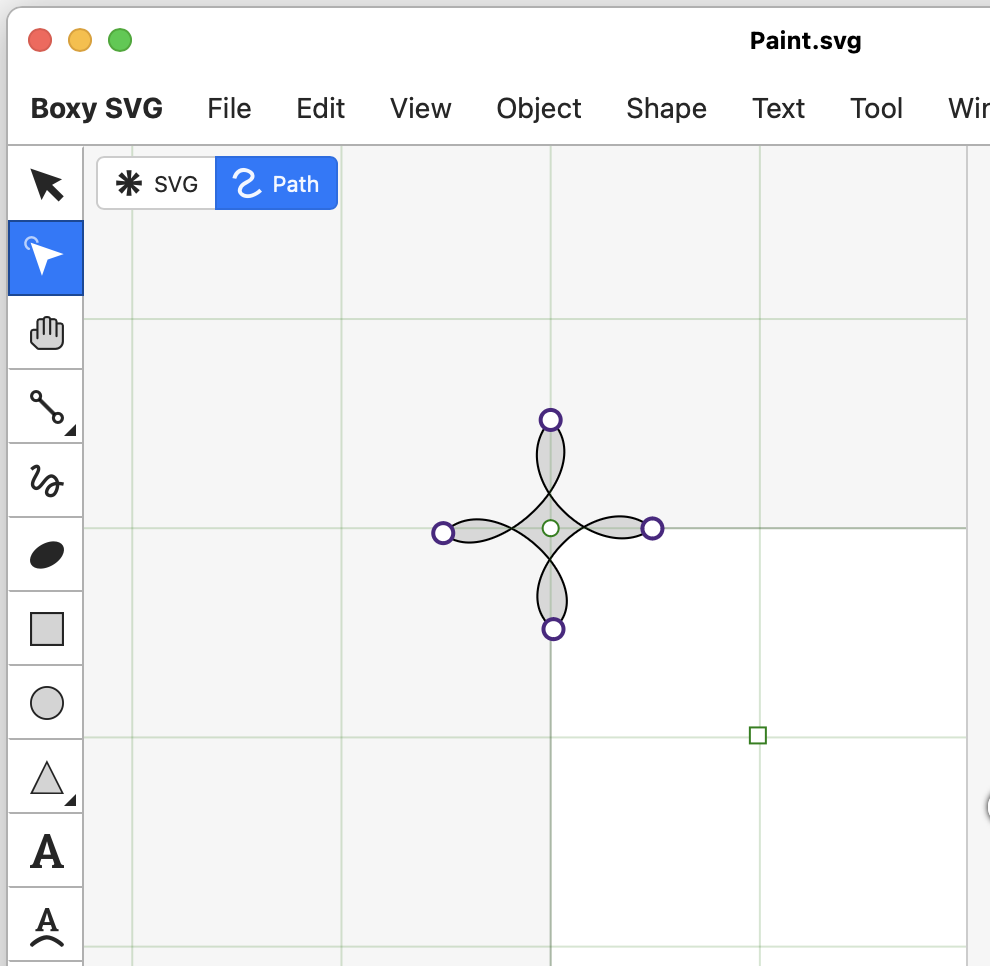
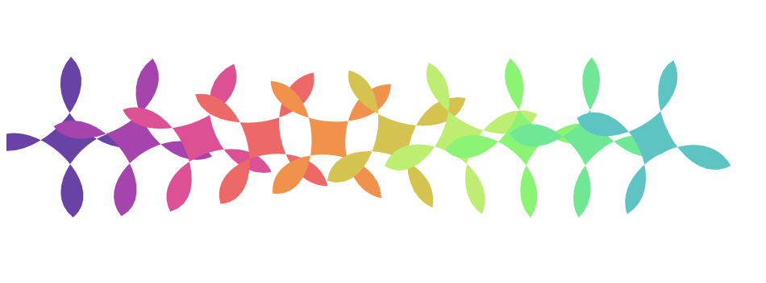

# D3 Custom Shapes

With D3 you can draw a wide range of shapes. Circles, rectangles, arcs, lines, and areas. You can't easily draw more specific shapes like cats, stars soda cans etc. This is not a limitation of the SVG format! With SVG you can draw just about anything you can imagine. it is possible to get your SVG drawings into your D3 projects! 

This tutorial will cover two ideas, drawing paths by plotting points, and using custom SVG art in D3. 

## Creating paths by plotting points

The SVG `<path>` element draws a shape by plotting points. Formatting these points is not for the faint of heart! With carefully planning you can do this with code. This exercise provides an insight into what D3 is doing behind the scenes. 

The `<path>` element uses the `d` attribute to describe the shape of the path. You can think of this as a string with a series of x and y points along with some other letters that describe how we draw the path. 

Try these examples in an HTML document. Make a new HTML document. 

```html
<!DOCTYPE html>
<html lang="en">
<head>
  <meta charset="UTF-8">
  <meta name="viewport" content="width=device-width, initial-scale=1.0">
  <title>D3 Custom Shapes</title>
</head>
<body>
  
</body>
</html>
```

Add an svg document: 

```html
<svg width="500" height="500">
  <path d="M 0 0 L 100 0 L 100 100 L 0 100 L 0 0 Z"  fill="red" />
</svg>
```

The code above draws a box 100 by 100 pixels. This is all described by the string assigned to `d`. 

```
M 0 0 L 100 0 L 100 100 L 0 100 L 0 0 Z
```

`M` is the Move to command. This causes the system to move to a point without drawing a line. The two values following `M` are the x and y coordinates, in this case 0 and 0. You can imagine that this places the "pen" in the upper left corner of the page. 

`L` is the Line to command. This draws a straight line from the previous position of the "pen" to the position defined by the following coordinates, in this case the next coordinates are 100 and 0. This draws a line along the top edge of the box. 

The data draws three more lines to 100, 100 then 0, 100, and back to the start at 0, 0.

`Z` is the close path command. This closes the path. You can use this to draw a straight line from the last point to the first point. 

It might look like this: 



We could have more easily created a rectangle like this: 

```HTML
<rect width="100" height="100" fill="red" />
```

With a path you can draw any shape for example: 

```HTML
<!-- Triangle -->
<path d="M 50 0 L 100 100 L 0 100 Z"  fill="red" />
<!-- Cat (sort of) -->
<path d="M 0 0 L 10 10 L 90 10 L 100 0 L 100 50 L 70 100 L 30 100 L 0 50 L 0 100 Z"  fill="red" transform="translate(0, 100)"/>
```

The shapes above could be drawn with D3 but not easily. While the writing the code is also not easy it does give us some options. 

It might look like this: 



Read more about SVG path: https://developer.mozilla.org/en-US/docs/Web/SVG/Tutorial/Paths

Imagine you wanted to create polygons with different numbers of sides. This could be accomplished by plotting straight lines around a circle. 

```html
<script>
    function polygon(sides = 3, radius = 100) {
      let d = ''

      for (let i = 0; i < sides; i += 1) {
        const x = Math.sin(Math.PI * 2 / sides * i) * radius
        const y = Math.cos(Math.PI * 2 / sides * i) * radius
        d += `${i ? 'L' : 'M'} ${x} ${y} `
      }

      return d + 'Z'
    }

    const svg = document.querySelector('svg')
    const path = document.createElementNS("http://www.w3.org/2000/svg", "path");
    path.setAttribute('d', polygon(5, 100))
    path.setAttribute('fill', 'red')
    path.setAttribute('transform', 'translate(200, 200)')
    svg.appendChild(path)

  </script>
```

The `polygon` function generates the `d` string for an svg path. It plots points around a center, moving to the first point, and drawing lines to each of the following points, then closing the path. 

The second half of the selects the svg element, creates a new path element, sets some attributes, then adds the new path to the svg element. Notice that this same things that D3 is doing but here is much more verbose! 

You could combine this with D3! 

Import D3: 

```HTML
<script src="https://cdn.jsdelivr.net/npm/d3@7"></script>
```

Add some D3: 

```js
const data = [3,4,5,6,7,8,9,10,11,12]
const colorScale = d3.scaleSequential()
  .domain([0, 12])
  .interpolator(d3.interpolateRainbow);

d3.select('svg')
  .selectAll('path')
  .data(data)
  .enter()
  .append('path')
  .attr('d', d => polygon(d, 40))
  .attr('fill', (d, i) => colorScale(i))
  .attr('transform', (d, i) => `translate(${i * 50 + 20}, ${50})`)
```

This creates a row of polygons from 3 to 12 sides. 

The code above might look like: 



## Defining a Custom shape

Drawing polygons is not hard with code but drawing things like cats, houses, a monkey holding a banana could be more difficult, maybe impossible. Using a vector drawing program you could draw all of these with comparative ease. How would you use drawings created in a vector drawing app in your d3 projects? 

For these examples I used: https://boxy-svg.com. This is a simple browser based vector drawing app. Give it a try. 

Here are a couple drawings that I made. I kept these simple, realizing that I would be using them in D3. 



The steps here might vary depending on what app you have used to make your SVG drawings. Using Boxy SVG I was able to copy and paste objects (command + c -> command + v) into my html document. The shape in the image above looked like this when pasted: 

```HTML
<?xml version="1.0" encoding="utf-8"?>
<svg viewBox="0 0 100 100" width="100" height="100" xmlns="http://www.w3.org/2000/svg">
  <path style="fill: rgb(216, 216, 216); stroke: rgb(0, 0, 0);" d="M 51.35 0 C 76.694 24.518 21.659 73.678 0 54.111 C 24.288 29.658 77.352 79.559 52.7 100 C 26.468 79.379 73.441 29.116 100 51.88 C 74.033 71.265 27.472 26.348 51.35 0 Z"/>
</svg>
```

This is a whole SVG document, to use this shape in the SVG document that we are using with D3 we just need the path element. 

```HTML
<path style="fill: rgb(216, 216, 216); stroke: rgb(0, 0, 0);" d="M 51.35 0 C 76.694 24.518 21.659 73.678 0 54.111 C 24.288 29.658 77.352 79.559 52.7 100 C 26.468 79.379 73.441 29.116 100 51.88 C 74.033 71.265 27.472 26.348 51.35 0 Z"/>
```

I removed anything extra, like the `style` attribute, since I was going to style this with D3. You might remove `fill`, `stroke`, or `transform` if they exist. 

```HTML
<path d="M 51.35 0 C 76.694 24.518 21.659 73.678 0 54.111 C 24.288 29.658 77.352 79.559 52.7 100 C 26.468 79.379 73.441 29.116 100 51.88 C 74.033 71.265 27.472 26.348 51.35 0 Z"/>
```

Now it's time to add this to the SVG element that will be used by D3. You can copy the `<path ... />` you've created and paste it into a `<defs>` tag inside your svg tag. 

```html
<svg width="500" height="500">
  <defs>
    <path d="M 51.35 0 C 76.694 24.518 21.659 73.678 0 54.111 C 24.288 29.658 77.352 79.559 52.7 100 C 26.468 79.379 73.441 29.116 100 51.88 C 74.033 71.265 27.472 26.348 51.35 0 Z"/>
  </defs>
</svg>
```

The svg `defs` element is a place where you can store elements that aren't displayed directly, but instead can be used in the document. Elements in defs can be duplicated as often you need. When you use elements from `defs` they come with all of their attributes but otherwise each is unique. 

To use an element you'll use the `<use>` tag! In D3 you can use `.appeand('use')` to "use" an element defined in `defs`. To identify the element to use you'll give it an id. 

```html
<svg width="500" height="500">
  <defs>
    <!-- Add id="clover" here! -->
    <path id="clover" d="M 51.35 0 C 76.694 24.518 21.659 73.678 0 54.111 C 24.288 29.658 77.352 79.559 52.7 100 C 26.468 79.379 73.441 29.116 100 51.88 C 74.033 71.265 27.472 26.348 51.35 0 Z"/>
  </defs>
</svg>
```

Notice I added an id to the `<path>` element above. 

Now we can use this element with D3. Add some D3. 

**Note:** `xlink:href` still works in every modern browser, but it's the older SVG 1.1 syntax. Newer SVG lets you drop the `xlink:` prefix and just use `.attr('href', '#clover')`. Both work here — you'll see `xlink:href` a lot in older tutorials and Stack Overflow answers, so it's worth recognizing.

```JS
const data = [3,4,5,6,7,8,9,10,11,12]

const colorScale = d3.scaleSequential()
  .domain([0, 12])
  .interpolator(d3.interpolateRainbow);

d3.select('svg')
  .selectAll('use')
  .data(data)
  .enter()
  .append('use')
  .attr('xlink:href', '#clover')
  .attr('transform', (d, i) => `rotate(${8 * i}) translate(${40 * i}, 0)`)
  .attr('fill', (d, i) => colorScale(i)) 
```

This should look something like: 



Bonus! the `rotate()` function in svg is not the same as the CSS `rotate()`. 

1. The order of `translate()` and `rotate()` matters! When `translate()` is first the object is moved then rotated. If rotate comes first it's rotated first! Try it! 

```js
.attr('transform', (d, i) => `translate(${40 * i}, 0) rotate(${8 * i})`)
```

Looks like this: 



Rotate is confusing! Take a look at the docs: https://developer.mozilla.org/en-US/docs/Web/SVG/Attribute/transform#rotate

The docs say that a rotation is performed "about the origin of the current user coordinate system. If the optional parameters `x` and `y` are supplied, the rotation is about the point `(x, y)`." Besides we have to consider where the center/origin of the element being rotated exists. 

Try this: 

```js
 .attr('transform', (d, i) => {
  const x = 40 * i
  return `translate(${x}, 100) rotate(${5 * i}, ${x}, 100)`
})
```

Here you are setting x and y for the rotation. For clarity I expanded this function into several lines. We used the same x and y for both translation and rotation. 

Here is what mine looked like: 



This still might not be what you are expecting. 

Look at the origin of the svg path. It's hard to see it. If you look at the positions in the path data you'll see the numbers are all positive. This means the 0,0 origin is somewhere in the upper left. 

We can visualize this in Boxy SVG. 


Notice the clover is drawn where its top and left edges meet the "white" background. I'm guessing this is showing us the where 0 left and 0 top are. 

Try this, reposition the drawing so that the center of the drawing is positioned around the upper left corner of the box. Like this: 



Copy and paste this new svg element. You'll need to extract just the path. 

Add the new path to your defs and give it a different id. My svg element looked like this: 

```HTML
<svg width="500" height="500">
  <defs>
    <path id="clover" d="M 51.35 0 C 76.694 24.518 21.659 73.678 0 54.111 C 24.288 29.658 77.352 79.559 52.7 100 C 26.468 79.379 73.441 29.116 100 51.88 C 74.033 71.265 27.472 26.348 51.35 0 Z"/>
    <path id="clover-2" d="M 0 -51.757 C 25.344 -27.239 -29.691 21.921 -51.35 2.354 C -27.062 -22.099 26.002 27.802 1.35 48.243 C -24.882 27.622 22.091 -22.641 48.65 0.123 C 22.683 19.508 -23.878 -25.409 0 -51.757 Z"/>
  </defs>
</svg>
```

Notice! Where the old path had only positive numbers the new path has a mix of positive and negative numbers. This should be placing the points that draw the path around the 0, 0 center origin. 

You can now use this shape by using its id name: `#clover-2`. 

Here are the changes I made: 

```js
d3.select('svg')
  .selectAll('use')
  .data(data)
  .enter()
  .append('use')
  .attr('xlink:href', '#clover-2') // use clover-2
  .attr('transform', (d, i) => {
    const x = 40 * (i + 1) // add 1 to move everything to right
    // Use x and y poisition in rotate(angle, x, y)
    return `translate(${x}, 100) rotate(${12 * i}, 0, 0)`
  })
  .attr('fill', (d, i) => colorScale(i)) 
```

With these changes this is what mine looked like: 



## Check Your Understanding

**Q1.** Why put a shape inside `<defs>` and reference it with `<use>` instead of just drawing several `<path>` elements with the same `d` string?

<details><summary>Answer</summary>

`<defs>` lets you define a shape once and stamp out as many copies as you want with `<use>`, each with its own transform, fill, and other attributes — without repeating (and risking typos in) that long, unreadable `d` path string every time. It's the SVG equivalent of defining a reusable component instead of copy-pasting markup.

</details>

**Q2.** Why does the order of `translate()` and `rotate()` in a `transform` attribute change the result?

<details><summary>Answer</summary>

SVG transforms apply right-to-left as nested coordinate-system changes, not as independent adjustments. `translate() rotate()` moves the coordinate system first, then rotates around the new (moved) origin. `rotate() translate()` rotates the coordinate system first, so the subsequent translate happens along the *rotated* axes — which usually sends the shape somewhere unexpected.

</details>

**Q3.** Why did repositioning the clover artwork so its center sits at `(0, 0)` in the drawing app matter for the rotation to look right?

<details><summary>Answer</summary>

`rotate(angle, x, y)` spins a shape around the point `(x, y)` in that shape's own coordinate system. If the artwork's visual center isn't at `(0, 0)`, rotating "around the origin" swings the shape around some point off to its side — like rotating a clock hand around a point near its tip instead of its center. Re-centering the path data first makes `rotate(angle, 0, 0)` spin the shape around its own visual middle, which is what you'd expect "rotate in place" to look like.

</details>

## Conclusion

This was a short exploration of using custom svg shapes in D3. You learned how to draw a shape with data, generated from code, use a shape generated from outside of D3 using `defs` and `use`, and we took a closer look at the `rotate()` function. 
